****************************
Step 2: Install a Compiler
****************************

.. include:: ../../includes/prolog.inc

.. include:: ../c-urls.rst

.. contents:: Table of Contents

**Objective**: Install |MinGW| to compile an ``.c`` file
and then create an ``.exe`` executable.

2.1: Install a GCC compiler
=============================

We will use |MinGW| to compile our assembly projects

#. Find the installer on |MinGW|'s site or download it from this site directly.

     :download:`mingw-get-setup-2017-09-06.exe
     <../downloads/mingw-get-setup-2017-09-06.exe>`

#. Note the default the installation directory and then press `Continue`.

   .. caution::

       * MinGW might not work correctly if you install it in another directory
         other than the default.
       * So, we recommend using the default installation directory.

   |image1|

#. The installer will download and install MinGW.
#. Verify that the installer downloaded and installed all selected items.

   |image2|

#. Select ``mingw32-base-bin`` and apply changes.

   - From the menu: ``Installation ➜ Apply Changes``
   - The installer might take a while depending on your internet connection.

   |br|
   |image3|

   |image4|

#. Press the `Close` button when the packages finish downloading.

   |image5|

#. Verify that ``ming32-base-bin`` installed.

   |image6|

#. You can now close the installer window.

2.2: Set the path to GCC
=============================

Windows needs to know where to find gcc.exe, which it will do by setting
the ``path=C:\MinGW\bin;%path%``

.. tip::
    * Set the path to your compiler in the Windows path so that all
      applications can find it.
    * Otherwise, you have to specify the full path to the compiler.

Verify the programs execute in CMD
-----------------------------------

   .. note::

       This path is set **ONLY for this CMD instance**. You have to run
       the command again when you close the CMD window. Or, you can
       specify the absolute path to the file.

       You can add it permanently the System Environment Variables.

#. Open up Command Prompt (CMD)
#. Set the temporary path by executing: ``path=C:\MinGW\bin;%path%``
#. Verify the path set correctly
#. Type: ``echo %path%``
   |image9|
#. Type: ``gcc --version``
   Verify that it displays the file version.
   |image10|

Errors
--------
If you get a ``not recognized`` error, then the path is not set correctly
or you installed MinGW in a different directory.

|image12|

#. Try executing it using the full path: ``C:\MinGW\bin\gcc --version``
#. Verify the installation path: ``dir C:\MinGW\bin``

.. _Set Path to GCC:

Set path in Windows System (standard user)
-------------------------------------------

#. Open the Environment Variables for your account

   - In the start menu type: ``edit environment variables for your account``

#. Select on ``Path`` and then click the ``Edit`` button.
#. Add an new path to ``C:\MinGW\bin``
#. Or, append ``;C:\MinGW\bin`` to the end of another path

Set path in Windows System (with Admin)
----------------------------------------

#. Open the ``Advanced System Properties`` in Windows. There are several
   ways:

   a. Copy and paste one of these commands to `Windows Explorer` or
      `Start Menu`

      * ``Advanced System Settings``
        |br| -OR-
      * ``C:\Windows\System32\SystemPropertiesAdvanced.exe``

   #. Navigate from the control panel:
      ``Control Panel > System and Security > System``

      |image21|

#. Click on the **Environment Variables** button

      |image22|

#. Select ``Path`` under **User variables** and then click on the
   **Edit** button

      |image23|

#. Click on **New** and then add a variable for the **bin** folder of GCC:
   ``C:\MinGW\bin``

   |image24|

#. Press OK on all windows
#. **Close and reopen** the CMD windows to get a new prompt.
#. Verify that GCC display the versions correctly before continuing.

   |image25|

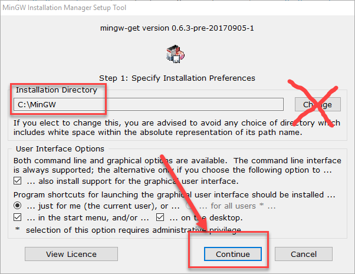
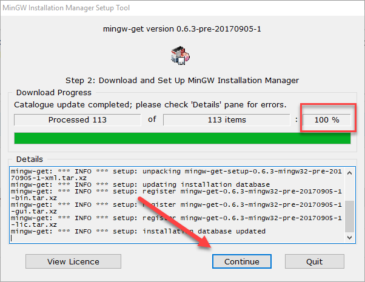
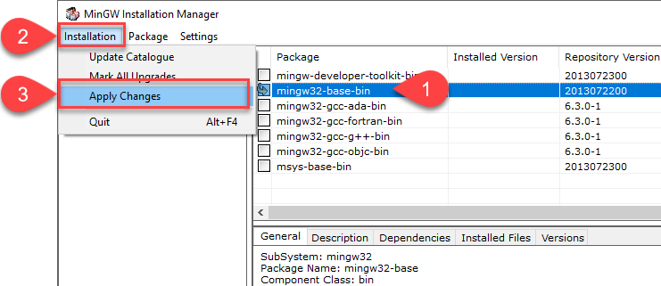
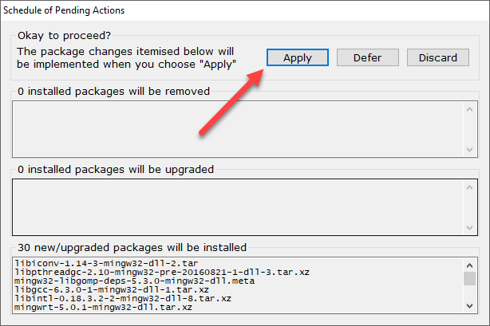
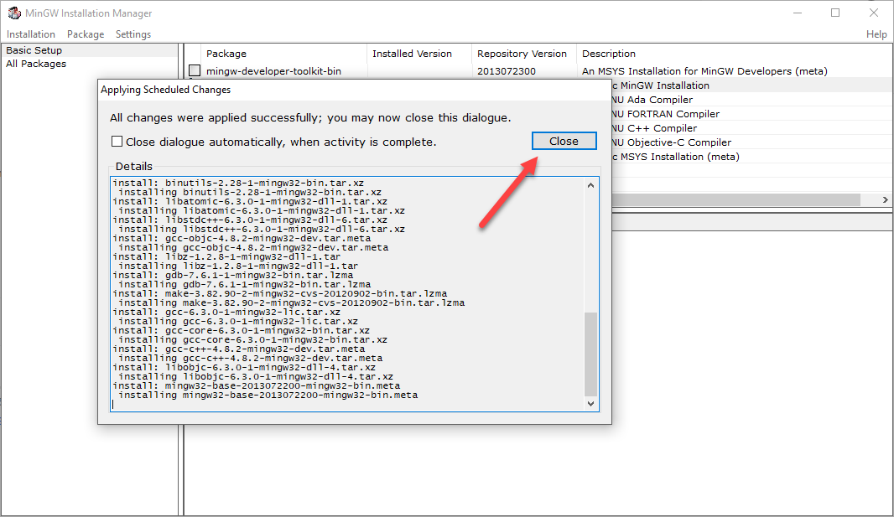
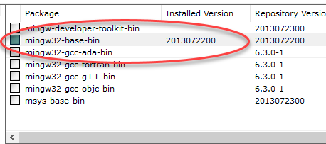
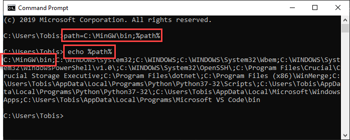
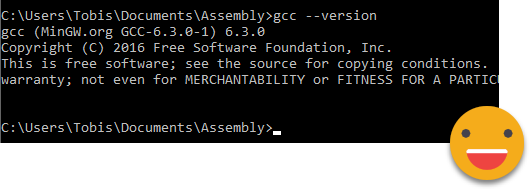
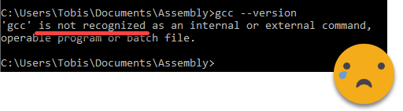
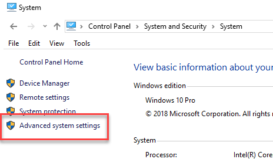
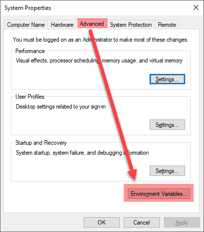
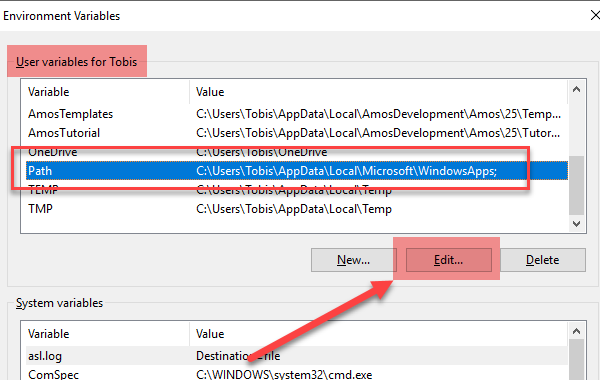
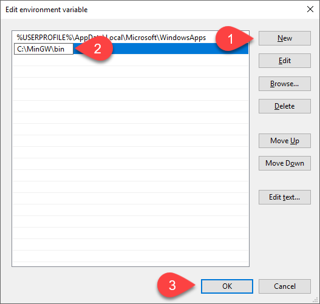
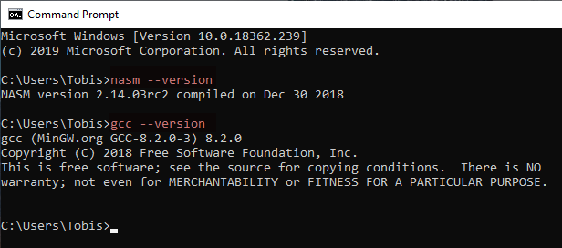

.. admonition:: Source & license
   :class: note

   Reproduced **verbatim, without modification** from
   `© 2022, BilimEdtech Labs <https://labs.bilimedtech.com/index.html>`__,
   licensed under
   `Creative Commons Attribution 4.0 International (CC BY 4.0) <https://creativecommons.org/licenses/by/4.0/deed.en>`__.

   Source page:
   https://labs.bilimedtech.com/c/windows-install/2.html

   See :doc:`LICENSE <../../LICENSE_edtech>` for the full license text.
