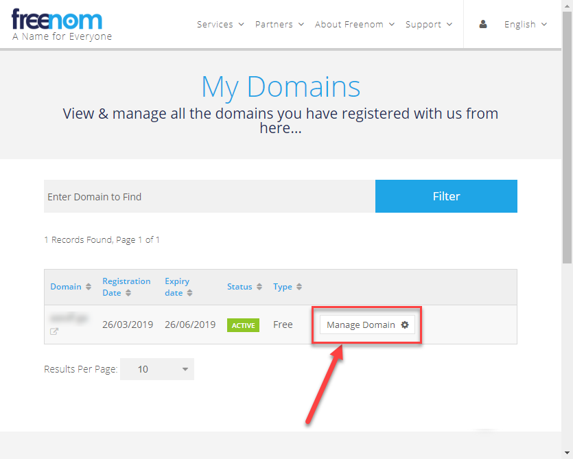
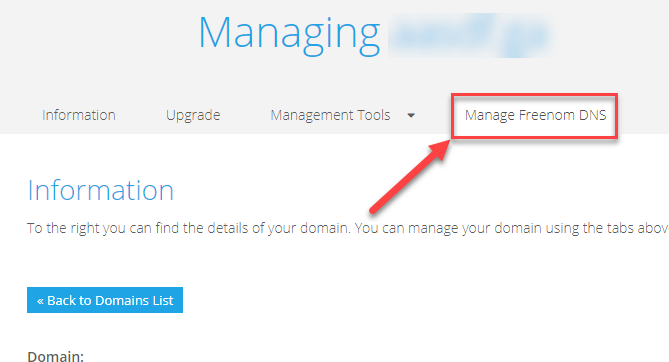
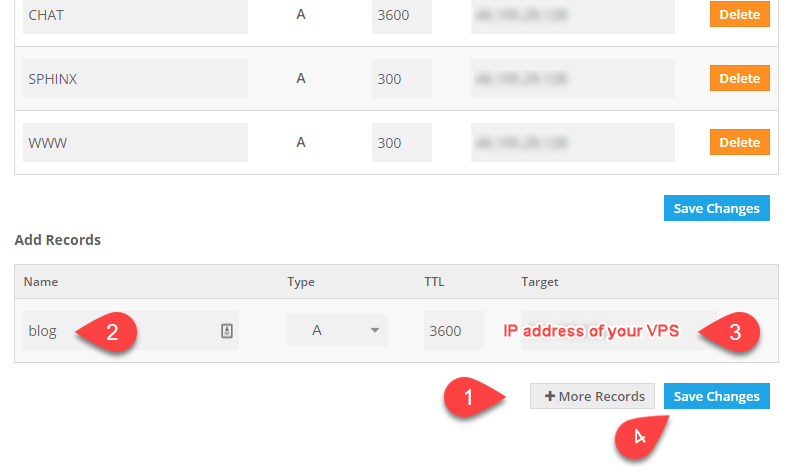

************************************************
Step 2: Configure Nginx using the Command Line
************************************************

.. include:: urls.rst

.. contents:: Table of Contents

We are running Nginx on ports 80 and 443. Our firewall is blocking
port 3000. We could open the firewall and direct our clients to use
port 3000. However, users are accustomed to using the domain name only.
We don't want to have to remember to use port 3000 or 8080. We like
domain names! We'll let Nginx do the conversion for us. This
functionality is the power of a reverse proxy.

At this point, we have the application running on port 3000. We could
open up the port on the firewall, but we'll use Nginx as a reverse proxy.
We will add additional services during this lab.

.. note::
    These instructions use **example.com**. You will use your own domain name.

For this part of the lab:

   * We will create a new sub-domain name for our service called
     ``chat.example.com``.
   * We will configure Nginx to watch for ``chat.example.com``
     and then direct that traffic to ``localhost:3000``.
   * This process works because we can associate many names with
     a single IP address.

For the other applications running on the server that we can configure
easily, we'll use ports 20850-20865 for HTTP data and then
20450-20465 for HTTPS. We can use any open port, but we'll use a
range that services rarely use.

   * Nginx will route the traffic to each service based on the domain name.
   * `s1.example.com` might route to port `20852`.
   * `s2.example.com` might route to port `20475`.

You might ask why we don't use port 80 for everything. Ports on a computer
have a restriction that only one process can bind to a port at a time.
Right now, our Nginx web server is binding to ports 80 and 443.
No other application can use those ports. So, they have to use different
ports. Python projects commonly use port 3000, such as Rocket.Chat.
Other projects might use port 8000.

2.1. Create sub-domain **chat.example.com**
==============================================
We need our sub-domain name that points to our VPS before our reverse
proxy will work.

.. tip:: Here are the instructions for Freenom and Namecheap.
    You will have to find the instructions if you used a different
    registrar.

Freenom
--------
|Freenom.com| is a source for free domains names from
TLDs .tk, .ml, ga, .cf, and .gq.

#. Add your subdomain names.

* You might have to wait several hours if you're unlucky

Namecheap
----------
See the |knowledgebase article from Namecheap| if you used their services.

To create sub-domain name **chat.example.com**:

#. Log into your domain name registrar
#. Add a new record

   + **Type**: ``A`` Record
   + **Host**: chat
   + **Address**: <your IP address>
   + **TTL**: Automatic (default value)

#. Click the green checkmark or press the *Save all changes* button
#. Wait several minutes before trying to ping the new sub-domain name.

   + You might have to wait several hours if you're unlucky

   .. image:: images/chat-domain-name.png

.. _create-nginx-site:

2.2. Create the Nginx Site
===========================

These instructions explain how to enable an Nginx config file using
the command line. Next, we'll look at how to create the site using Ajenti.

1. Create the new Nginx config file and copy the file contents.

   + **Right-click** in the terminal window to paste the code.
   + Press **Ctrl+X** to exit
   + Press **y** to save the changes

   .. code-block:: bash

       nano /etc/nginx/sites-available/chat.example.com

   .. code-block:: bash
       :caption: File contents of /etc/nginx/sites-available/chat.example.com
       :linenos:
       :emphasize-lines: 4,6

       server {
           listen 80;

           server_name chat.example.com;

           location / {
               proxy_pass http://localhost:3000;
               proxy_set_header Host $host;
               proxy_set_header X-Real-IP $remote_addr;
               proxy_set_header X-Forwarded-For $proxy_add_x_forwarded_for;
           }
       }

#. Enable the Nginx Site

   Ubuntu uses folders that determine if a site is enabled or disabled.
   You will find two folders in ``/etc/nginx/``

       a. ``sites-available`` contains that sites that are configured
          but not active.
       #. ``sites-enabled`` contains the sites that are active and
          accepting connections.

   Instead of moving a file between ``sites-available`` and ``sites-enabled``,
   all files physically remain in ``sites-available``. A user creates a
   symbolic link to ``sites-enabled`` to make the site active. Linux file
   system treats the link as the actual. Once the link is made, a user can
   edit the same file in either directory.

       * ``ln -s`` creates a symbolic link to an existing file.
       * ``ln -s source destination``
       * ``ln -s /etc/nginx/sites-available/chat.example.com
         /etc/nginx/sites-enabled/`` creates a link of
         ``chat.example.com`` in folder ``/etc/nginx/sites-enabled/``

   .. code-block:: bash

       ln -s /etc/nginx/sites-available/chat.example.com /etc/nginx/sites-enabled/

   Once this link is made, view the directory contents using ``ls -lh``. You will see the link.

   .. code-block:: bash

       ls -lh /etc/nginx/sites-enabled/

   .. code-block:: bash
       :caption: Output
       :emphasize-lines: 1,7

       root@vps298933:~# ls -lh /etc/nginx/sites-available/
       total 12K
       -rw-r--r-- 1 root root 2.4K Mar 16 22:35 default
       -rw-r--r-- 1 root root 1.1K Mar 19 21:01 y.jj8i.com
       -rw-r--r-- 1 root root  277 Mar 19 20:40 www.y.jj8i.com
       root@vps298933:~#
       root@vps298933:~# ls -lh /etc/nginx/sites-enabled/
       total 0
       lrwxrwxrwx 1 root root 34 Mar 16 22:28 default -> /etc/nginx/sites-available/default
       lrwxrwxrwx 1 root root 34 Mar 16 22:44 y.jj8i.com -> /etc/nginx/sites-available/y.jj8i.com
       lrwxrwxrwx 1 root root 39 Mar 19 20:39 www.y.jj8i.com -> /etc/nginx/sites-available/www.y.jj8i.com
       root@vps298933:~#

#. Verify that there are no configuration issues

   .. code-block:: bash

       sudo nginx -t

   .. code-block:: bash
       :caption: Output
       :emphasize-lines: 1

       root@vps298933:~# sudo nginx -t
       nginx: the configuration file /etc/nginx/nginx.conf syntax is ok
       nginx: configuration file /etc/nginx/nginx.conf test is successful

#. Restart Nginx and verify that it restarted without errors

   .. code-block:: bash

       sudo systemctl restart nginx
       sudo systemctl status nginx

#. Now, let's verify that the reverse proxy is working correctly.
   We will use ``curl`` to access the site using the domain name.

   * The file is very large.
   * If something is wrong if you see the default Nginx HTML.

   .. code-block:: bash
       :caption: Expected Output
       :emphasize-lines: 1

       root@vps298933:~# curl http://chat.y.jj8i.com
       <!DOCTYPE html>
       <html>
       <head>
       <meta name="referrer" content="origin-when-crossorigin">
       

         

       </body>
       </html>root@vps298933:~#

#. Lastly, we should add the SSL certificate using ``certbot``.

   - SSL certificates are free and easy to install.
   - Let's promote a secure web!

    .. code-block:: bash

       sudo certbot --nginx

#. If everything is successful, you should be able to access your
   chat application using your web browser.

   - Here is the URL to my box: http://chat.y.jj8i.com

#. Navigate to the URL using your web browser and configure Rocket.Chat

   - You should set the admin password before someone else finds the site. :))
   - **Sever type**: Private Team
   - **Register Server**: Keep standalone

Congratulations! You have just installed a complex application and routed
it through your web server.

.. admonition:: Source & license
   :class: note

   Reproduced **verbatim, without modification** from
   `© 2022, BilimEdtech Labs <https://labs.bilimedtech.com/index.html>`__,
   licensed under
   `Creative Commons Attribution 4.0 International (CC BY 4.0) <https://creativecommons.org/licenses/by/4.0/deed.en>`__.

   Source page:
   https://labs.bilimedtech.com/cloud-computing/2/2.2.html

   See :doc:`LICENSE <../../LICENSE_edtech>` for the full license text.
