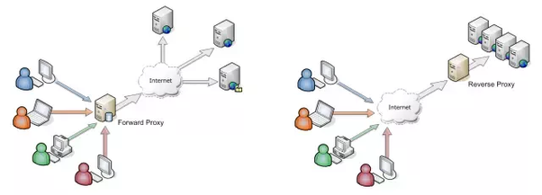

*****************
Lab 2: Overview
*****************

.. include:: urls.rst

.. contents:: Table of Contents

As you saw in the presentations on the course site, cloud computing has
three main categories:

   #. SaaS: Software as a service
   #. PaaS: Platform as a service
   #. IaaS: Infrastructure as a service

|Interoute Communications| explain that SaaS is a new and alternative
way of accessing software, as opposed to more traditional methods of
access. Whereas in the past software would generally be purchased
outright and loaded onto a device, SaaS normally refers to a
subscription-based model where the software is hosted in the cloud and
accessed via the internet. There are a number of benefits of this to
consumers, whether that is individuals using software for private purposes,
or businesses.

This lab guides you to install free or open-source alternatives to
traditional **SaaS** tools. Many SaaS services that are free do not
allow users to control their own data or host instances of the service.
There might be security concerns about who has access to your data and what
the companies do with it. The companies that create these open source
projects provide paid SaaS services often as part of their business model.

   #. |Rocket.Chat|: Communicate and collaborate with your team, share
      files, chat in real time or switch to video/audio conferencing.
      It is similar to Slack.
   #. |Nextcloud|: is a suite of client-server software for creating
      and using file hosting services. Nextcloud application functionally
      is similar to Dropbox. Nextcloud is free and open-source, which
      means that anyone is allowed to install and operate it on their
      own private server devices.
   #. |Wordpress|: A popular blogging platform. The commercial component
      is Wordpress.com.

The Complexity of Web Applications
======================================

This week you will look at how to install complex applications on your VPS.
The goal is to configure Nginx as a reverse-proxy to access running services.

The main problem is that web applications have requirements for specific
dependencies or packages. For example, one application might require Python
2.7, but another will use Python 3.6. Sometimes you can install different
versions of the same application. Other times, you can't. What if
Python 2.7 requires an earlier version of PIP that won't work with
Python 3.6? It becomes complex to run multiple versions of the same
application. Large or well-developed web applications often have
requirements to use specific versions of integrated software. For example,
look at the install instructions for |Canvas LMS|. The guidelines
recommend Node.js version 8, but the current version is 11. It is unknown
if the latest version of Node.js will work with the other modules included
in the application due to deprecating features because of security risks.

I try to install Canvas LMS from time-to-time because I really like the
product. I'm rarely successful because it is an exceedingly fragile
application! It has many obscure and obsolete dependencies that often
conflict with newer versions of the software. It might install on one
build of Ubuntu 16.04 that runs on VPS company A but not on VPS
company B. Or, one of the many dependencies might be offline, which
causes the build process to fail. Furthermore, a recent update might
break the install process, which requires the instructions to be updated
to specify an older version of the software.

The solution is to run complex and fragile applications in separate
packages or containers. We will look at two of them in this lab. In
both instances, the applications are isolated and contain the exact
dependencies and packages required for it to operate.

#. **Snaps** are a newer technology developed by Ubuntu to bundle an
   application and all dependencies in a single package.

#. **Docker** uses container technology to run pre-configured services
   using virtualization. Docker provides images that we can then run.

A Reverse Proxy
=================

A reserve proxy directs outside traffic (from the internet) to specific
addresses, ports, or services inside of the server or network. |Read more|.

We will use Nginx as a reverse proxy to forward traffic on port 80 (HTTP)
and 443 (HTTPS) to web services running on the VPS that use different ports.
These other services cannot use port 80 or 443 because Nginx already uses
those ports. For example, our Docker application might run on port 8000.
We will configure Nginx to forward the request from a client on the
internet (using a domain name) from port 80 to the service running on
port 8000 in Docker. The operation is seamless or transparent to the user.

In short, a reverse proxy allows us to run internal web services that are
accessible from the outside.

Goals for Lab 2
=================
During this lab, you will:

 #. Learn how complex applications are distributed in single package
 #. Learn how to install applications using snap, Docker, and Docker Compose.
 #. Install Rocket.Chat server using ``snap``
 #. Install Nextcloud using ``Docker``
 #. Install Wordpress using ``Docker Compose``
 #. Configure Nginx as a reverse proxy to services running HTTP and HTTPS

.. admonition:: Source & license
   :class: note

   Reproduced **verbatim, without modification** from
   `© 2022, BilimEdtech Labs <https://labs.bilimedtech.com/index.html>`__,
   licensed under
   `Creative Commons Attribution 4.0 International (CC BY 4.0) <https://creativecommons.org/licenses/by/4.0/deed.en>`__.

   Source page:
   https://labs.bilimedtech.com/cloud-computing/2/overview.html

   See :doc:`LICENSE <../../LICENSE_edtech>` for the full license text.
