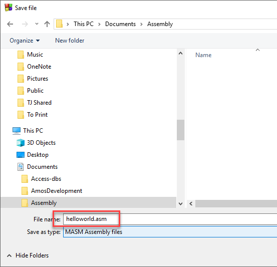
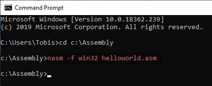
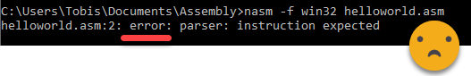
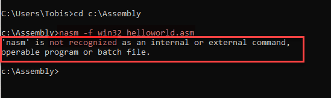
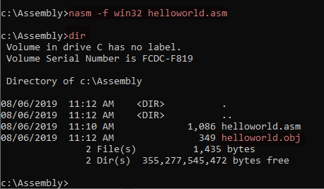
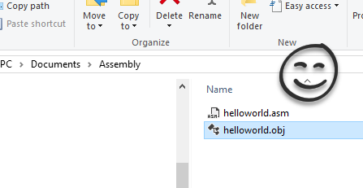
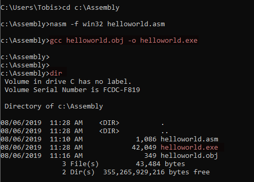
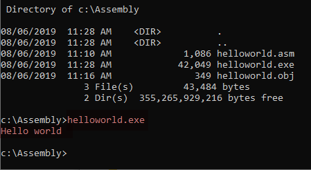

*********************************************
Step 3: Create a ``Hello World`` Application
*********************************************

.. include:: ../../includes/prolog.inc

.. include:: ../asm-urls.rst

.. contents:: Table of Contents

**Objective**: Walk through the complete process of creating a
``hello world`` application using assembly code.

Assembling and compiling an ``.asm`` code file is a two part process:

#. ``nasm -f win32 file.asm``

   - ``nasm`` is the assembler program
   - ``-f`` specifies the format, which is win32
   - ``file.asm`` is the file to parse and then create the ``.obj`` file

#. ``gcc file.obj -o file.exe``

   - ``gcc`` is the compiler
   - ``file.obj`` is the assembled file used to create the executable
   - ``-o file.exe`` specifies the output file in the form of an executable

Assembly-Compile Process
========================================

#. Create a ``helloworld.asm`` file using `Visual Studio Code` or your
   favorite text editor.
#. Add this code:

   .. code-block:: nasm
       :caption: helloworld.asm

       ; ------------------------------------------------------------------
       ; helloworld.asm
       ;
       ; This is a Win32 console program that writes "Hello World"
       ; on a single line and then exits.
       ;
       ; To assemble to .obj: nasm -f win32 helloworld.asm
       ; To compile to .exe:  gcc helloworld.obj -o helloworld.exe
       ; ------------------------------------------------------------------

               global    _main                ; declare main() method
               extern    _printf              ; link to external library

               segment  .data
               message: db   'Hello world', 0xA, 0  ; text message
                           ; 0xA (10) is hex for (NL), carriage return
                           ; 0 terminates the line

               ; code is put in the .text section
               section .text
       _main:                            ; the entry point! void main()
               push    message           ; save message to the stack
               call    _printf           ; display the first value on the stack
               add     esp, 4            ; clear the stack
               ret                       ; return

#. Save it someplace on your computer. Be sure to keep the file
   extension as ``.asm``.

   |image13|

#. Go back to your command prompt
#. **cd** to the directory where you saved ``helloworld.asm``
#. Use NASM to assemble the file and create the ``.obj`` file:

#. Type: ``nasm -f win32 helloworld.asm``.

   .. note::
            * NASM does not give you a message if the operation was successful.
            * Take note of any message that NASM displays.

   |image14|

   - **Common Errors**

     a. If you get a **parser** error, then you have an error in your code
        file. The first part of the text tells you the the line number of
        the error.

        |image15|

     b. If you a **not recognized** error, then your path is not set
        correctly. Go back to the :ref:`previous section <Set Path to ASM>`
        and verify that the locations of the assembler and compile are
        correctly added to the system path variable.

        |image16|

#. If successful, the assembler would have created the `helloworld.obj` file.
   Verify that it exists.

   |image17|
   |image18|

#. Now, compile the file to create an executable file using GCC using command:
   ``gcc helloworld.obj -o helloworld.exe``

   - If successful, the compiler would have created file ``helloworld.exe``.

     |image19|

#. Finally, execute the ``.exe`` file by running ``helloworld.exe`` to
   verify that it display `Hello world`.

   |image20|

#. To get lab credit, show your instructor that your assembly
   environment works.

.. admonition:: Source & license
   :class: note

   Reproduced **verbatim, without modification** from
   `© 2022, BilimEdtech Labs <https://labs.bilimedtech.com/index.html>`__,
   licensed under
   `Creative Commons Attribution 4.0 International (CC BY 4.0) <https://creativecommons.org/licenses/by/4.0/deed.en>`__.

   Source page:
   https://labs.bilimedtech.com/nasm/windows-install/3.html

   See :doc:`LICENSE <../../LICENSE_edtech>` for the full license text.
