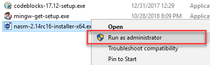

4. Reading a File using System Calls
====================================

.. include:: ../../includes/prolog.inc

.. include:: ../c-urls.rst

.. contents:: Table of Contents

This lab is an introduction to using systems call in C to interact with
the operating system directly. This lab shows you how to read a file
using the system call ``read()``.

Please create a file called ``lab4.c`` from the
:ref:`template C file <basic-c-template>` for this assignment.

System Call overview
~~~~~~~~~~~~~~~~~~~~

In computing, a **system call** is the programmatic way in which a
computer program requests a service from the kernel of the operating
system it is executed on. A system call is a way for programs
**to interact with the operating system**. A computer program makes a
system call when it makes a request to the operating system’s kernel.
A system call **provides** the services of the operating system to
the user programs via Application Program Interface (API). It
provides an interface between a process and operating system to allow
user-level processes to request operating system services. System
calls are the only entry points into the kernel system. All programs
needing resources must use system calls.
|br| `Source:` |Introduction to System Calls|

Reading a file
~~~~~~~~~~~~~~

Reading a file is a three-step process using system calls:

#. **Open the file**: ``open()`` gets the filehandle or descriptor
#. **Read the file**: ``read()`` gets the bytes as a file stream
#. **Close the file:** ``close()`` closes the filehandle

|image0|
|br| `Source:` |A Handy Guide To Handling Handles|

4.1. ``open()`` System Call
---------------------------

-  System call ``open()`` returns the |file descriptor handle| that
   is used to access the file.
-  More details at:

   -  |open (code wiki)| on Code Wiki for more details.
   -  |open (Microsoft)| on Microsoft’s C Runtime Library reference.

**Required Include Files**

    .. code-block:: c

        #include <fcntl.h>

**Function Definition**

    .. code-block:: c

        int open(const char* path, int flags);
        int open(const char* path, int flags, int file_permissions);

**Example Usages**

    .. code-block:: c

        int file_descriptor;
        file_descriptor = open("file_name.txt", O_RDONLY);

.. csv-table:: |open (code wiki)|
   :widths: 3, 20
   :header: "Field","Description"

   ``const char *path``,The relative or absolute path to the file that is to be opened.
   ``int flags``,"A bitwise 'or' separated list of values that determine the method in which the file is to be opened (whether it should be read only, read/write, whether it should be cleared when opened, etc)."
   ``int file_permissions``,"A bitwise 'or' separated list of values that determine the permissions of the file if it is created. See a list of legal values at the end."
   ``return value``,"Returns the file descriptor for the new file. The file descriptor returned is always the smallest integer greater than zero that is still available. If a negative value is returned, then there was an error opening the file."

4.1.1. Task
~~~~~~~~~~~

Your first task is to open a file and create a filehandle (a file
descriptor object) to that file.

#. Create a text file and write data to it using ``echo`` and then verify
   using ``type``

   .. code-block:: bat

      echo echo|set /p="My code works if we can read this text." > lab4.txt
      type lab4.txt

   .. note:: You should use CMD (not PowerShell) for this echo statement to work.

   **Expected Output**:
   |image3|

#. Create file ``lab4.c`` or start with a
   :ref:`template C file <basic-c-template>`.
#. Create the file descriptor handle using ``open()``.
#. Verify that the file descriptor is valid. The return value
   of ``open()`` will be a positive number if the handle is valid.
#. Print an error message and exit the program with return 1 if the file
   is not valid.
#. Verify the code functions correctly.

   **Expected Output**

   |image4|

4.2. ``read()`` System Call
----------------------------

-  System call ``read()`` reads data from a file.
-  More details at:

   -  |read (code wiki)| on Code Wiki for more details.
   -  |read (Microsoft)| on Microsoft’s C Runtime Library reference.

**Required Include Files**

    .. code-block:: c

        #include <fcntl.h>

**Function Definition**

    .. code-block:: c

        int read(int file_descriptor, void* data, int num_bytes);

**Example Usages**

    .. code-block:: c

        int file_size;     // Number of bytes returned
        char data[128];    // Retrieved data
        int num_bytes;     // Number of bytes to read

        num_bytes = 128;   // Read in 128 bytes of the file

        file_size = read(file_descriptor, data, num_bytes);

.. csv-table:: |read (code wiki)|
   :widths: 3, 20
   :header: "Field","Description"

    ``int file_descriptor``,"The file descriptor of where to read the input. You can either use a file descriptor obtained from the open system call, or you can use 0, 1, or 2, to refer to standard input, standard output, or standard error, respectively."
    ``const void *data``,"A character array where the read content will be stored."
    ``int num_bytes``,"The number of bytes to read before truncating the data. If the data to be read is smaller than num_bytes, all data is saved in the buffer."
    ``return value``,"Returns the number of bytes that were read. If value is negative, then the system call returned an error."

4.2.1. Task: Print the results from ``read()``
~~~~~~~~~~~~~~~~~~~~~~~~~~~~~~~~~~~~~~~~~~~~~~

Your second task is to read the file and print the contents to the
screen.

#. call ``read()``
#. Print the results of ``data`` to the screen.

   **Expected Output**:

   |image5|

You will notice some extra characters at the end of the text. The text
should stop at the period, but the ``char array`` is not terminated using
the |null terminator|.

4.2.2. Task: Insert the Null Terminator ``\0``
~~~~~~~~~~~~~~~~~~~~~~~~~~~~~~~~~~~~~~~~~~~~~~~

The string that we print must be terminated:|br|
``My code works if we can read this text.\0``

However, our string does not have a null terminator. The program reads in
128 bytes, but our text string is shorter than 128 bytes. The memory
location still has leftover data that ``print_f`` writes to the output
buffer.

    .. code-block:: c

        //The length of the string 128 bytes:
        char* buffer[128];

        // read() obtained 128 bytes of data from memory:
        num_bytes = 128;

The solution to the problem is determining how many bytes to read. We
know the actual number of bytes read from variable ``file_size``. We can
insert the null terminator into the array after the last byte read.

    .. code-block:: c

        printf("The number of bytes read is '%d'\n", file_size);
        // We should set '\0' at in char array at index file_size

    |image6|

Before printing the string, set the value at array
index ``file_size`` to ``\0``.

**Expected Output**:
|image7|

4.3. ``close()`` System Call
-----------------------------

- System call ``close()`` closes the filehandle.
- More details:

  - |close (code wiki)| on Code Wiki for more details.
  - |close (Microsoft)| on Microsoft’s C Runtime Library reference.

**Required Include Files**

    .. code-block:: c

        #include <unistd.h>

**Function Definition**

    .. code-block:: c

        int close(int file_descriptor);

**Example Usages**

    .. code-block:: c

        close(file_descriptor);

.. csv-table:: |close (code wiki)|
   :widths: 3, 20
   :header: "Field","Description"

    ``int file_descriptor``,"The file descriptor to be closed."
    ``return value``,"Returns a 0 upon success, and a -1 upon failure. It is important to check the return value, because some network errors are not returned until the file is closed."

4.3.1. Task
~~~~~~~~~~~

Your third task is to close the file.

#. call ``close()`` to close the file.
#. If the file closed successfully, exit the program normally.
#. If the file failed to close, write and error message and exit the
   program with a return value of 1.

   **Expected Output**:

   |image8|

.. |image0| image:: images/image4.png
.. |image3| image:: images/image1.png
.. |image4| image:: images/image6.png

.. |image6| image:: images/image5.png
.. |image7| image:: images/image2.png
.. |image8| image:: images/image3.png

.. admonition:: Source & license
   :class: note

   Reproduced **verbatim, without modification** from
   `© 2022, BilimEdtech Labs <https://labs.bilimedtech.com/index.html>`__,
   licensed under
   `Creative Commons Attribution 4.0 International (CC BY 4.0) <https://creativecommons.org/licenses/by/4.0/deed.en>`__.

   Source page:
   https://labs.bilimedtech.com/operating-systems/4/index.html

   See :doc:`LICENSE <../../LICENSE_edtech>` for the full license text.
