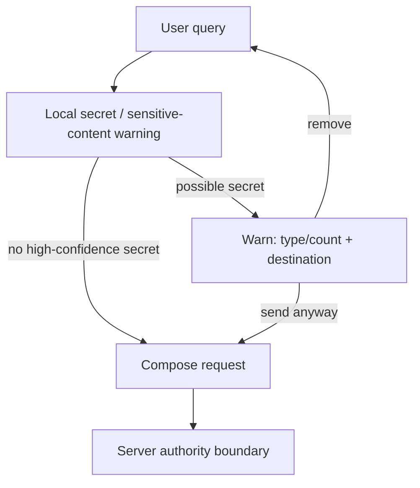
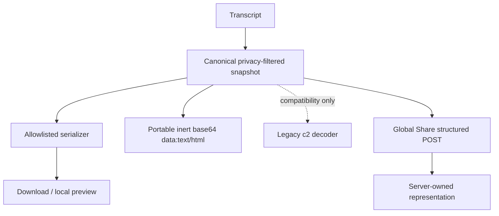
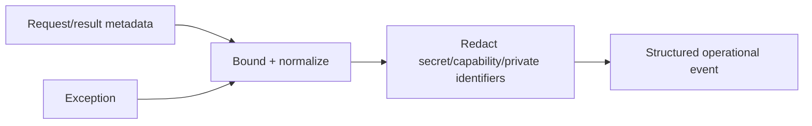
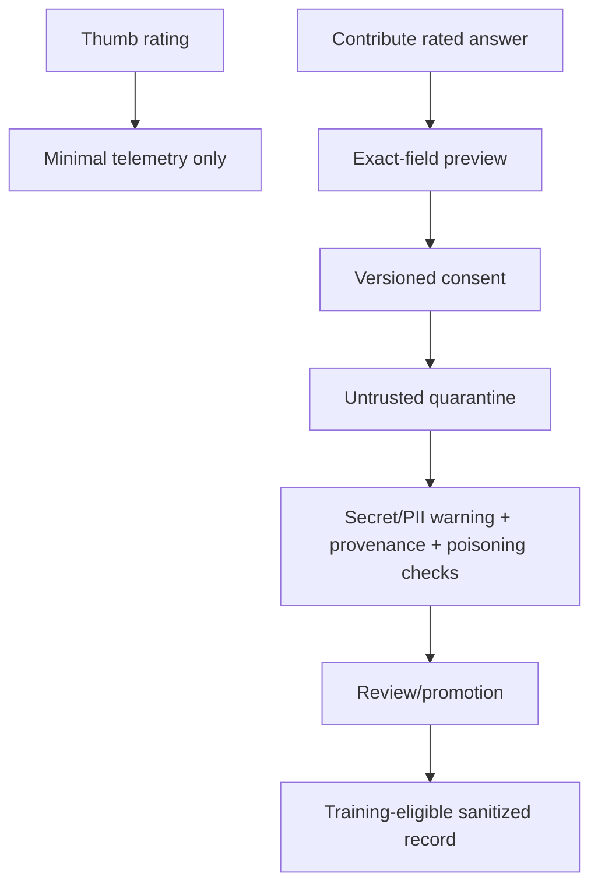

# `_sphinx_ai_assistant` Runtime Flows

## Page-load / representation flow

```text
HTML page loads
    |
    +--> build-time client-safe config
    +--> browser preferences
    +--> server discovery (non-secret capability truth)
    |
    v
resolve current document representation
    |
    +--> Tier 1 canonical static Markdown emitted by this extension
    |       |
    |       +--> manifest / alternate-link lookup
    |
    +--> Tier 2 static compatibility Markdown
    |
    +--> Tier 3 live DOM fallback only if needed
    |
    v
reference context package
```

## Chat flow

```text
user question
     |
browser UI
     |
     +--> user input
     +--> selected documentation context (UNTRUSTED REFERENCE)
     |
     v
proxy/service
     |
     +--> authenticate / authorize / limit / route
     +--> inject immutable SERVER SYSTEM POLICY
     +--> keep user/reference roles non-authoritative
     |
     v
model service/provider
     |
     v
validated/streamed response
     |
     v
browser rendering
```

## Share flow

```text
conversation payload
  -> server validation/size policy
  -> create read locator/capability
  -> return read link

edit/delete
  -> separate write authorization/capability
  -> never infer write authority from read UUID alone
```

## Feedback/training flow

```text
user feedback
  -> explicit consent state/version
  -> schema validation + resource limits
  -> provenance/authenticity metadata
  -> persist as UNTRUSTED CONTRIBUTION
  -> dedup/review/promotion policy outside raw submission path
```

## Failure UX rule

A security or representation failure must not silently fall back to a less safe
path. Fallbacks are explicit, fidelity-labeled, and limited to representation
availability; auth/policy failures remain failures.

## Chat transport negotiation — proxy v6.4+

`stream:true` is browser intent, not proof that the selected upstream is SSE.
The proxy opens the upstream first and chooses the downstream representation
from the actual response.

```text
browser stream:true
        |
        v
proxy opens upstream
        |
        +-- pre-header failure ----------> real HTTP 502/504
        +-- JSON ------------------------> JSON unchanged
        `-- SSE -------------------------> SSE passthrough
                                             |
                                             `-- terminal failure
                                                 -> event: error
```

The deterministic `stub/*` namespace is intercepted before real routing. When
`STUB_ENABLED=false`, stub requests fail locally with HTTP 503 and never touch a
provider credential or model endpoint.

See `APP_STREAMING_RUNBOOK.md` for exact curl probes, response interpretation,
retry rules, and the empty-answer decision tree.


## Pre-send privacy flow



Detection never proves safety; the server still treats every field as untrusted.

## Export / Share isolation flow



## Logging flow



## Contribution flow



## Recoverable Share / contribution create flow — Run 18 / B37

```text
browser prepares reviewed payload
  -> create operationId + resourceId + raw managementToken
  -> SHA-256(managementToken)
  -> POST resourceId + operationId + tokenDigest + reviewed payload
       (raw managementToken stays client-side)
  -> server atomically binds operation/resource/payload/token digest
       | exact replay       -> same object/receipt
       | mismatch          -> 409 conflict
       | response unknown  -> browser keeps envelope + reports outcome unknown
  -> Retry reuses SAME envelope
  -> later revoke/delete sends raw capability for one-way hash verification
```

## Feedback egress permissions — Run 18 / B37

```text
local thumb rating
  +-> local UI/state                                  [always available]
  +-> /v1/feedback                                    [telemetry permission]
  `-> public ai-assistant-feedback CustomEvent        [separate page-integration permission]
```

Neither optional egress grant implies dataset contribution consent.


## Run 19 / B38 deployment startup gate

```text
container build
  -> immutable linux/amd64 Python base
  -> exact hashed binary-only lock install in builder
  -> copy isolated venv into runtime
  -> USER 1000:1000
  -> DEPLOYMENT_PROFILE=strict
        |
        +-- root process? ----------------------> startup FAIL
        +-- wildcard/opaque browser origin? ---> startup FAIL
        +-- Redis selected with redis:// ? -----> startup FAIL
        +-- Redis URL query options? -----------> configuration FAIL
        `-- rediss:// + verified peer ----------> initialize authority plane

release after source tests
  -> fresh dependency scan
  -> exact lock install/build
  -> full image SBOM + CVE policy
  -> signed provenance/registry evidence
```

The networked release-evidence branch is not replaced by the offline source
verifier.

## Run 20 production release-evidence flow

```text
canonical source subjects
(lock + Python SBOM + runtime-source digest + base index)
        |
        v
networked build/scans -> final immutable image digest
        |                         |
        |                         +-> image scan
        |                         +-> full image SBOM
        |                         +-> SLSA provenance + signature verification
        v
sanitized Redis + infrastructure logging evidence
        |
        v
short-lived release-evidence.json
        |
        v
verify_release_gate.py
        |
        +-- source verifier GREEN? ----- no -> STOP
        |
        +-- evidence fresh + hashes/subjects bound? -- no -> STOP
        |
        +-- provenance image/base bound? ----------- no -> STOP
        |
        +-- telemetry/logging guardrails Off? ------ no -> STOP
        |
        +-- Share/Contribution Redis ops proved? --- no -> STOP
        |
        `-- GREEN -> release system may continue promotion
```

The verifier performs no network calls. Evidence collection is an explicit
release/operator action; ordinary application runtime never polls scanners,
registries or Redis merely to maintain an attestation.


## B41 isolated browser flow

```text
docs origin                         isolated origin
-----------                         ---------------
config + tiny host bridge
  | create distinct-origin sandbox iframe
  |-------------------------------------> frame bootstrap
  | <--- HELLO(v, channel)  [origin/source exact]
  | --- INIT + transferred MessagePort ->
  X window message listener removed       |
  |                                        | load full ai-assistant.js
  | <== bounded capability messages =====>|
  | page.context / canonical / print       | transcript + UI + network
  | UI resize                              | scoped storage
  | consented bounded public projection    | privacy/injection fencing
```

There is no automatic same-origin fallback.

## Run 23 / B42 isolation bootstrap and navigation flow

```text
Sphinx build
  -> generate exact parent-origin policy (deny-all if unresolved)

Docs host start
  -> snapshot safe config
  -> install native capture message listener
  -> attach sandboxed isolated iframe (no nonce in URL)

Isolated frame
  -> fetch policy with credentials=omit
  -> validate parent + isolation origin + closed schema
  -> WebCrypto random channel
  -> HELLO exact parent origin

Host
  -> validate event.source/origin/protocol/channel
  -> consume HELLO
  -> transfer MessagePort

Runtime
  -> sequenced capability envelopes only
  -> service fetch credentials=omit by default
  -> canonical docs read: same-origin + redirect:error + stream bound
  -> HTTP(S) link: prevent frame-self navigation -> external noopener/noreferrer
```

## Run 24 / B43 response ingestion flow

```text
Remote response
      |
      +-- Content-Length present? -- malformed/too large --> FAIL CLOSED
      |
      v
stream reader / byte-counting transform
      |
      +-- actual bytes exceed route ceiling -----------> CANCEL / FAIL
      |
      +-- SSE line exceeds 256 KiB --------------------> CANCEL / FAIL
      |
      v
bounded bytes/text
      |
      v
JSON/SSE/rendering or downstream forwarding
```

Covered route ceilings:

- browser control/discovery: 512 KiB;
- browser canonical static Markdown: 1 MiB;
- browser chat/SSE: 8 MiB total;
- standalone Global Share viewer JSON: 4 MiB;
- HF/dev proxy upstream chat: `MAX_UPSTREAM_RESPONSE_BYTES`, default 8 MiB,
  hard maximum 32 MiB;
- Worker chat response: `MAX_RESPONSE_BYTES`, default 8 MiB, hard maximum 32 MiB.
