# `_sphinx_ai_assistant` Security Implementation Runbook

Status: **ACTIVE**
Baseline: B16 unified Share overlay
Umbrella contracts: `B17_EXPORT_SHARE_CONTENT_ISOLATION.md`, `B18_PRIVACY_SECRETS_IDENTITY_ABUSE.md`

## Governing assumption

The project is open-source browser software. Assume an attacker knows every
client implementation detail and can call public service routes directly.
Therefore client-side checks protect users and improve hygiene, but **server
boundaries own authorization, credentials, prompt authority, persistence,
identity claims, quotas, and retention policy**.

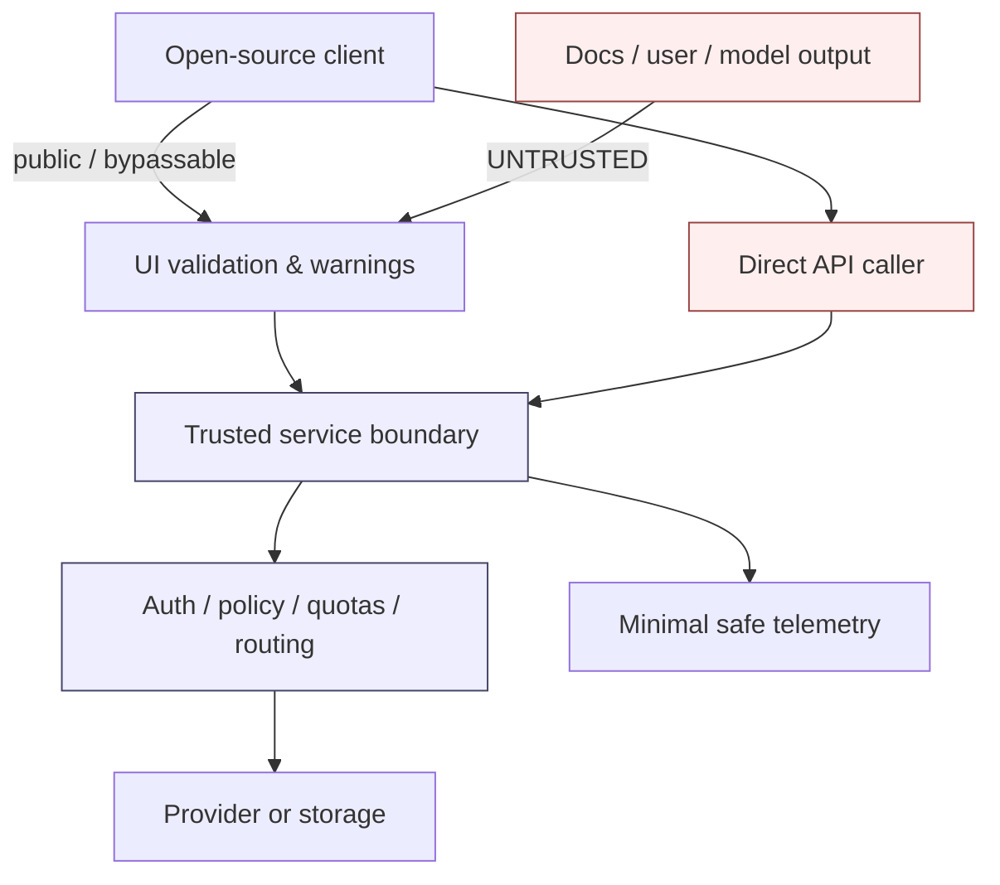

## Non-negotiable data hierarchy

Use controls in this order. Detection is deliberately late because regexes and
classifiers cannot make over-collection safe.


## Run contract

Every run is bounded. It must end with:

1. exact source diff;
2. new/updated executable regression tests;
3. mutation/positive-control evidence for the defect class where practical;
4. updated maintenance checkpoint / registry / state / verification;
5. a drop-in ZIP containing only `scikitplot/` and `maintenances/` overlay trees;
6. packaged-copy verification, not only working-tree verification.

Never mix an unrelated security domain into a run only because the file is
already open.

## Run 1 — client/build-time secret lifecycle — COMPLETE

### Goal

No bearer credential configured for Share/Feedback may persist in browser
storage or be serialized by Sphinx into static HTML.

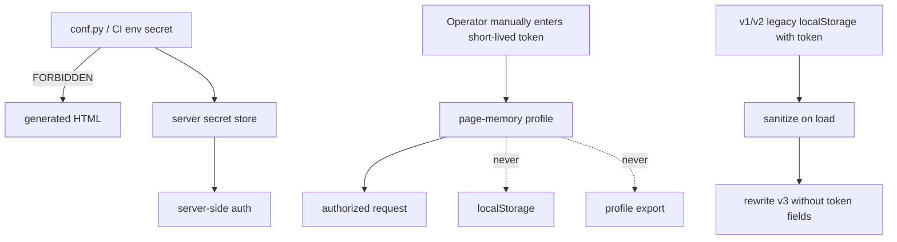

### Landed gates

- `tests/test_endpoint_secret_lifecycle.mjs`
- `tests/test_client_secret_boundary.py`
- mutation: `endpoint-token-persisted-again`
- mutation: `endpoint-legacy-token-storage-not-scrubbed`

### Residual

A same-origin script can still read a token while it is intentionally present in
page memory. Runtime browser tokens are therefore compatibility tools, not a
production secret-management mechanism.

## Run 2 — export / Share active-content isolation — COMPLETE

### Goal

Conversation/model content remains inert data in HTML download, Local preview,
self-contained Share, and Global Share.

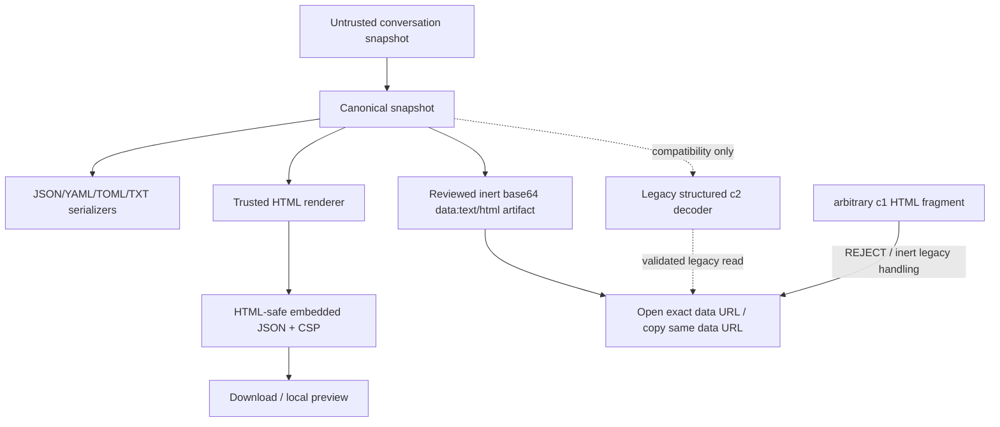

Required closure:

- literal `</script>` cannot terminate embedded data;
- no untrusted `javascript:` / event handler / raw HTML becomes executable;
- legacy `c1.html` cannot execute arbitrary Blob HTML;
- Share source URL strips query, fragment, credentials, and filesystem path;
- one canonical snapshot feeds every format/destination.

### Landed gates

- `tests/test_active_content_isolation.mjs`
- `tests/test_share_conversation.mjs`
- `tests/test_share_conversation_dom.mjs`
- mutation: `export-html-raw-json-breakout`
- mutation: `export-source-url-unsanitized`
- mutation: `share-c1-html-executable-again`
- mutation: `share-c2-loses-structured-envelope`
- mutation: `share-c2-skips-canonicalization`

### Residual

Global Share is intentionally **not** closed here. A direct API caller can still
bypass the client serializer and choose content/MIME at the current server
endpoint. Run 3 owns structured server storage, representation, authorization,
quotas, and headers. YAML/TOML/final Share IA remain Run 8.

## Run 3 — Global Share server capability / representation boundary

### Goal

The server stores structured data, owns response representation, and separates
public read capability from private mutation capability.

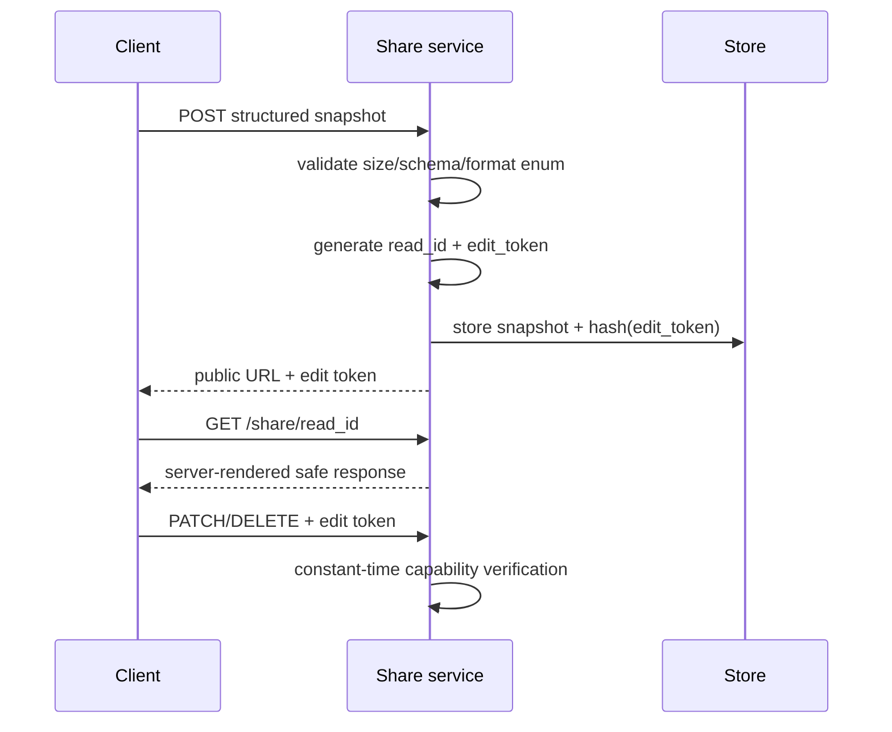

Required closure:

- client cannot choose arbitrary MIME / inline executable content;
- public ID alone cannot PATCH/DELETE;
- security headers/no-store/noindex policy;
- payload, entry-count, and aggregate-storage quotas;
- no public read/edit capability appears in logs.

### Run 3 landed

- HF + Cloudflare accept `{snapshot, format, ttlDays}` only;
- server canonicalization and representation are authoritative;
- create returns public read ID + memory-only private edit capability;
- PATCH/DELETE require `X-Share-Edit-Token`;
- application Share logs omit both capabilities and content;
- HF Uvicorn access logs disabled;
- no-store/noindex/nosniff/sandbox response policy;
- explicit per-entry/count/aggregate budgets;
- HF forwarded identity is opt-in; Cloudflare uses edge-injected `CF-Connecting-IP`.

Run 13 supersession: current generated Share URLs are fragment-backed and current operations use fixed request paths, so ordinary request-URL logs no longer receive the public locator. Legacy `/v1/share/{id}` compatibility paths remain a bounded migration residual. Cloudflare KV aggregate/count checks are still not transactionally atomic under eventual consistency; strict distributed quota requires a shared authority such as a Durable Object.

Landed gates:

- `tests/test_share_server_authority.py`;
- `tests/test_global_share_capability.mjs`;
- mutations `global-share-client-mime-authority-returns`,
  `global-share-patch-uses-endpoint-token`, and
  `global-share-edit-token-persisted`.

## Run 4 — prompt authority + credential destination binding

### Goal

Direct API callers cannot submit authoritative `system`/`developer` policy and
server credentials can reach only allowlisted/bound upstream destinations.

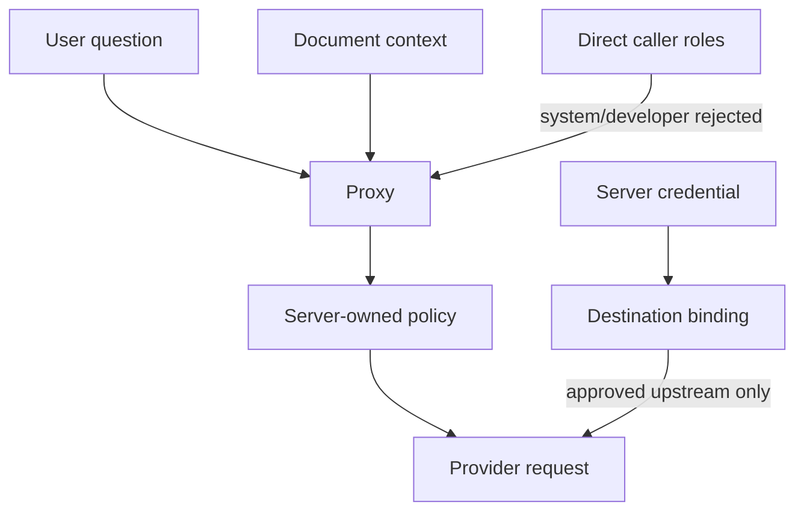

Run 4 landed invariants:

- browser negotiates `scikitplot-chat-v1`; trust is never inferred from hostname/provider label;
- HF proxy / Worker / dev proxy reject caller system/developer/messages/tool authority;
- `_hf_spaces_model` independently parses the same contract and builds policy locally;
- Path 2 preserves the structured envelope proxy → model service;
- model selection is allowlisted server-side before provider/model spend;
- `HF_TOKEN`, `BACKEND_AUTH_TOKEN`, and `HF_SPACES_AUTH_TOKEN` are destination-separated;
- credential-bearing redirects do not auto-follow.

Landed gates: `test_chat_authority.py`, `test_chat_authority.mjs`,
`test_model_service_authority.py`, JS harness integration, and Run 4 mutation positives.

Residuals intentionally remain in later runs: CORS parity, resource/rate limits,
centralized logging/traceback minimization, contribution provenance/retention,
and local sensitive-input preflight.

## Run 5 — logging / telemetry / diagnostic minimization

### Goal

Logs contain bounded operational metadata, never conversation text, bearer
capabilities, secrets, exact private URLs, or unsanitized tracebacks.

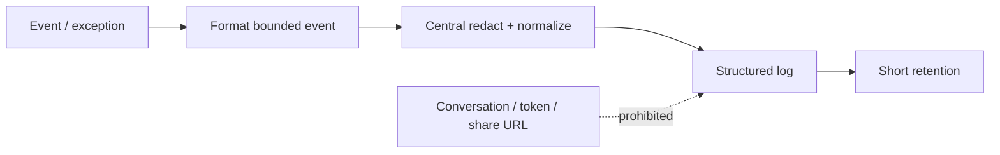

**Status: COMPLETE — B21 (2026-08-29), with deployment access-log residual.**

Run 5 landed invariants:

- HF proxy/model use byte-identical `_telemetry.py` privacy boundaries;
- ordinary log messages and exceptions use the same sanitization/bounding path;
- raw traceback/source-line/full-path logging is removed from model-service paths;
- partial-secret token fragments are prohibited;
- Worker application events omit feedback/session/share stable identifiers and
  raw exception messages;
- bundled HF Uvicorn access logs are disabled;
- proxy/model/dev public health/discovery returns only coarse capability/readiness
  data needed by clients, not backend/storage/token-class topology;
- discovery remains schema-tested and browser-compatible after minimization.

Landed gates: `test_logging_privacy.py`, `test_logging_privacy_mutations.py`,
`test_discovery_contract.py`, `test_storage_multisource.py`, Node harness
integration, and broad non-Sphinx regression.

Run 13 closes current-generated request-path exposure with a fragment-backed fixed viewer plus fixed operations. Run 14 further stamps current transport generation 2, rejects those objects on legacy `/v1/share/{id}` paths, retires legacy PATCH, and makes fixed update a one-way migration. `AIA-022`/`SEC-P0-15` remain PARTIAL only for still-live pre-generation URLs and deployment telemetry that records full request bodies/packets rather than ordinary request URLs.

## Run 6 — feedback / contribution / provenance / retention

**Status: COMPLETE via B22 — durable multi-replica quarantine and post-promotion physical-erasure guarantees remain explicit residuals.**

### Goal

Simple rating telemetry is minimal. Content contribution is separate,
version-consented, quarantined, provenance-labeled, reviewable, and not treated
as training truth on receipt.

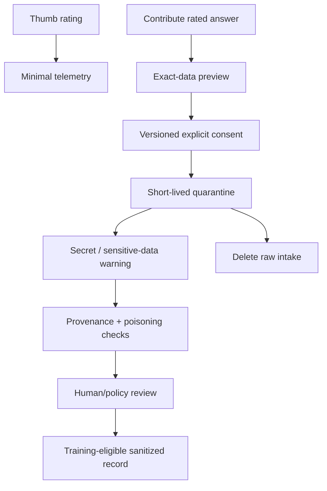

Deletion language must distinguish **withdraw from training** from **physical
data deletion**. Append-only Git/history storage is not an acceptable first
landing zone for raw sensitive contributions.

### Landed invariants

- browser rating telemetry is opt-in and contains rating/event mechanics only;
- server feedback normalization discards Q&A/comment/model/page/session content even from direct callers;
- persisted feedback is `trainingStatus=telemetry` and training-ineligible;
- current contribution consent is exact/versioned;
- raw accepted contribution content enters bounded mutable quarantine first;
- pending deletion uses an independent high-entropy capability;
- only `CONTRIBUTION_REVIEW_TOKEN` can promote rows to `trainingStatus=eligible`;
- client model/provider attribution is labeled `client_reported`, never silently verified;
- default dataset cleaning accepts eligible contribution rows only;
- withdrawal and physical erasure are not conflated.

Residuals: process-local quarantine is not a durable multi-replica control plane;
physical erasure after promotion to append-only/mirrored storage is not guaranteed;
Cloudflare currently has feedback-minimization parity but not contribution review
parity. Run 7 owns local secret/sensitive-input preflight.

## Run 7 — privacy preflight / sensitive-input user protection

**Status: COMPLETE via B23 — 2026-08-29.**

### Goal

Warn before sending likely secrets or sensitive information to an external
endpoint without claiming detection is complete.

- detect high-confidence credential shapes locally;
- show type/count, never echo the matching value into telemetry;
- offer Go back / Redact & continue / Continue unchanged for intentional input;
- inspect the actual inference envelope (user message + prepared page context),
  canonical Share snapshot, and explicit contribution payload before egress;
- surface Unicode/bidi/invisible characters as inspectable codepoint/count metadata;
- never label a payload “PII free” based only on regex/classifier output;
- bind delayed privacy decisions to the initiating conversation identity.

Landed invariants:

- one local preflight engine owns inference/Share/contribution warning semantics;
- findings retain only category/count/codepoint metadata, never matched source text;
- explicit redaction transforms an outbound copy and does not silently rewrite the
  transcript/composer/source;
- flagged data fails closed when the review UI cannot be presented;
- page context is included in review, not only the user-authored question;
- direct API callers remain governed by Runs 3-6 server controls because client
  preflight is advisory and bypassable.

Primary gates: `test_privacy_preflight.mjs`, `test_privacy_preflight_dom.mjs`,
`test_share_conversation_dom.mjs`, dynamic Node harnesses, and Run 7 mutation positives.

## Run 8 — YAML/TOML + final Share-sheet IA

**Status: COMPLETE WITH REAL-BROWSER ACCEPTANCE RESIDUAL — see B24.**

Landed:

- canonical snapshot with pre-serialization Content & privacy presets;
- five first-class formats: JSON / HTML / Text / YAML / TOML;
- deterministic YAML/TOML serializers with browser and server real-parser round-trip gates;
- one sheet-level destination model: Local preview / Self-contained / Global;
- one destination-aware result component;
- conservative self-contained-link size warning/block preflight;
- contribution isolated under More actions;
- lifecycle-aware **Created artifacts** registry;
- true Blob revoke for Local preview;
- truthful local-only removal for self-contained links;
- true server DELETE/Revoke for Global links when the memory-only edit capability exists;
- explicit device-file deletion guidance for Downloads; Share-sheet and direct toolbar downloads share one page-memory lifecycle registry;
- legacy IndexedDB Share-artifact clear action;
- new-chat behavior preserves old page-memory Global revoke capability until page close;
- Run 8 positive-control mutations for YAML/TOML structure injection, direct-download tracking, and artifact lifecycle regressions.

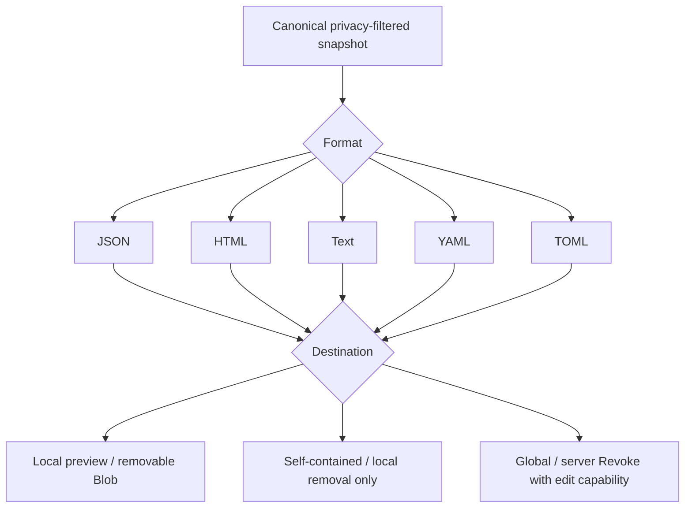

Residual: real representative-browser accessibility/responsive/focus/clipboard
acceptance remains required before closing `AIA-019`; source/fake-DOM testing is
not labeled browser E2E.

## Release closure

No release-level security claim until:

- all P0 findings are closed or explicitly deployment-blocking;
- direct-service bypass tests pass without browser involvement;
- hostile export/share fixture passes every supported representation;
- logs have positive controls proving tokens/capabilities are redacted/absent;
- full canonical Sphinx suite runs in an environment with Sphinx installed;
- production deployment configuration is checked separately from source tests.

## Run 9 — Global link artifact tracking

**Status: COMPLETE via B25 — infrastructure access-log and real-browser residuals remain.**

### Goal

Every Global link the assistant gives the user remains lifecycle-visible across
new-chat/reload boundaries without persisting private mutation authority.

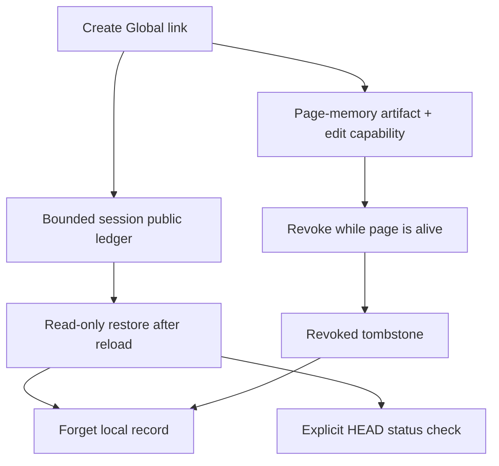

Landed invariants:

- `ai-assistant-global-share-ledger:v1` is `sessionStorage` only and capped at 25 entries;
- ledger persists public read URL/UUID + minimal lifecycle metadata only;
- `editToken`, snapshots, conversation text, content hashes, and credentials are never serialized into the ledger;
- new chat preserves prior Global artifacts while clearing current update state;
- reload restores all ledger entries read-only; edit/revoke authority is intentionally lost;
- successful server DELETE becomes a visible `revoked` lifecycle row until explicit Forget;
- expired/unavailable states do not overclaim the reason for a 404;
- status checks are explicit user actions; Run 13 current transport uses fixed `POST /v1/share/status` with a bounded locator body, `no-store`, and no redirect following;
- legacy `HEAD/GET` and authenticated `DELETE /v1/share/{id}` remain pre-generation-only; legacy PATCH is retired, and generation-2 objects return not-found on capability-bearing paths.

Run 13 supersedes the old path-based current transport. Newly generated/opened fragment links request only the fixed viewer path; legacy path links remain the migration residual.

## Run 10 — fail-closed Global lifecycle recovery

**Status: COMPLETE via B26 — packaged-copy evidence recorded in VERIFICATION.md.**

### Why this pass exists

Run 9 correctly separated public tracking from private mutation authority, but review of the actual recovery code found three residual lifecycle hazards:

1. `ai-assistant-global-share:v2` was parsed and returned nearly wholesale, so a legacy/tampered record could carry an old `editToken` or conversation-derived fields back into live state after reload.
2. A reason-unknown `404` was handled too destructively and the matching `_globalShareState` could remain a stale implicit PATCH target.
3. Expiry handling was not explicit on every bundled lifecycle route; stale storage could make GET/PATCH/DELETE semantics diverge from HEAD.

### Required flow

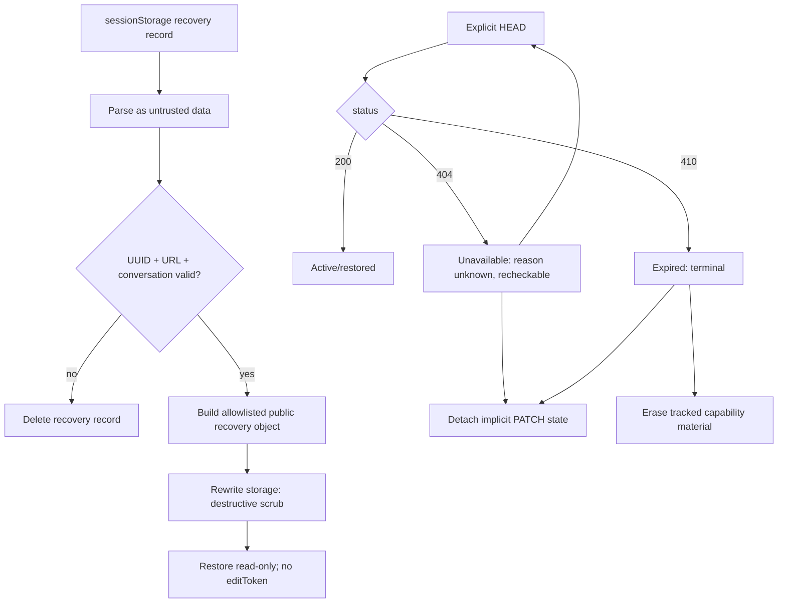

### Route parity

```text
HEAD expired   -> 410
GET expired    -> 410
PATCH expired  -> 410, client may POST fresh share
DELETE expired -> 410, not false successful revoke
```

### Non-negotiable rules

- Never trust a parsed Web Storage object as an authority-bearing runtime object.
- Never persist `editToken`, snapshot/message content, credentials, or `contentHash` in Global recovery storage.
- `404` is not `revoked`; keep it recheckable unless independent expiry evidence has matured.
- Detach unavailable/expired objects from implicit current-share PATCH selection.
- Only confirmed terminal states destroy the tracked public locator and live mutation capability.
- Cross-reload remote revoke remains intentionally unavailable without a separate management-credential architecture.
- An unavailable same-page artifact with a live edit capability exposes a distinct local Forget action so repeated remote 404 cannot make the lifecycle row unremovable.


## Run 11 — B05/B06 CORS, identity, request-limit and deployment parity

**Status: COMPLETE via B27; Run 15/B31 adds shared authority. `SEC-P0-31` is now deployment-conditional for HF rather than pure infrastructure debt.**

### Browser-origin flow

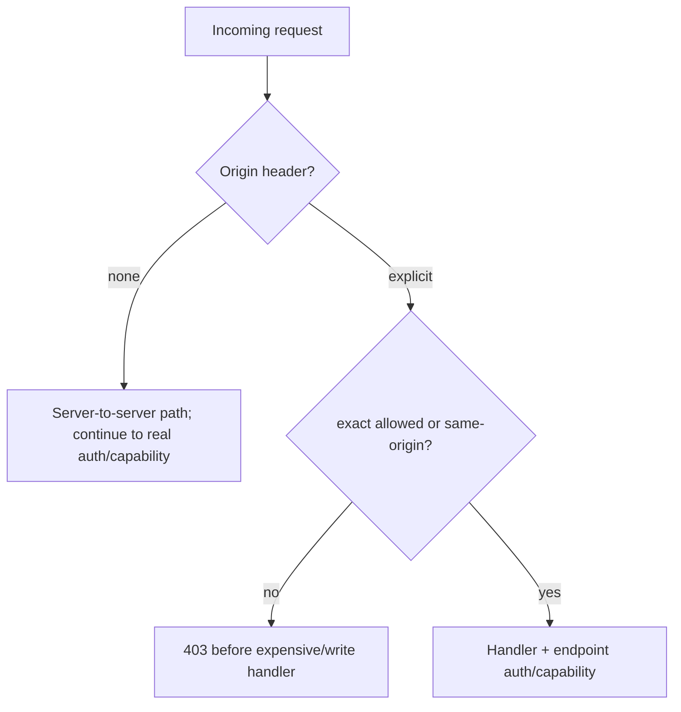

Origin is never mutation authority, identity proof, or a replacement for Share/feedback/provider credentials.

### Request-body flow

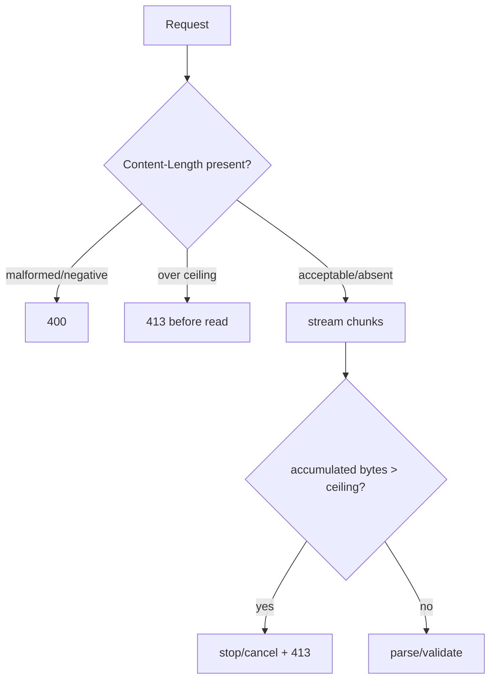

### Abuse-state semantics

HF process memory is hard-bounded per rate table. Worker KV uses unique TTL event keys to avoid same-key write throttling, but KV observation is eventually consistent. Both are abuse controls. Strict multi-replica/PoP quota requires deployment infrastructure; do not use these counters for billing or identity.


## Run 15 — authoritative distributed rate-limit deployment

### Cloudflare Worker

The bundled `wrangler.toml` binds `RATE_LIMIT_DO` to `RateLimitBucket`, exports SQLite-backed Durable Object storage, and sets `RATE_LIMIT_REQUIRE_AUTHORITATIVE=true`. Provision a separate `RATE_LIMIT_IDENTITY_SECRET` (>=32 random bytes) with Wrangler secrets. If the binding/secret/object fails, rate-limited operations fail closed before provider spend/write work. The KV event limiter exists only for explicit compatibility deployments that omit authoritative-required mode.

### Hugging Face / FastAPI proxy

Single-instance compatibility stays `RATE_LIMIT_BACKEND=local`. For horizontal replicas that require one quota domain:

1. provision one intended Redis consistency domain reachable by all replicas; prefer encrypted `rediss://` plus network ACL/auth;
2. set `RATE_LIMIT_BACKEND=redis`;
3. set secret `RATE_LIMIT_REDIS_URL`;
4. set a separate >=32-byte `RATE_LIMIT_IDENTITY_SECRET`;
5. set `RATE_LIMIT_REQUIRE_SHARED=true`;
6. verify public health/discovery says Redis/shared/authoritative/ready without exposing endpoint or secret values;
7. exercise an integration probe through more than one replica and verify the combined request budget is enforced.

Do not enable shared-required mode without Redis and then add a local fallback to improve availability: that silently changes one intended quota into N replica-local quotas. Decide explicitly between fail-closed authority and documented soft compatibility.

### Non-goals

Do not use these counters as authenticated identity, money/billing meters, or evidence of exact atomic accounting across independent/Active-Active Redis domains. Cloudflare's local/permissive Rate Limiting binding is not used as the authoritative cross-PoP contract here.


## Run 16 — shared contribution receipt authority deployment

For horizontally scaled contribution collection:

1. provision one intended Redis consistency domain reachable by every proxy replica; use TLS/ACL/network restrictions appropriate to the deployment;
2. set `CONTRIBUTION_LEDGER_BACKEND=redis`;
3. set secret `CONTRIBUTION_LEDGER_REDIS_URL`;
4. set a dedicated >=32-byte `CONTRIBUTION_LEDGER_KEY_SECRET` distinct from rate-limit/provider/review/delete credentials;
5. set `CONTRIBUTION_REQUIRE_SHARED=true`;
6. verify the contribution readiness/manifest reports shared + authoritative + ready without exposing URL/secret/raw receipt IDs;
7. exercise concurrent review through multiple replicas and verify only one promotion claim wins;
8. independently verify Redis persistence/replication/backup/recovery if cross-crash durability is required.

### Promotion ambiguity runbook

If a provider mutation times out or an operation claim expires after a write may have been issued, do **not** re-promote. The receipt must remain `promotion_uncertain` / reconciliation-required. Resolve by inspecting provider current state with privileged operational tooling and either reconcile the known promoted artifact or drive the receipt toward participant withdrawal. Redis lease expiry alone is not evidence that the old worker produced no external side effect.

### Non-negotiable rules

- Do not set `CONTRIBUTION_REQUIRE_SHARED=true` and then add memory/SQLite fallback for availability.
- Do not store raw receipt IDs, delete tokens, review tokens, operation claims, Redis URLs or HMAC secrets in shared key names/logs/discovery.
- Do not call Redis shared coordination “durable” unless persistence/recovery is separately verified.
- Do not automatically transfer an expired promotion lease across external provider side effects.
- Withdrawal recovery may be retried toward `withdrawn`; it may not restore uncertain content to training eligibility.

## B36 dataset-contribution release checks

Before shipping contribution UI/schema changes:

1. Confirm `/v1/feedback` payload construction contains no Q&A/content/page/model/conversation fields.
2. Confirm `_buildConversationShareSheet` contains no contribution submission or receipt-management authority.
3. Exercise **This Q&A**, **Rated answers**, and **Whole conversation** through the canonical contribution sheet.
4. Inspect the generated JSON and verify that exact object enters `_privacyPreflightReview`; then verify `_postTrainingContribution` receives exactly `review.value` (unchanged or explicitly redacted), with no independent rebuild.
5. For whole conversation, verify one `recordType="conversation"` row, ordered user/assistant `messages[]`, per-assistant model evidence, and no runtime error rows.
6. Verify schema v4 rejects legacy consent 1.0.0 while legacy v2/v3 remains compatibility-accepted.
7. Verify successful intake remains quarantined and the receipt capability still deletes pending content / withdraws training use without physical-erasure overclaim.
8. Run source, DOM, Python, mutation, broad non-Sphinx, syntax/compile, maintenance-drift, then exact packaged-byte gates.
9. Verify telemetry defaults local-only with no current consent record, ignores legacy boolean opt-ins, and rejects stale/malformed structured consent.
10. Verify consented feedback carries schema 4 + telemetry consent version/timestamp while Q&A/note/model/page/conversation data remain absent.
11. Verify turning telemetry Off blocks both rating POST and retraction with zero hidden final request, and verify HF/Worker reject requests missing the current consent marker before persistence work.
12. Verify the public `ai-assistant-feedback` DOM event is rating-only and cannot act as a content-bearing side channel.

## Run 20 — production release evidence

1. Run `python security/release_subjects.py` from the exact release source.
2. In networked CI install/build from the exact hash lock and run fresh dependency
   scanning.
3. Build the exact linux/amd64 image and record its immutable digest plus the
   resolved base-manifest digest.
4. Generate a full-image CycloneDX SBOM and High/Critical vulnerability result.
5. Generate SLSA/in-toto provenance whose subject is the final image and whose
   resolved dependencies include the exact base manifest; verify its signature
   through the approved CI/registry trust root.
6. Collect Redis operational/provider evidence. Use
   `probe_redis_authority.py --url-env <NAME>` only when useful; never place a
   Redis URL on the command line or in the release manifest.
7. Verify Share/Contribution persistence, replication and a successful
   backup/restore test within the policy window. Do not classify a rate-limit
   cache as durable user-data storage.
8. Confirm ingress/WAF/APM policy does not capture request bodies,
   Authorization/capability headers, query strings, or export third-party
   telemetry for this service.
9. Build `release-evidence.json` beside the external evidence files. Use only
   relative paths + SHA-256 + explicit subjects; include no secrets/topology.
10. Run `python security/verify_release_gate.py release-evidence.json`. Any
    non-zero result blocks promotion. Never downgrade this command to warning.
11. Retain the final manifest and external evidence outside the application image
    according to the organization's security evidence policy.

A B39 GREEN result proves binding/policy only. It does not close `SEC-P1-38`
until the concrete production release actually supplies trusted fresh evidence.

## Run 21 — runtime isolation release checks

1. Verify page integration defaults Off with no current v2 permission record.
2. Verify model/profile/conversation/contribution events still update internal UI
   while producing zero `document` events when page integration is Off.
3. Enable page integration and verify public event projections contain only their
   allowlisted bounded fields; never raw model objects, provider model ids,
   endpoint URLs/keys, bearer tokens, Q&A/note text or stable conversation ids.
4. Verify network feedback telemetry permission neither enables nor disables page
   integration; the two grants must remain independent.
5. Verify `SHARE_ALLOW_OPAQUE_ORIGIN=true` permits only viewer/read behavior.
   Create/update/revoke/capability mutation must still reject without the second
   write flag, including browser preflight.
6. Verify strict HF startup rejects `SHARE_ALLOW_OPAQUE_ORIGIN_WRITE=true`.
7. Verify `ai_assistant_allow_runtime_tokens` defaults False and injected token
   fields resolve to empty while Off. Test the explicit compatibility path only
   with the flag enabled and confirm no Web Storage persistence.
8. Verify HF/Worker Share viewer responses deny framing and sensitive browser
   permissions in addition to CSP/no-store/no-referrer.
9. Run B40 focused tests, all Node harnesses, mutation/privacy gates, complete
   runnable non-Sphinx suite, compile/syntax/TOML, maintenance drift, Sphinx
   boundary, then candidate/prefinal/final exact-byte acceptance.


## Run 22 — separate-origin isolation release checks

1. Validate isolation origin/path with Python tests; HTTPS production, localhost-only HTTP, no credential/path/query/fragment origin components.
2. Require host bridge registration before the full bundle and main-bundle self-suppression whenever isolation was requested.
3. Run the executable B41 host/frame harness: wrong origin/source rejection, exact targetOrigin INIT, one MessagePort, replay guard, capability deny-default, stripped page query/fragment, secret-safe config and parent-origin storage scope.
4. Run B40/B37 privacy/token/telemetry harnesses and the full dynamic Node registry.
5. Run mutation/privacy controls so page-context isolation does not rot injection, contribution-linkability or telemetry gates.
6. Run complete non-Sphinx and Sphinx-inclusive boundaries, Python compile, browser/Worker/host/frame JS syntax, TOML/release-subject and maintenance checks.
7. Package candidate → independently extract/retest → record metadata → prefinal → independently extract/retest → final immutable ZIP → independently extract/retest.
8. Do not close `SEC-P1-43` without real deployed-header/CORS evidence and do not generalize isolated-mode `SEC-P1-41` closure to compatibility mode.
