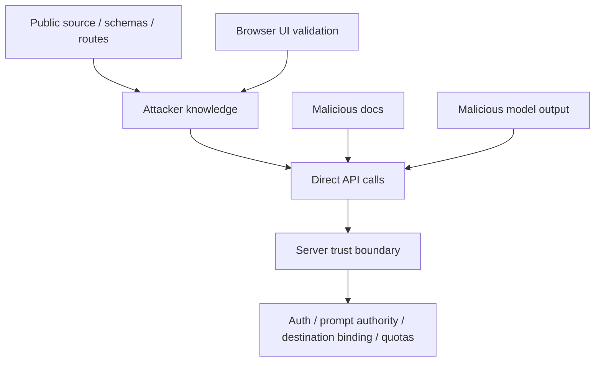
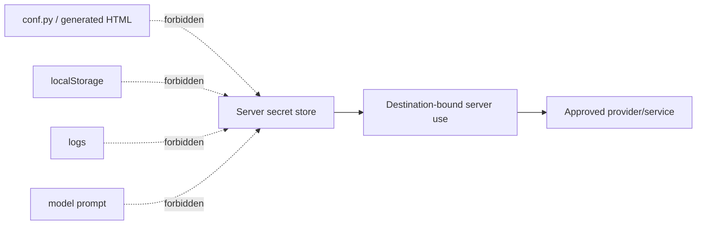
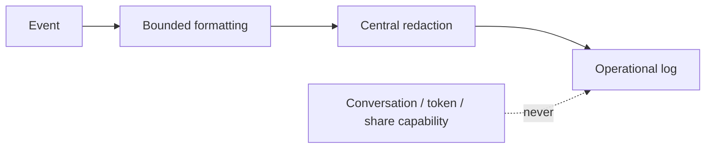
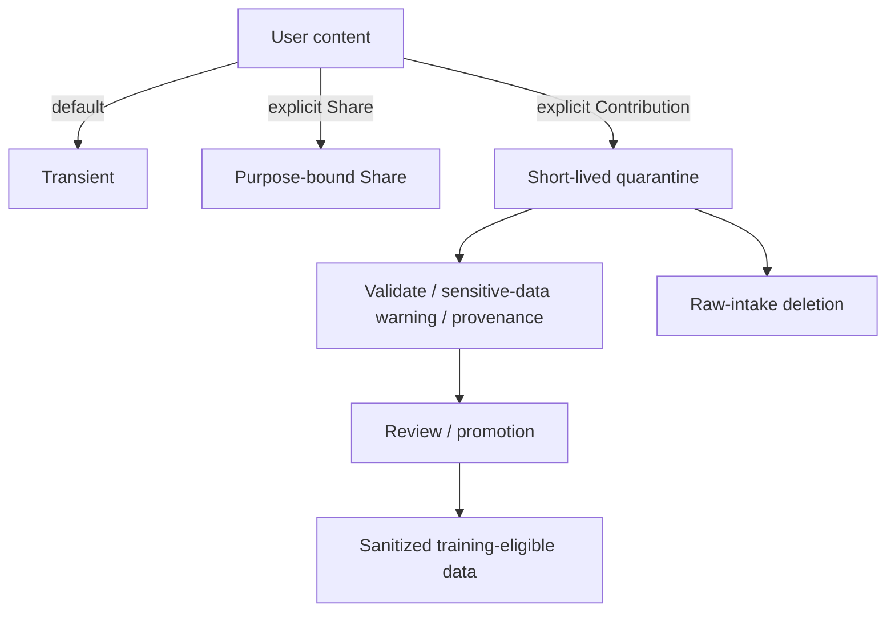

# `_sphinx_ai_assistant` Security Model

## Trust hierarchy

```text
SERVER-OWNED SECURITY/MODEL POLICY
        |
        +-- validates/authenticates/rate-limits/routes
        |
        +-- accepts USER INPUT as untrusted
        |
        +-- accepts DOCUMENT/RETRIEVAL CONTEXT as untrusted evidence

BROWSER
        presentation, local preferences, request UX
        never authoritative for secrets/auth/model policy
```

## Critical boundary families

### Secret boundary

Production credentials remain server-side. Client-visible configuration may
expose non-secret endpoint/capability metadata and booleans such as credential
presence, never values.

### Destination boundary

A server-held credential may be sent only to an approved/bound destination.
Configurable URLs must not turn a server token into an exfiltration primitive.

### Prompt boundary

The direct model/service endpoint enforces system-role ownership. A malicious
page, browser client, or API caller must not gain system authority by choosing a
message role or by embedding instructions in documentation.

### Authorization boundary

Possession of a share/read locator is not edit/delete authority. Write actions
need a distinct capability/authorization decision.

### Origin/identity boundary

CORS and forwarded-client identity have explicit trusted boundaries. The worker
and proxy cannot disagree in a way that creates a bypass path.

### Contribution boundary

Feedback/training data is attacker-controlled input until validated and stored
with consent/provenance/authenticity metadata. Persistence does not make it
trusted training evidence.

### Resource boundary

Body, streaming, concurrency, timeout, and storage limits protect allocation and
processing paths early enough to resist exhaustion.

## Static representation interaction

Using the build-time static Markdown reduces live-DOM variability and
makes page artifacts reviewable, but it does not neutralize malicious prose.
Every representation remains untrusted model context.


## Open-source attacker model



Anything before `TRUST` is bypassable. Browser validation remains useful for
reader safety but never closes a server-side finding.

## Data classification

| Class | Examples | Default handling |
|---|---|---|
| 0 public | source, schemas, public routes | no secrecy assumption |
| 1 operational | status code, latency bucket, event code | bounded logs |
| 2 conversation | query, answer, context, feedback text | transient |
| 3 sensitive/personal | private URLs, local paths, confidential/health/financial/legal material | minimize; explicit share/contribute only |
| 4 secrets/capabilities | API keys, tokens, private keys, edit capability | never client-build persisted/logged/prompted |

## Secret lifecycle



A short-lived token manually entered by an operator may exist in page memory as
a compatibility path, but same-origin script access means this is not a strong
production secret-management boundary.

## Logging boundary



## Retention / contribution boundary




## Run 13 Share transport boundary

For current generated Global Share links, the public read locator is browser-fragment state, not request-target state. The fixed viewer sends the locator only as bounded JSON body data to fixed same-origin Share operation paths. This reduces ordinary access/request-URL logging exposure; it does not make request bodies secret from an explicitly configured full-body WAF/trace/packet capture system. Legacy capability-bearing paths are a separately tracked migration surface. Run 14 makes that surface monotonic: current-generation objects are rejected there, legacy PATCH is retired, and fixed update migrates pre-generation objects to the current transport generation.


## Run 15 distributed rate-limit authority

B31 splits **soft abuse gates** from **shared quota authority**. HF local dictionaries and Worker KV unique-event observations remain useful bounded compatibility controls, but they are not globally atomic. Authoritative mode has a separate trust boundary:

- HF: one configured Redis consistency domain executes an atomic Lua increment/expiry operation; `RATE_LIMIT_REQUIRE_SHARED=true` makes absence/failure a 503 rather than an implicit local fallback.
- Worker: one Durable Object per route-family + HMAC identity owns the fixed-window state. Different PoPs resolve the same identity/scope to the same coordination object; bundled Wrangler requires the binding.
- Identity privacy: the rate-limit identity is operational network identity, not human authentication. A dedicated HMAC secret pseudonymizes it before Redis keys/DO names; this secret is not reused for providers or user auth.
- Claim boundary: neither backend proves billing-grade exact accounting across unrelated Redis domains, Active-Active conflict resolution, malicious operators, or authenticated person identity.


## Run 16 shared contribution receipt authority

B32 adds an optional Redis authority domain for horizontal contribution collection. The trust boundary is deliberately split:

- **receipt-state authority:** one Redis consistency domain serializes create/capacity, review claim, promotion finalization, withdrawal claim and terminal lifecycle state across participating replicas; raw receipt IDs are HMAC-pseudonymized before shared storage;
- **external side effects:** Git/Hugging Face/GitLab/Bitbucket writes are outside Redis transactions. A Redis lease cannot fence a paused worker after it has issued such a mutation, so expired or response-ambiguous promotion becomes `promotion_uncertain`, blocks re-promotion, and requires reconciliation or privacy-safe withdrawal;
- **durability:** Redis `shared/authoritative` describes coordination, not AOF/RDB/replication/backup guarantees. Production persistence/recovery policy is separate deployment evidence.

This is a distributed-saga safety boundary, not an exactly-once provider mutation claim.

## Dataset contribution purpose boundary — Run 17 / B36

Feedback telemetry, Share/export, and dataset contribution are separate purposes.
The browser may offer adjacent shortcuts, but only the dedicated contribution
controller may construct content-bearing `/v1/contribute` payloads. The same canonical schema-v4 object is inspected and enters privacy review; submission uses exactly the returned reviewed value, including an explicit redacted copy when the user chooses Redact.
Whole-conversation contribution is one ordered user/assistant record; runtime
errors and other non-dialogue roles are excluded. This UX separation does not
weaken server authority: intake remains quarantined and training-ineligible until
independent review promotion, with the existing receipt capability lifecycle.


### Feedback telemetry permission boundary — Run 17 / B36

The rating UI is a local interaction first. Network feedback requires two
independent application checks: a current structured browser permission and the
server's current telemetry-consent contract. Legacy boolean preferences, absent
state, malformed JSON, stale versions, and storage failure all resolve to Off.
The network helper and retraction helper self-gate, while the proxy/Worker reject
missing/malformed consent before rate-limit/storage work. The public DOM feedback
event uses the same content-free allowlist, so disabling network telemetry does
not leave a second Q&A broadcast channel to arbitrary page listeners. Operator
persistence settings govern storage only; they cannot manufacture reader consent.
The marker is not identity/authentication evidence and cannot authorize dataset
contribution.

## Recoverable create / browser-origin boundary — Run 18 / B37

Current browser Share/contribution creation treats management authority as a
client-held capability from the beginning of the operation. The CREATE request
contains only its SHA-256 digest plus bounded operation/resource identity; the
raw revoke/delete capability is not part of the request or response for current
browser-envelope clients. Exact replay is bound to resource, operation, payload,
and capability digest. Ambiguous outcomes remain recoverable rather than being
reclassified as failure.

Network feedback telemetry and public page-integration events are independent
purpose grants. Both are Off by default; enabling one cannot authorize the
other. This closes package-owned public event leakage but does not remove
same-origin JavaScript from the browser trust boundary. A stronger future
isolation architecture would host sensitive assistant state in a separate-origin
frame/service with a narrow capability/message interface.

Global Share storage properties are deployment facts, not UI adjectives.
Memory, SQLite, Redis, and Worker KV have different durability/consistency
semantics and health/discovery may expose only those coarse facts. In
particular, Workers KV eventual consistency and deterministic retry identities
do not amount to linearizable global mutation authority.


## Supply-chain and strict deployment boundary — Run 19 / B38

Release identity, runtime least privilege, and vulnerability evidence are three
separate claims:

```text
immutable digest + exact hash lock
        -> reproducible selected inputs
non-root/read-only/TLS strict profile
        -> application/reference least privilege
fresh advisory + image SBOM/CVE + provenance
        -> time-bounded release evidence
```

None implies the other two. In particular, a base-image digest cannot waive a
new CVE and a checked-in Python SBOM cannot describe OS/container layers.

All Redis-backed shared authority uses the same transport validator. Strict
mode requires TLS with certificate and hostname verification and rejects URL
query options before redis-py can interpret them. This protects transport
configuration but deliberately does not claim Redis ACL, persistence,
replication, backup or failover correctness.

## Release-evidence trust boundary — Run 20 / B39

Production evidence has two independent questions:

```text
Is this evidence bound to this exact source + artifact?
            |
            +-- repository verifier can prove
            v
Did the external scanner/provider/operator result itself come from a trusted,
current production process?
            |
            +-- release/operations trust root must prove
```

B39 closes only the first question. The manifest is short-lived and
content-addressed, includes a deterministic digest of Docker-owned application
source, and binds every scan/SBOM/provenance/signature artifact to the exact lock
or final image subject. SLSA provenance additionally names the resolved base
manifest. A GREEN source verifier is never promoted as proof that the external
scanner or Redis provider is truthful.

Infrastructure logging is a separate privacy authority. Browser rating consent
cannot authorize reverse-proxy/WAF/APM body capture, credential/capability header
logging, query logging or third-party telemetry export. Hardened promotion
therefore requires explicit Off evidence for those channels.

Redis probing is intentionally non-identifying. The B39 probe may establish
coarse transport/reachability/AOF/replication observations but never emits Redis
URL, host, user, key/value or replication-offset information and never asks an
operator to broaden ACLs solely for inspection.

## Runtime browser isolation boundary — Run 21 / B40

The host document is not an internal message bus. Internal assistant lifecycle
state travels through a private in-bundle bus. A reader may separately authorize
a bounded same-origin integration projection, but that grant is independent from
network telemetry and dataset contribution. Public projection is an allowlist,
not a copy-and-delete transform: unknown events fail closed and sensitive model,
endpoint, token, content and stable identity fields are not emitted.

`Origin: null` is ambiguous by design: local `file://` documents and sandboxed
hostile documents serialize identically. Therefore local-file Share viewing can
be enabled separately from mutation authority. The high-risk write opt-in is
never implied by read compatibility and is forbidden by the strict HF profile.

Browser memory is still readable by arbitrary compromised same-origin code.
Memory-only credentials are therefore not a sufficient isolation claim; browser
bearer entry is site-owner opt-in and Off by default. Separate-origin execution
with a narrow validated message contract remains the stronger future boundary.


## Separate-origin browser compartment — Run 22 / B41

The optional B41 mode changes the browser trust topology from one origin with a private JavaScript bus to two browser origins. The docs origin owns only a bounded context/canonical/print/UI/public-projection adapter. The assistant origin owns transcript, UI state, local/session storage and network interaction. A one-time exact-origin/source HELLO/INIT transfers a MessagePort; all later messages are bounded, sequenced, capability-scoped envelopes. The frame never receives an ambient parent DOM reference it can dereference across SOP. Storage is explicitly parent-origin namespaced.

This reduces exposure to ordinary/later-compromised docs-origin scripts but does not establish integrity of a fully hostile parent. `SEC-P1-42` and deployment-header evidence `SEC-P1-43` remain open.

### B41 bootstrap snapshot boundary

When separate-origin mode is requested, the parent bridge snapshots/sanitizes its non-secret configuration and endpoint descriptors immediately at startup. The later cross-origin INIT uses only that snapshot; secret-shaped and prototype-pollution keys are excluded. This removes a post-start asynchronous global-mutation race but does not make a parent compromised before bridge initialization trustworthy (`SEC-P1-42`).


## Run 23 / B42 — hostile-parent and egress narrowing

B42 strengthens the B41 compartment without changing the core residual: the docs parent is still the source of page content and presentation. Protocol v2 makes the isolated frame the owner of bootstrap entropy, validates a generated exact-parent policy before HELLO, and never places the capability in the iframe URL. The host capture listener is installed before frame attachment and uses snapshotted native event primitives.

The sandbox is treated as a navigation security boundary. `allow-popups-to-escape-sandbox` and top-navigation authority are absent; frame-self HTTP(S) navigation is intercepted so the assistant cannot navigate onto the docs origin while retaining script execution. External links leave the frame only through `_blank` + `noopener,noreferrer`.

Browser network credentials are also split by purpose. Assistant/model/Share/feedback/contribution service traffic is ambient-cookie-free by default and cannot escalate beyond `same-origin` under explicit compatibility. Canonical documentation reads remain intentionally same-origin because the docs host owns that content capability, but reads are redirect-blocked and streaming-bounded. Microphone delegation is independent and default Off.

`SEC-P1-42` remains open for compromise before host startup and hostile page/presentation integrity. `SEC-P1-43` remains external deployment evidence for response headers/CORS/CDN behavior.

## Run 24 / B43 — remote-response memory boundary

Remote response bytes are untrusted input even when the destination host is an
approved model or assistant service. Request-size limits do not bound response
allocation. B43 therefore treats response consumption as a separate trust
boundary:

```text
approved request destination
        |
        v
response headers
  | invalid/oversize Content-Length -> reject
  v
bounded stream reader
  | actual bytes > ceiling -> cancel/fail
  v
parse / render / forward
```

The browser uses distinct ceilings for chat, control/discovery, canonical
Markdown and public Share-viewer JSON. HF/dev proxies use a bounded streamed
collector for responses that must become buffered application responses. The
Worker keeps unknown-length responses streaming but wraps them in a byte-counting
stream. Missing browser stream capability is a fail-closed condition on these
security-sensitive paths, not a reason to call whole-body APIs.

The model does not yet assert that every optional provider-storage SDK/client
response is covered by B43; that is a separate residual audit surface.


## B44 semantic-context and provider-response invariant

Treat provider control metadata as a bounded control plane, never as an implicit bulk-transfer channel. Treat the live rendered documentation DOM—not a detached clone—as the strongest repository-controlled visibility authority available before model context serialization. This is a deterministic filtering boundary, not a claim of perfect human perception.
