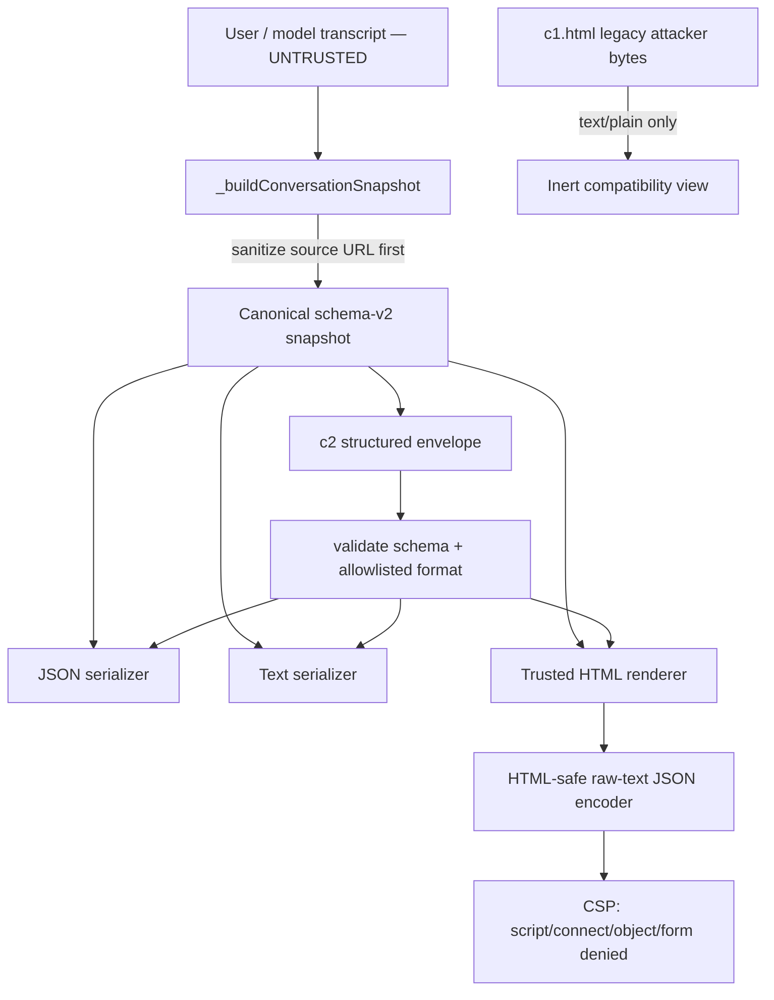

# B17 — Export / Share Content Isolation + Share-Sheet Information Architecture

Status: **IN PROGRESS — Run 2 client active-content isolation LANDED; Run 3 server Share boundary and Run 8 YAML/TOML/final IA remain**
Source baseline: **B16 overlay SHA-256 37228bb8fece0e181494a0a27f44d7689dcba03f60371293bf82b8e53c5e928c**
Run discipline: do not mark B17 complete until the hostile-content, structured-share, server-owned MIME, URL-redaction, and YAML/TOML gates are green.

## Run 2 implementation closure — 2026-08-29

Run 2 closes the browser/export execution primitives without claiming server-side
Global Share closure. The B16 unified Share shell remains in place.

### Landed data flow



### Closed in this run

- **SEC-P0-12 / AIA-020 client subfinding:** raw `JSON.stringify()` is no longer concatenated
  directly into the export `<script type="application/json">` raw-text context.
  `_jsonForHtmlRawText()` encodes `<`, `>`, `&`, U+2028, and U+2029 while
  preserving exact `JSON.parse(textContent)` semantics.
- **SEC-P0-13 / AIA-020 client subfinding (Run 2 historical state):** Run 2 moved current generation to `c2`, which
  carries `{share_schema, format, snapshot}` structured data. **Superseded by B33 / Run 16.2:** current generation is now a bounded inert base64 `data:text/html` artifact built from the same reviewed normalized snapshot; c2 remains compatibility/decode-only. Legacy `c1.html`
  and legacy IndexedDB HTML are never opened as `text/html`; they are inert
  `text/plain` compatibility views.
- **SEC-P0-17 / AIA-020 privacy subfinding (client/export side):** canonical export metadata now
  uses `_sanitizePage()` before every serializer. HTTP(S) keeps origin+pathname;
  query, fragment, URL credentials, and local/custom schemes do not enter the
  snapshot. Local `file:` pages do not create a path-leaking c2 hash URL and
  instead use the safe self-contained data-URI fallback already supported by
  the UI.
- Direct JSON/HTML/TXT download and Share now consume the same registry-owned
  canonical snapshot/serializer path.
- Generated HTML includes a restrictive CSP and `no-referrer` defense in depth.

### Still open — do not over-close B17

- **SEC-P0-14 / AIA-020 server subfinding:** Global Share server still accepts caller-controlled
  content/MIME and serves it inline. Run 3 owns this server boundary.
- **AIA-006 / AIA-C09:** public read locator still must be separated from
  PATCH/DELETE capability in Run 3.
- YAML/TOML and the final Local preview / Self-contained / Global information
  architecture remain Run 8.
- Real-browser CSP/navigation/clipboard/responsive validation remains required
  before release.

### Run 2 executable gates

- `tests/test_active_content_isolation.mjs` — hostile payload execution contract;
- `tests/test_share_conversation.mjs` — canonical Share architecture contract;
- `tests/test_share_conversation_dom.mjs` — runtime construction/lifecycle;
- mutation positives:
  - `export-html-raw-json-breakout`;
  - `export-source-url-unsanitized`;
  - `share-c1-html-executable-again`;
  - `share-c2-loses-structured-envelope`.
  - `share-c2-skips-canonicalization`.

---

## Part A — Export & Share Content Isolation Review


Status: **REVIEW COMPLETE — production fixes not yet applied**
Date: **2026-08-29**
Subsystem: **sphinx-ai-assistant export / Share conversation / HF Spaces share service**

## Source anchors

- `scikitplot__sphinx_ai_assistant_share_conversation_b16_overlay.zip`
  - SHA-256: `37228bb8fece0e181494a0a27f44d7689dcba03f60371293bf82b8e53c5e928c`
- `view-sourceblobnullabe54514-bfa0-4e2d-a4e9-7d96418a5b2c.txt`
  - SHA-256: `2e04763dcfd3c0e77d5c2806a73f9736548a3662c9ee5f7a50b416078c78f21a`

B16's unified Share-sheet architecture is not the problem and should remain. B17 reviews the lower trust boundary where untrusted conversation data becomes HTML, URL payloads, Blob documents, or server-hosted responses.

---

## Executive finding

The hostile fixture contains intentional prompt-injection, XSS, `javascript:`, hidden-comment, zero-width, bidi-control, and malformed-Markdown probes. The visible message renderer neutralizes the HTML/XSS probes correctly. The critical failure occurs later: raw transcript JSON is embedded inside a `<script type="application/json">` element without HTML-context encoding.

A literal `</script>` inside JSON therefore terminates the supposedly inert JSON element. Chromium execution against the exact supplied export produced:

- 2 `<script>` elements instead of the intended single inert JSON element;
- 2 injected `` elements;
- `window.__stub_xss === true`.

This is a confirmed active-content breakout, not a theoretical sanitizer warning.

The review also found two independent execution paths that remain dangerous even after the JSON-embedding bug is fixed:

1. the `#ai-share-c1.html.<payload>` reader decodes arbitrary attacker-controlled HTML and opens it as a `text/html` Blob;
2. the HF Spaces `/v1/share` API stores caller-controlled content + caller-controlled MIME and serves it inline from the service origin.

Therefore B17 must fix **content isolation**, not only escape `</script>`.

---

## Trust-boundary map

```text
conversation text (untrusted model/user data)
        |
        +--> _mdToHtml() --------------------------> visible bubble
        |       escapes HTML first                    CURRENTLY SAFE for tested payload
        |
        +--> JSON.stringify(snapshot)
                |
                +--> HTML export <script type=application/json>
                |       CURRENTLY UNSAFE: raw-text </script> breakout
                |
                +--> Session-only Blob
                |       HTML inherits the unsafe export document
                |
                +--> Portable data:text/html
                |       opaque origin, but active HTML still executes
                |
                +--> Permanent #ai-share-c1.html.<base64url>
                |       receiver decodes arbitrary HTML -> text/html Blob
                |
                +--> Global Share POST /v1/share
                        server trusts content + MIME -> inline response
```

---

## Finding register

### SEC-P0-12 / AIA-020(a) — P0 — HTML export raw-text breakout / stored XSS

**Evidence**

`_buildConvHtmlString()` uses `JSON.stringify(...)` directly for `jsonPayload` (`ai-assistant.js` ~7950-7962). `_buildExportHtmlDoc()` concatenates that string verbatim inside:

```html
<script type="application/json" id="export-data">
... raw JSON ...
</script>
```

(`ai-assistant.js` ~8217-8219).

The supplied hostile record contains a literal `</script>` inside `text`. HTML parsing terminates the outer JSON element before JSON parsing ever occurs.

**Impact**

- downloaded HTML can execute hostile model/user content when opened;
- Session-only HTML Blob inherits the same vulnerable document;
- Portable HTML carries the same vulnerable document;
- Global HTML carries the same vulnerable document;
- malformed remainder corrupts the exported JSON payload/view.

**Required invariant**

Raw JSON must never be concatenated into an HTML raw-text element without HTML-context encoding. At minimum encode `<` (`\u003C`), and consistently encode `>`, `&`, U+2028, U+2029 before embedding. Preserve exact data after `JSON.parse(textContent)`.

**Defense in depth**

The generated offline HTML should also contain a restrictive CSP that allows the inline CSS required by the export but denies script/network/object/form execution.

---

### SEC-P0-13 / AIA-020(b) — P0 — Self-contained hash accepts arbitrary executable HTML

**Evidence**

`_checkShareHash()` accepts:

```text
#ai-share-c1.html.<base64url>
```

It decodes the payload, assigns MIME `text/html;charset=utf-8`, creates a Blob, and opens it (`ai-assistant.js` ~26382-26403).

The payload is not authenticated, schema-validated, canonicalized, or rebuilt through the trusted renderer. Anyone can construct it.

**Impact**

On hosted HTTP(S) documentation, a Blob URL carries the creator origin. A crafted Share hash can therefore become an active-document gadget associated with the documentation origin if navigation/open succeeds. `noopener` removes the opener reference but does not make the Blob content inert.

**Required invariant**

A URL fragment must be treated as data, never as a complete executable HTML document.

**Recommended compatibility design**

- introduce `c2` self-contained links whose payload is a structured conversation snapshot, not rendered HTML;
- trusted page code renders that snapshot using existing safe renderer/DOM primitives;
- legacy `c1.html` should not be opened as `text/html`; fail closed, show a migration warning, or expose it only as inert text/download.

JSON/TXT legacy payloads can remain readable if MIME stays server/application-owned and inert.

---

### SEC-P0-14 / AIA-020(c) — P0 — Global Share is arbitrary active-content hosting

**Evidence**

`POST /v1/share` accepts caller-controlled:

- `content`
- `mimeType`
- `ext`
- `title`

and stores them unchanged (`app.py` ~2000-2050).

`GET /v1/share/{share_id}` returns `entry["content"]` with `entry["mimeType"]` and `Content-Disposition: inline` (`app.py` ~2069-2115).

No server-side format allowlist, HTML sanitizer, canonical snapshot validation, CSP, `nosniff`, or attachment isolation is applied.

**Impact**

The service can be used as arbitrary HTML/SVG/active-content hosting on the trusted HF Space origin. The problem exists even if the browser HTML serializer is fixed because a direct API caller can bypass the browser serializer entirely.

**Required invariant**

The server owns representation and MIME. Clients submit structured data, never an arbitrary response body + arbitrary MIME pair.

**Preferred v2 shape**

```text
POST /v1/share
{
  "schemaVersion": "share/2",
  "snapshot": { ...validated structured conversation... },
  "format": "html" | "json" | "txt",
  "ttlDays": ...
}
```

The server validates bounds/schema and chooses all response MIME/header behavior. For HTML viewing, use a trusted viewer over structured data rather than returning client-provided HTML verbatim.

---

### AIA-006 / AIA-C09 — existing P0 — read capability also grants edit capability

B17 confirms the existing finding remains valid and should not be duplicated under a new ID.

`PATCH /v1/share/{share_id}` explicitly documents that no ownership token is required and anyone knowing the UUID may update the public URL (`app.py` ~2163-2166).

**Required invariant**

- public/read locator: GET capability only;
- independent high-entropy edit token: PATCH/DELETE capability;
- browser conversation ID is never authorization.

Suggested response from POST:

```json
{
  "uuid": "public-read-id",
  "url": "https://.../v1/share/public-read-id",
  "editToken": "separate-secret",
  "expiresAt": "..."
}
```

Do not place the edit token in the public URL.

---

### SEC-P0-03 / AIA-006 related — P0/P1 — configured Share bearer token is not enforced by built-in HF proxy

The Sphinx/browser configuration exposes `ai_assistant_global_share_token` / `shareToken` as a bearer token for Share writes. `_remotePost()` sends it as `Authorization: Bearer ...`.

The built-in HF Spaces `POST /v1/share` and `PATCH /v1/share/{id}` handlers do not validate `Authorization` at all.

**Impact**

For the built-in proxy, the setting is not an authorization control. It may still be meaningful for a custom CF Worker or other endpoint, but the bundled HF implementation currently ignores it.

**Required decision**

Either:

1. implement a server-side Share write-token contract for the HF proxy; or
2. remove/clarify the token promise for that backend and rely on a different capability/auth model.

Because static documentation exposes browser-configured tokens to readers, such a token must be low-privilege/write-only and cannot be treated as a private server secret for public docs.

---

### SEC-P0-17 / AIA-020(d) — P1 — Share serialization leaks full page URL / local filesystem path

`_sanitizePage()` already defines the desired privacy behavior: HTTP(S) -> `origin + pathname`; non-HTTP schemes -> `<page-redacted>`.

The export/share builders do not use it. `_buildExportRecords()`, JSON, HTML, and TXT capture full `location.href`.

The supplied export exposes a full Windows `file:///E:/...` build path in the visible viewer and embedded records. On hosted docs, query strings and fragments can similarly contain OAuth state, tokens, searches, internal navigation, or PII.

Global Share sends this full URL inside the serialized `content`, so the normal server-payload privacy layer cannot redact it.

**Required invariant**

Sharing must use a privacy-safe source descriptor. Recommended default:

- HTTP(S): origin + pathname only;
- `file:`, `blob:`, `data:` and other schemes: `<page-redacted>` plus safe page title;
- optionally omit stable browser/session identifiers from public shares unless explicitly needed.

Direct offline export can use the same safer default unless a separate explicit "include source details" option is justified.

---

### SEC-P0-20 — P1 — Global capability URL is emitted as HTTP behind proxy

The user-observed Global link was `http://scikit-plots-ai.hf.space/...`; external retrieval redirects it to HTTPS.

The server constructs its returned URL from `request.base_url`. Behind a reverse proxy this can reflect the internal HTTP hop rather than the public scheme.

**Impact**

A share UUID is a bearer/read capability. An HTTP URL exposes that capability in the first plaintext request before a redirect unless the user agent upgrades locally through HSTS. Security must not rely on that upgrade.

**Required invariant**

Public share URLs must be emitted as canonical HTTPS URLs for non-local deployments. Prefer a configured canonical public base or trusted-proxy scheme handling; do not blindly trust arbitrary forwarding headers.

Client write endpoints should likewise reject non-HTTPS remote endpoints except loopback/local development.

---

### SEC-P0-21 — P1 — TTL semantics are not cache-safe

`GET /v1/share/{id}` has no explicit `Cache-Control: no-store` policy. The application TTL removes an in-memory entry, but browser/intermediary caches are a separate storage layer.

**Required invariant**

Conversation-share responses should not be cached unless there is an explicit cache design. Recommended baseline:

```text
Cache-Control: no-store
X-Content-Type-Options: nosniff
Referrer-Policy: no-referrer
```

For HTML viewer responses, also send a restrictive CSP and framing policy.

---

### SEC-P0-22 — P1 — Share store resource limits are too weak / operator override bypassed

The share handlers compare body size against `DEFAULT_MAX_BODY_BYTES` (10 MiB), not the configured module-level `MAX_BODY_BYTES`.

The in-memory `_share_store` has no global entry-count or byte-budget cap. With 10 accepted writes/hour per apparent IP, one client identity can attempt roughly 100 MiB/hour at the default maximum, and distributed/spoofed identities multiply that.

**Required invariant**

- use a dedicated `SHARE_MAX_BODY_BYTES` with a materially smaller default;
- enforce global entry and total-byte budgets;
- evict expired entries and reject/evict under pressure deterministically;
- expose operational metrics without content.

---

### SEC-P0-23 — P1/P2 — rate-limit identity trusts leftmost X-Forwarded-For

`_client_ip()` uses the first `X-Forwarded-For` value as the user identity. That is valid only when a trusted ingress guarantees the header cannot contain an attacker-supplied leftmost value.

**Required invariant**

Trust proxy-derived client IP only under an explicit trusted-proxy deployment contract. Otherwise use the ASGI server's validated proxy-header handling / known proxy depth, or fall back to `request.client.host`.

This is defense for abuse/resource limits, not an authentication mechanism.

---

### SEC-P0-24 — P2 — non-object JSON can produce 500s

After `json.loads(raw)`, Share POST/PATCH immediately use `payload.get(...)`. Valid JSON such as `[]`, `42`, or `"x"` has no `.get` method and can reach an unhandled exception.

Feedback already contains the correct pattern: validate `isinstance(payload, dict)` before field access.

**Required invariant**

Valid-but-wrong JSON shape returns deterministic 422, never 500.

---

### SEC-P0-25 — P2 — invisible/bidi control characters can visually spoof shared content

The hostile fixture includes zero-width spaces and bidi override/pop controls. They are not an XSS primitive by themselves, but they can make source code, URLs, commands, or identifiers appear different from their logical character sequence.

**Do not globally strip Unicode.** Legitimate languages/emoji can use invisible characters.

Recommended UX/security behavior:

- detect high-risk bidi controls (`U+202A..U+202E`, isolates, overrides) and selected zero-width controls;
- show a small "invisible/bidi characters detected" warning on affected messages/exports;
- provide a security/debug view that reveals code points;
- preserve the original raw text in structured export data.

---

## Delivery-path risk matrix

| Path | Current representation | Origin / execution | Main risk | B17 target |
|---|---|---|---|---|
| HTML download | generated HTML file | active browser document | JSON `</script>` breakout | safe embedded JSON + CSP |
| Session-only | `blob:` HTML | creator origin for normal HTTP(S) creator | same vulnerable HTML; origin privilege | safe HTML only; no arbitrary raw HTML |
| Portable | `data:text/html;base64,...` | unique opaque origin | active script can still run/exfiltrate; browser navigation limits | preferably structured/c2 transport, truthful warning |
| Permanent c1 | same-page fragment containing raw serialized content | decoded HTML is reopened as Blob | attacker-crafted arbitrary HTML gadget | c2 structured payload; legacy HTML fail closed |
| Global | server stores raw content + MIME | HF service origin | arbitrary active-content hosting | validated snapshot + server-owned representation |
| JSON/TXT | inert when MIME is correct | normally non-executable | server lets caller override MIME | server allowlist/owned MIME |

---

## Recommended architecture after B17

### 1. One canonical snapshot, multiple representations

Keep B16's `_EXPORT_FORMATS` registry and unified Share shell, but make the canonical trust boundary a **structured snapshot object**.

```text
_transcript + metadata
      |
      v
_buildConversationSnapshot({privacy: "share" | "export"})
      |
      +--> JSON serializer
      +--> TXT serializer
      +--> safe HTML renderer
      +--> c2 self-contained encoder
      +--> global share payload
```

The Share transport should not need to trust pre-rendered HTML.

### 2. Separate data encoding from display encoding

Introduce explicit helpers rather than one generic escape function:

- `_escapeHtmlText()` / existing `_escapeHtml()` — HTML text/attribute contexts;
- `_serializeJsonForHtmlRawText()` — JSON inside `<script type=application/json>`;
- `_sanitizeShareSourceUrl()` — privacy-safe metadata;
- `_validateShareFormat()` — allowlisted format IDs only.

Context-specific names make future misuse reviewable.

### 3. Self-contained link v2

Recommended payload:

```text
#ai-share-c2.<base64url(structured-json)>
```

Format is not authority. The trusted viewer renders the snapshot. If a requested download format needs to be remembered, put an enum inside the validated envelope rather than using it to choose an executable MIME directly from URL data.

Optional later upgrade:

```text
c3 = gzip/CompressionStream compressed structured payload
```

### 4. Global Share v2

- POST structured snapshot only;
- server validates schema, record count, string lengths, and total bytes;
- server generates/owns public representation;
- separate edit capability;
- GET uses HTTPS canonical URL, `no-store`, `nosniff`, no-referrer;
- HTML viewer gets strict CSP / framing isolation;
- raw JSON export can be a separate inert endpoint if needed.

### 5. Keep HTML download as a first-class export

HTML download remains useful and can stay fully offline. It simply must be generated through a secure serializer and be able to render every adversarial record without producing executable attacker-controlled nodes.

---

## Mandatory adversarial regression gates before B17 can close

### Browser HTML-export gate

Use the exact hostile fixture plus variants containing:

- `</script><script>...`
- mixed-case closing script tag;
- ``
- `javascript:` Markdown link;
- `</style>` / `</title>` probes;
- quotes, ampersands, `<`, `>`;
- U+2028 / U+2029;
- bidi and zero-width controls;
- malformed Markdown fences.

Assert in a real browser:

1. `window.__stub_xss` remains absent/false;
2. exactly the intended non-executable JSON payload element exists;
3. no hostile ``, event handler, executable `<script>`, iframe, object, form, or base element is created;
4. `JSON.parse(document.getElementById('export-data').textContent)` succeeds;
5. parsed hostile strings exactly round-trip as data;
6. no network request is generated by hostile content.

### Self-contained-link gate

A hand-crafted `c1.html` payload containing executable HTML must not execute. New `c2` payloads accept only the structured schema and render through trusted code.

### Global API gate

Assert:

- top-level non-object JSON -> 422;
- unknown format / caller MIME override -> 422;
- arbitrary `text/html` body cannot become a raw inline response;
- public GET cannot PATCH without edit capability;
- edit token is never included in public URL or GET body;
- expired/not-found behavior remains deterministic;
- security/cache headers are present;
- canonical URL is HTTPS in deployed mode;
- configured byte and store quotas are enforced.

### Privacy gate

Assert global/self-contained shares do not contain:

- page query string;
- page fragment;
- local `file:///` path;
- unnecessary local/session-only identifiers.

---

## Suggested implementation order

Do not patch all symptoms independently. Apply in this order so later layers build on a safe primitive:

1. **Snapshot + privacy-source helper** — define the canonical data contract first.
2. **Secure HTML serializer** — fix raw-text JSON and add browser adversarial gate.
3. **Disable raw HTML execution in c1 hash path; add c2 structured self-contained reader.**
4. **Harden Global Share API representation/MIME/schema.**
5. **Split read/edit capability.**
6. **Add HTTPS canonicalization + response security/cache headers.**
7. **Add resource quotas and trusted-proxy rate-limit identity.**
8. **Add invisible/bidi warning UX.**
9. **Only then return to optional B16 UX ideas such as payload-size preflight.**

This ordering prevents a cosmetic warning or CSP-only patch from masking an active-content boundary that still accepts arbitrary HTML.

---

## B17 closure criteria

B17 must not be marked complete until all of these are true:

- hostile supplied export executes no attacker-controlled script in Chromium;
- HTML JSON payload round-trips exactly without raw-text breakout;
- no URL/hash input is opened directly as caller-supplied `text/html`;
- built-in Global Share no longer serves arbitrary caller MIME/content inline;
- public read locator cannot mutate a share;
- share-source metadata obeys the privacy policy;
- deployed public links are HTTPS capability URLs;
- share responses have explicit cache/security headers;
- malformed JSON shapes and over-limit payloads fail closed;
- mutation tests prove each critical guard is load-bearing;
- B16's unified Share sheet, format-switch behavior, async state isolation, and direct download behavior remain green.


---

## Part B — Share-Sheet Information Architecture / YAML / TOML Contract


Status: **DESIGN REVIEW / IMPLEMENTATION CONTRACT — production code not yet changed**
Date: **2026-08-29**
Depends on: **B16 unified Share sheet**, **B17 Export & Share Content Isolation review**

## 1. Decision

Keep the B16 architecture: one Share conversation sheet and one export-format registry.

Do **not** keep the B16 user mental model of four overlapping link concepts inside every format panel.
The next implementation should organize the sheet around three independent questions:

1. **Format** — how should the snapshot be represented?
2. **Destination** — where/how should the snapshot be opened or shared?
3. **Content & privacy** — what data may be included?

Everything else is progressive disclosure.

```text
Share conversation
│
├── 1. Format
│      JSON | HTML | Text | YAML | TOML
│
├── 2. Destination
│      Local preview | Self-contained link | Global link
│
├── 3. Content & privacy       [collapsed by default]
│      preset + granular metadata controls
│
├── 4. Advanced / Format options [collapsed]
│
└── Result
       summary + Copy/Open/Update/Revoke as applicable
```

The current **Download ↔ Share** toolbar mode remains a separate top-level behavior. The Share sheet may expose a small “Download this format instead” helper, but must not duplicate the whole Download workflow.

---

## 2. Why the current sheet needs another structural pass

The current unified sheet fixed duplication, but each format panel still mixes:

- temporary local Blob creation;
- a Base64 data URL;
- a self-contained hash plus IndexedDB;
- server-backed Global Share;
- training-data contribution;
- format description;
- link rows and per-tier save/update state.

These are not one decision axis.

Specific UX problems:

- `blob:null/<uuid>` is technically a local object URL, but looks hostile and is not useful as a person-to-person “share link”.
- Portable and Permanent both embed the conversation into a URL, so they are two implementations of one user concept.
- “Delete permanent link” cannot revoke a copied self-contained link; it only removes local state.
- showing the complete Base64 URL makes the UI look corrupted/malicious and adds no routine value.
- Global Share is genuinely different because it is server-backed, short, expiring, and can support update/revoke after authorization is fixed.
- Training contribution is a consent/data-collection action, not a share destination.

---

## 3. Proposed complete sheet copy

### Header

**Share conversation**  `[HTML]`

> Create a local preview, a self-contained link, or an expiring global link.

Secondary live summary:

> `8 turns · 16 messages · 27.4 KB`

If suspicious invisible/bidi characters exist:

> `⚠ Invisible formatting characters detected`  **Inspect**

This warning is informational. Raw data is preserved; the UI does not silently delete Unicode.

---

## 4. Section 1 — Format

Use one keyboard-accessible tab/segmented control driven entirely by `_EXPORT_FORMATS`:

```text
[ JSON ] [ HTML ] [ Text ] [ YAML ] [ TOML ]
```

Below the tabs, show **one contextual sentence only** for the active format.

### JSON

**Label:** JSON
**Hint:** Structured · pandas / APIs
**Description:**
> Complete structured snapshot for pandas, APIs, tests, and model pipelines.

### HTML

**Label:** HTML
**Hint:** Readable · browser view
**Description:**
> Readable offline conversation page generated by the trusted viewer.

### Text

**Label:** Text
**Hint:** Simple · copy / notes
**Description:**
> Plain human-readable transcript for editors, notes, and email.

### YAML

**Label:** YAML
**Hint:** Structured · human-readable
**Description:**
> YAML 1.2 snapshot for configuration-oriented tooling and readable structured data.

### TOML

**Label:** TOML
**Hint:** Structured · tooling / config
**Description:**
> Deterministic TOML snapshot using tables and arrays of tables for tooling and configuration workflows.

### Format-order policy

Canonical registry order:

```text
JSON → HTML → Text → YAML → TOML
```

Do not maintain a separate hard-coded order in the toolbar, Share sheet, tests, or export cards.

Responsive behavior:

- desktop/tablet: one row where space permits;
- narrow view: horizontally scrollable tab list with visible focus/selection, **not** five compressed unreadable buttons;
- optional future `More` menu only when the implemented registry becomes materially larger than five or six formats.

---

## 5. Section 2 — Destination

Replace the current `private/public` variable with a semantic destination enum:

```text
local | self_contained | global
```

Never use “private/public” for transport behavior; it overstates privacy semantics.

### A. Local preview — default

**Title:** Local preview
**Description:**
> Open a temporary preview in this browser. Nothing is uploaded.

Badges:

`Local` · `Temporary`

Primary action:

**Open preview**

Behavior:

- generate a Blob from the trusted serializer;
- open it;
- do **not** expose `blob:null/...` as the main user-facing value;
- revoke old Blob URLs deterministically;
- for HTML, only safe canonical HTML may enter the Blob;
- for JSON/YAML/TOML/Text, Blob is inert text/data.

Optional secondary helper:

**Copy temporary URL** may exist under Advanced/Debug only, with explicit warning that it is local/tab-scoped and is not a normal share link.

### B. Self-contained link

**Title:** Self-contained link
**Description:**
> Embed the conversation in the link. No server is used.

Mandatory helper copy:

> Not encrypted · anyone with the complete link can read it · cannot be revoked after sharing.

Primary action:

**Create link**

Result area should **not render the huge Base64 payload in an input by default**.
Show:

```text
Self-contained link ready
36.2 KB · no server · not revocable
[ Copy ] [ Open ] [ Inspect ]
```

`Inspect` may reveal:

- encoded size;
- format;
- snapshot schema;
- safe source-page descriptor;
- optional “Show full URL” disclosure for debugging.

Implementation target:

- new `#ai-share-c2.<base64url(structured-envelope)>` transport;
- payload is a validated structured snapshot/envelope, never caller-supplied rendered HTML;
- trusted page code renders/serializes the snapshot after decoding;
- format is an allowlisted enum in the envelope, not executable MIME authority.

Example envelope:

```json
{
  "share_schema": "c2",
  "format": "html",
  "snapshot": { "schema_version": "2.0", "session": {}, "turns": [], "records": [] }
}
```

Optional future compression:

`c3` may add gzip/CompressionStream, but only after c2 is stable and size tests justify it.

### C. Global link

Render only when a valid Share endpoint is available.

**Title:** Global link
**Description:**
> Create a short server link that expires automatically.

Helper:

> Expires in **30 days** · update/revoke requires the private edit capability.

Primary action before first save:

**Create global link**

Result after success:

```text
https://…/v1/share/<public-id>
Expires 28 Sep 2026
[ Copy ] [ Open ] [ Update ] [ Revoke ]
```

When no endpoint is configured:

```text
Global link
A Share endpoint is not configured.
[ Configure endpoint ]
```

The helper should deep-link/open **Endpoint Configuration**, not merely display a dead disabled card.

Security contract before Global may be considered complete:

- client sends structured snapshot + allowlisted requested representation;
- server owns MIME/content rendering;
- GET/public ID is read-only;
- separate edit token/capability is required for PATCH/DELETE;
- server stores only a hash of the edit token where practical;
- public URL never contains the edit capability;
- canonical public URL is HTTPS outside local development;
- responses use explicit no-store/security headers;
- payload/store quotas are enforced.

---

## 6. Section 3 — Content & privacy

Collapsed by default under:

**Content & privacy**  `Standard`

The controls modify the **canonical snapshot before serialization**. A field hidden here must not remain secretly embedded in HTML JSON, YAML, TOML, or Global payloads.

### Presets

#### Standard — default for normal sharing

- Messages: on
- Timestamps: on
- Model/provider: on
- Ratings/feedback: on
- Error messages: on
- Page title: on
- Safe source page: on
- Session identifier: off
- Raw local/query/hash page details: never

#### Minimal

- Messages: on
- Timestamps: off
- Model/provider: off
- Ratings/feedback: off
- Error messages: on
- Page title: off
- Safe source page: off
- Session identifier: off

#### Complete

- Messages: on
- Timestamps: on
- Model/provider: on
- Ratings/feedback: on
- Error messages: on
- Page title: on
- Safe source page: on
- Session identifier: on only after explicit user opt-in

“Complete” does **not** disable source-URL sanitization.

### Granular controls

Under `Customize`:

```text
☑ Timestamps
☑ Model and provider
☑ Ratings and feedback
☑ Error messages
☑ Page title
☑ Safe source page
☐ Session identifier
```

Locked security row:

```text
🔒 Remove URL query, fragment, and local filesystem path   Always on for Share
```

For offline Download mode, future configuration may allow exact source URL as an explicit opt-in, but Share must remain privacy-safe by default.

### Conversation scope helper — P2, but architecture-ready

Do not implement until the safe snapshot layer is stable, but reserve the model:

```text
Full conversation | Latest turn | Rated answers | Custom selection
```

The first implementation may expose only `Full conversation`; capability can be added without serializer rewrites if snapshot filtering is centralized.

---

## 7. Section 4 — Advanced / helpers

Collapsed by default. Only show controls meaningful to the active format/destination.

### Universal helpers

- **Estimated size:** `27.4 KB`
- **Messages:** `16`
- **Turns:** `8`
- **Security:** `Source URL sanitized`
- **Unicode warning:** number of bidi/invisible controls, if non-zero
- **Reset options**
- **Download this format instead**

### Self-contained link preflight

Before generation show size status:

```text
27.4 KB — good for a self-contained link
```

Threshold states should be configurable:

- OK
- Warning: may be truncated by apps/browsers
- Block: use Global link or Download instead

Do not rely on one universal browser maximum. The product should use conservative application limits and clear fallbacks.

### HTML options

- Theme: `Auto | Light | Dark`
- Include embedded machine-readable snapshot: on by default; still safely raw-text encoded
- Viewer density: `Comfortable | Compact` (optional P3)

HTML security settings are **not user-disableable**:

- safe embedded JSON encoding;
- restrictive export CSP;
- no remote network dependencies;
- no script execution;
- no untrusted raw HTML.

### JSON options

- Pretty print: on
- Shape: `Snapshot` default; optional future `Records only`

### YAML options

- Pretty/block style: fixed on
- Multiline message strings: block scalar when safe/readable
- Explicit document marker `---`: optional, default off
- No tags, anchors, aliases, or executable/custom object types

### TOML options

- Multiline message strings: multiline basic/literal string chosen safely
- Stable table ordering: fixed on
- Null policy: fixed/documented — optional/null fields are omitted; schema semantics define omitted optional fields as null
- No datetime coercion for message/user data; timestamps remain numeric + ISO strings as in canonical snapshot

### Global options

- Expiry: show resolved TTL; changing it is allowed only if endpoint policy/config explicitly permits it
- Update existing link: on by default after first global save
- Revoke link: available only after edit-capability support is implemented

---

## 8. Result area — one component, not four duplicated link rows

Use one destination-aware result component:

```text
Result
┌──────────────────────────────────────────────┐
│ Global link ready                           │
│ https://example/…                           │
│ Expires 28 Sep · HTML · 27.4 KB             │
│ [Copy] [Open] [Update] [Revoke]             │
└──────────────────────────────────────────────┘
```

For self-contained links, hide the huge URL text by default:

```text
Self-contained link ready
36.2 KB · HTML · not encrypted · not revocable
[Copy] [Open] [Inspect]
```

For local preview:

```text
Preview ready
Temporary · this browser only
[Open preview] [Create again]
```

This component owns operation status:

`idle → preparing → ready | warning | error`

Network/update operations additionally use:

`creating → ready → updating → ready`
`ready → revoking → revoked`

No button should claim success before clipboard/network completion resolves.

---

## 9. Training contribution

Move **Contribute to training** out of the main Share destination flow.

Recommended within this checkpoint:

```text
More actions
└── Contribute rated answers…
```

Selecting it opens a dedicated consent section/sheet.

Reason:

- Share = user distributes a snapshot.
- Contribution = user sends selected data to a training/data endpoint under consent.

Combining them makes consent semantics harder to understand and increases the chance that a user believes sharing implies training or vice versa.

If moving it to a separate sheet is too large for B17, keep it collapsed behind **Data contribution** with a strong divider and do not reuse Share wording/buttons.

---

## 10. Canonical format registry v2

Extend the current `_EXPORT_FORMATS` rather than adding format-specific `if` chains.

Recommended record shape:

```js
{
  fmt: 'yaml',
  label: 'YAML',
  hint: 'Structured · human-readable',
  desc: '...',
  shareDesc: '...',
  mime: 'application/yaml',
  ext: '.yaml',
  buildStr: function (snapshot, options) { ... },
  icon: ICONS.exportYaml,
  capabilities: {
    structured: true,
    humanReadable: true,
    download: true,
    localPreview: true,
    selfContained: true,
    global: true,
    activeDocument: false,
    previewKind: 'code'
  },
  optionSchema: { ... }
}
```

HTML differs in capability metadata:

```js
activeDocument: true,
previewKind: 'rendered'
```

For JSON/YAML/TOML/Text, `previewKind: 'code'` means Local preview should use a trusted escaped code/text viewer rather than depending on whether a browser chooses to display or download `application/yaml` / `application/toml`. Download still uses the registered format MIME.

That flag is **descriptive**, not permission to accept arbitrary HTML. HTML content is still generated only by the trusted serializer/viewer.

Recommended full live set:

| fmt | MIME | ext | structured | local preview | self-contained | global |
|---|---|---|---:|---:|---:|---:|
| json | `application/json` | `.json` | yes | yes | yes | yes |
| html | `text/html;charset=utf-8` | `.html` | rendered + embedded snapshot | yes | yes via c2 trusted viewer | yes via server viewer |
| txt | `text/plain;charset=utf-8` | `.txt` | no | yes | yes | yes |
| yaml | `application/yaml` | `.yaml` | yes | yes | yes | yes |
| toml | `application/toml` | `.toml` | yes | yes | yes | yes |

Do not use legacy unregistered YAML MIME aliases for new output.

---

## 11. Canonical snapshot first

Introduce one function before adding YAML/TOML:

```js
_buildConversationSnapshot(options)
```

It returns the canonical data object after:

1. transcript selection;
2. feedback/model pairing;
3. content preset/filtering;
4. page/source sanitization;
5. privacy choices;
6. deterministic field ordering policy.

Then every serializer consumes that object:

```text
_buildConversationSnapshot()
       |
       +--> _serializeConversationJson(snapshot, opts)
       +--> _serializeConversationYaml(snapshot, opts)
       +--> _serializeConversationToml(snapshot, opts)
       +--> _serializeConversationText(snapshot, opts)
       +--> _renderConversationHtml(snapshot, opts)
       +--> c2 self-contained envelope
       +--> Global Share POST snapshot
```

Direct Download must also use these same serializers. Remove the remaining duplicated JSON/TXT reconstruction paths.

---

## 12. YAML serializer contract

YAML is a new format in this source; implement a deliberately small, deterministic YAML 1.2 serializer over the canonical JSON-like snapshot types only:

Supported input values:

- object with string keys;
- arrays;
- UTF-8 strings;
- finite numbers;
- booleans;
- null.

Rules:

- deterministic key order from snapshot construction;
- two-space indentation;
- quote ambiguous strings that could be retyped (`yes`, `null`, dates, numbers, booleans, leading/trailing spaces, special punctuation);
- multiline message text may use `|-` with correct indentation;
- never emit custom YAML tags;
- never emit aliases/anchors;
- never deserialize YAML in the browser merely to display it;
- round-trip test through at least one standards-compliant YAML parser in test tooling.

The serializer should prioritize **data preservation and predictability**, not clever compact YAML.

---

## 13. TOML serializer contract

TOML does not have a native `null` value. Therefore do not claim byte/type identity with JSON.

Define a documented semantic mapping:

- root scalar metadata → root keys;
- `session` → `[session]` table;
- `turns` → `[[turns]]` arrays of tables with nested `[turns.user]` / `[turns.assistant]` handling or a deterministic equivalent that remains valid TOML;
- `records` → `[[records]]` arrays of tables;
- optional canonical values that are `null` are omitted;
- under schema v2 semantics, omitted optional fields reconstruct to null when converting back to the canonical snapshot;
- arrays must be homogeneous where TOML requires it;
- strings are escaped by one dedicated TOML-string helper;
- multiline message text uses a safe multiline string form only when it round-trips exactly; otherwise use escaped basic strings;
- finite numbers only;
- timestamps remain the canonical numeric millisecond value and ISO string rather than being implicitly converted to TOML datetime types.

Add a serializer metadata comment/header:

```toml
# AI Assistant conversation export
# schema_version = "2.0" semantics: omitted optional values represent null
```

Tests must parse the produced TOML with a real TOML parser and compare reconstructed canonical semantics.

---

## 14. Configuration / customization model

Avoid adding dozens of unrelated flat globals. Normalize old flat keys into one internal Share config object.

Recommended author-facing shape:

```js
shareConversation: {
  title: 'Share conversation',
  enabled: true,
  formats: ['json', 'html', 'txt', 'yaml', 'toml'],
  defaultFormat: 'html',
  destinations: ['local', 'self_contained', 'global'],
  defaultDestination: 'local',

  content: {
    defaultPreset: 'standard',
    allowCustomize: true,
    includeTimestamps: true,
    includeModel: true,
    includeRatings: true,
    includeErrors: true,
    includePageTitle: true,
    includeSafeSourcePage: true,
    includeSessionId: false
  },

  security: {
    sanitizeSourceUrl: true,          // locked true for Share
    warnInvisibleCharacters: true,
    allowLegacyC1Html: false
  },

  limits: {
    selfContainedWarnBytes: 48 * 1024,
    selfContainedMaxBytes: 256 * 1024
  },

  ui: {
    showSummary: true,
    showAdvanced: true,
    showFullEncodedUrl: false,
    rememberLastFormat: true,
    rememberLastDestination: true
  }
}
```

Exact byte thresholds are product defaults, not browser guarantees; tune after real-browser tests.

Legacy keys such as `panelShare`, `panelShareLabel`, `panelGlobalShareEndpoint`, and endpoint-profile settings remain supported through `_getShareConversationConfig()` normalization.


### Custom-format extension rule

Author/runtime customization is intentionally narrower than the internal registry. A config/API may:

- enable/disable known format IDs;
- reorder known format IDs;
- choose a default;
- override non-security display copy if desired.

It may **not** provide a serializer function, MIME type, arbitrary extension, raw HTML template, or executable preview handler. If third-party export formats are needed later, introduce an explicit initialization-time plugin registration API with validation/tests and a clear trust boundary; do not turn the Share-sheet editor into a code-execution surface.

### Safe runtime customization API — optional later

```js
AI_ASSISTANT.setShareFormats(['html', 'json', 'yaml', 'toml', 'txt'], 'html')
AI_ASSISTANT.setShareDestination('local')
AI_ASSISTANT.resetSharePreferences()
```

Only allow known registry format IDs and destination IDs. Never accept serializer functions, MIME strings, or arbitrary HTML through this public UI API.

---

## 15. State model

Outer sheet owns:

```text
selectedFormat
selectedDestination
contentPreset / contentOptions
advancedOpen
resultState
conversationId
```

Format panels should no longer each own independent copies of destination controls.

The destination/result operation captures an immutable operation context:

```js
{
  operationId,
  conversationId,
  format,
  destination,
  snapshotHash,
  startedAt
}
```

Any delayed callback must verify its context before mutating visible state.

Changing format/content/destination after a result exists marks the result **stale** rather than silently pretending the old link contains the new settings:

> `Conversation or options changed — create/update the link to publish the latest snapshot.`

This is clearer than hidden content-hash logic alone.

---

## 16. Security invariants for the new sheet

1. Conversation/model text is untrusted data.
2. Content filters operate before serialization.
3. HTML is generated only by the trusted renderer.
4. JSON inside HTML raw-text contexts is HTML-safe encoded.
5. Self-contained links carry structured data, not arbitrary HTML.
6. Server owns MIME and rendered response.
7. URL query/hash/local filesystem path never enters Share output by default.
8. No UI label says private unless an actual privacy boundary exists.
9. Self-contained means **not encrypted** and **not revocable**.
10. Global read and edit capabilities are separate.
11. Clipboard success UI occurs only after resolved success.
12. Invisible/bidi characters are preserved as data but can be surfaced visually.
13. YAML tags/aliases and TOML type tricks are never generated from user text.
14. Registry/config cannot inject arbitrary MIME/serializer/HTML code.

---

## 17. Accessibility and keyboard contract

- `role=dialog`, labelled title, real focus trap/restore behavior;
- format control uses `tablist`/`tab` or a true single-select control consistently;
- Arrow keys move format selection; Home/End supported;
- destination cards are real radio-like buttons, not nested interactive elements;
- collapsed sections expose `aria-expanded` and `aria-controls`;
- async status/result uses polite live region; errors are announced assertively only when necessary;
- warnings never rely on color/icon alone;
- large encoded URLs do not become enormous focus traps;
- all primary actions have unique contextual accessible names, e.g. `Create self-contained HTML link`.

---

## 18. Test additions

### Registry

Assert exactly one live entry for JSON/HTML/TXT/YAML/TOML and no TOML preview remains.

### Serializer round-trip

- JSON parses and matches canonical snapshot.
- YAML parses and matches canonical snapshot exactly.
- TOML parses and reconstructs canonical semantics with omitted-null policy.
- TXT preserves expected visible transcript content.
- HTML viewer renders safely and embedded JSON reconstructs canonical snapshot.

### Cross-format hostile fixture

Use the current hostile fixture in **all five formats**, including:

- `</script>`;
- HTML event handlers;
- `javascript:` links;
- multiline strings;
- quotes/backslashes;
- `#`, `=`, `[`, `]`, `{`, `}`;
- YAML-looking `!!tag`, `&anchor`, `*alias`, `---`, `...`;
- TOML-looking table headers and multiline delimiters;
- zero-width and bidi controls.

Assert they remain data only.

### Destination

- Local preview never requires/copies a user-visible Blob URL by default.
- Self-contained c2 rejects malformed/non-object/oversize envelopes.
- c1 HTML never executes.
- Global requires server-owned representation and edit capability for mutation.
- changing format/content marks result stale.

### Privacy

Assert every format excludes query/fragment/local path under Share policy.

### Mutation gates

Add mutants for:

- raw `</script>` embedding;
- arbitrary c1 HTML Blob open;
- MIME supplied by client;
- missing edit-token check;
- source URL unsanitized;
- YAML raw scalar injection / indentation break;
- TOML raw string/table-header injection;
- stale async result applied to new format/conversation.

---

## 19. Implementation order

1. Canonical snapshot + content/privacy options.
2. Collapse direct exports onto canonical serializers.
3. Secure HTML serializer / embedded JSON.
4. Add YAML serializer + parser round-trip tests.
5. Add TOML serializer + omitted-null semantic tests.
6. Promote YAML/TOML into `_EXPORT_FORMATS`; remove TOML stub.
7. Replace per-format destination controls with one sheet-level destination section.
8. Implement Local preview + unified result component.
9. Implement structured self-contained c2 + disable active c1 HTML behavior.
10. Harden Global server contract + read/edit capability.
11. Move/collapse Training contribution into a separate action boundary.
12. Add preflight/invisible-character helpers and real-browser E2E.

Do not start with CSS. The snapshot/serializer boundary must become safe first; UI should then render those stable capabilities.

---

## 20. Final proposed user flow

```text
User clicks Share-mode HTML
        ↓
Share conversation [HTML]
        ↓
Format: HTML               (changeable to JSON/Text/YAML/TOML)
        ↓
Destination: Local preview (default)
        ↓
Content & privacy: Standard
        ↓
[ Open preview ]

or

Destination: Self-contained link
        ↓
27.4 KB · Not encrypted · Not revocable
        ↓
[ Create link ]
        ↓
Self-contained link ready
[ Copy ] [ Open ] [ Inspect ]

or

Destination: Global link
        ↓
Expires in 30 days
        ↓
[ Create global link ]
        ↓
https://…/v1/share/<public-id>
[ Copy ] [ Open ] [ Update ] [ Revoke ]
```

This keeps the interaction compact while making the security/lifetime model understandable without exposing implementation artifacts such as `blob:null/...`, raw Base64 payloads, IndexedDB UUIDs, or transport-specific internal terminology.


---

### Run 3 landed — Global server representation boundary

The Global path now consumes the same structured canonical snapshot contract.
HF and Cloudflare reject caller-rendered `content` / `mimeType` / `ext`, render
JSON/HTML/Text server-side, and split public read from private edit capability.
See `B19_GLOBAL_SHARE_SERVER_AUTHORITY.md`. YAML/TOML and the final Share IA
remain intentionally deferred to Run 8.
