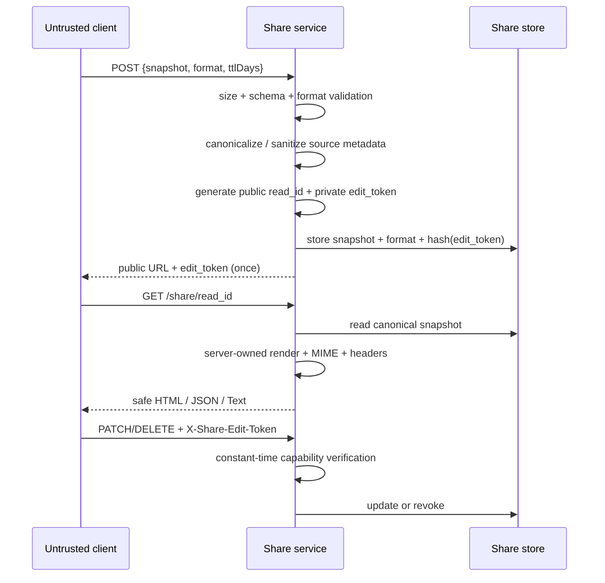
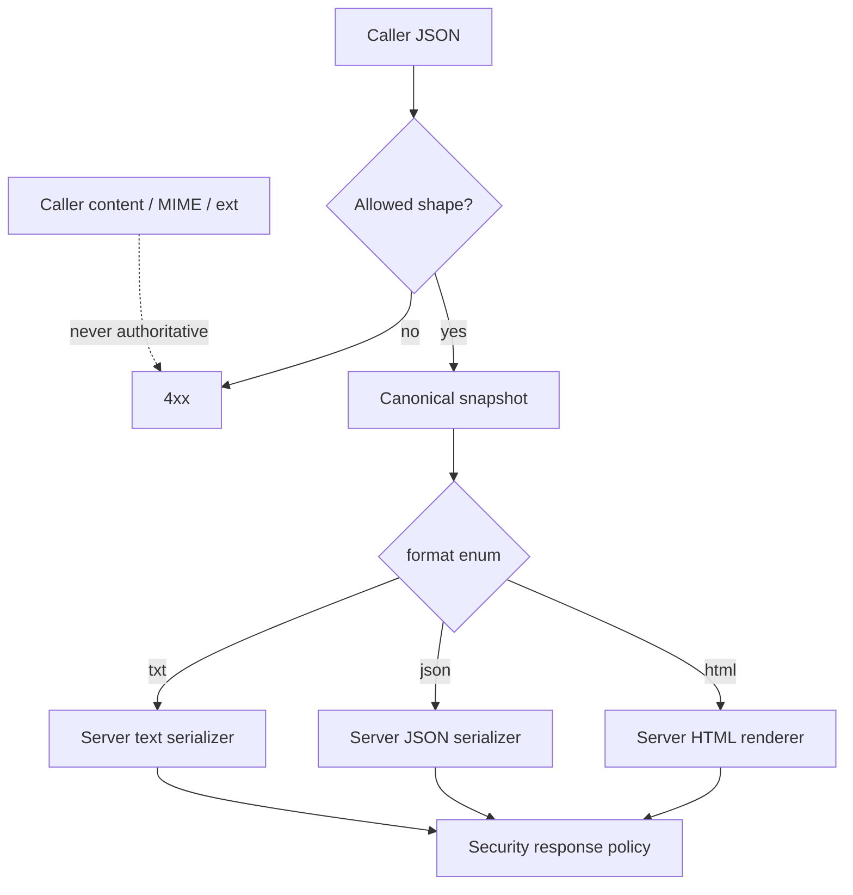
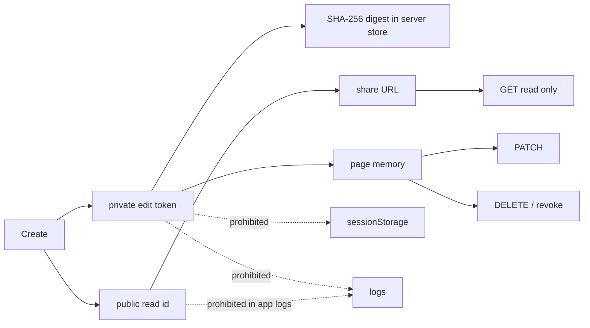

# B19 — Global Share Server Authority & Capability Separation

Status: **RUN 3 CODE-LAYER COMPLETE — deployment logging / strict distributed quota residuals documented**
Date: **2026-08-29**
Depends on: **B17 Run 2 active-content isolation**, **B18 privacy/secrets/identity threat model**

## 1. Decision

Global Share is a server security boundary. The browser is not allowed to choose
rendered content, MIME type, file extension, public identifier, or mutation
authority.

## 2. Required trust rules

1. `POST /v1/share` accepts structured snapshot data only.
2. Caller-supplied `content`, `mimeType`, `ext`, rendered HTML, and public IDs are not authority.
3. Supported representation is an allowlisted enum: `html | json | txt` in Run 3.
4. Server canonicalizes the snapshot again even if the browser already did so.
5. Unknown root/session/record fields are discarded.
6. Per-record `session_id` / `page_url` claims are rebound to canonical session values.
7. Source URL is HTTP(S)-only and strips credentials, query, and fragment.
8. Server owns response MIME, extension, rendering, security headers, and cache policy.
9. Public read ID and private mutation capability are distinct high-entropy values.
10. Server stores only a digest of the edit capability.
11. PATCH and DELETE require `X-Share-Edit-Token`; public URL possession is insufficient.
12. Browser keeps the edit capability in live page memory only; sessionStorage persists only public link state.
13. Application logs contain neither public share IDs/URLs nor edit capabilities nor conversation content.
14. Per-entry, live-entry-count, and aggregate byte budgets are explicit.
15. Forwarded client identity is trusted only when deployment explicitly declares a trusted ingress boundary.

## 3. Representation boundary

HTML rendering is deliberately simple: no Markdown execution, no scripts, no
remote dependencies, and every message is HTML-escaped. The HTTP response adds
CSP `sandbox`, `default-src 'none'`, `X-Content-Type-Options: nosniff`, frame
denial, no-referrer, noindex/noarchive, and `private, no-store`.

## 4. Capability lifecycle

A page refresh may restore the public URL from sessionStorage, but not its edit
capability. If the conversation changes after such a refresh, the browser
creates a new share instead of pretending it still has authority over the old
one.

## 5. Resource / abuse limits

### HF in-memory service

Defaults:

- `SHARE_MAX_BODY_BYTES = 512000`
- `SHARE_MAX_ENTRIES = 256`
- `SHARE_MAX_TOTAL_BYTES = 16 MiB`
- 10 Share writes per client identity per hour

Expired entries are swept on create. The rate-limit identity dictionary is also
pruned by time window. `X-Forwarded-For` is ignored unless
`TRUST_X_FORWARDED_FOR=true` is explicitly configured for a trusted ingress that
overwrites caller-supplied forwarding headers.

### Cloudflare Worker

Defaults are equivalent for body/count/aggregate budgets. KV metadata records
canonical byte size so capacity checks do not need to load message bodies.

**Residual:** Workers KV is eventually consistent. Therefore count/aggregate
checks are conservative but not a globally atomic quota under concurrent edge
writes. The 500 KiB per-entry limit is hard. A deployment requiring a strict
transactional global quota must move Share state/counters to a Durable Object or
another transactional store. Do not mislabel the KV gate as atomic.

## 6. Logging boundary

Application events may include only bounded operational metadata such as:

- event name;
- format enum;
- byte count;
- TTL;
- masked/hashed abuse identity where applicable.

They must not include:

- public Share UUID / URL;
- edit token or its raw value;
- snapshot/message text;
- exact private source page;
- caller Authorization header.

The bundled HF Uvicorn command uses `--no-access-log` because path-based bearer
URLs would otherwise appear in request lines.

**Historical deployment residual (B19):** pre-Run-13 links use `/v1/share/<read-id>` and can expose the locator to request-URL logs. B29 supersedes the current generated transport with a fragment-backed fixed viewer; the legacy path remains compatibility-only until retired.

## 7. Compatibility consequences

- Old Global Share clients that POST `{content, mimeType, ext}` receive 422.
- PATCH now requires the per-share edit capability; UUID-only update is removed.
- New create responses include `editToken`; update responses do not echo it.
- Existing in-memory/KV entries written under the old raw-content schema are not
  interpreted as trusted HTML by the new read path; they fail validation rather
  than being served as arbitrary active content.
- Run 3 supports JSON/HTML/Text. YAML/TOML are intentionally deferred to Run 8,
  where they will be added to both client and server allowlists from the same
  canonical snapshot contract.

## 8. Verification gates

Executable gates introduced/expanded in Run 3:

- `tests/test_share_server_authority.py`
  - server snapshot canonicalization;
  - hostile HTML remains inert;
  - caller MIME/content rejected;
  - read/edit separation;
  - PATCH/DELETE capability enforcement;
  - edit token not stored raw;
  - no-store/noindex/sandbox response policy;
  - entry + aggregate quotas;
  - optional create-token guard;
  - forwarded identity opt-in.
- `tests/test_global_share_capability.mjs`
  - browser structured payload;
  - memory-only edit capability;
  - Worker structured storage/representation;
  - Worker PATCH/DELETE capability checks;
  - Worker response headers/capacity gates;
  - Share application log events omit capabilities.
- mutation positives:
  - `global-share-client-mime-authority-returns`;
  - `global-share-patch-uses-endpoint-token`;
  - `global-share-edit-token-persisted`.

## 9. Closure statement

Run 3 closes the **application-code** Global Share authority defect: a direct API
caller cannot use the supported HF or Cloudflare route to host caller-selected
active MIME/content, and a public read locator cannot PATCH/DELETE.

It does **not** close:

- upstream infrastructure access-log retention of path capabilities;
- globally atomic Cloudflare KV aggregate quotas;
- prompt authority / credential destination binding (Run 4);
- centralized traceback/log redaction (Run 5);
- feedback/contribution retention/provenance (Run 6);
- local secret/sensitive-data preflight (Run 7);
- YAML/TOML/final Share IA (Run 8).

## Run 13 transport supersession

B19's capability-bearing public path remains supported only as a legacy compatibility API. B29 changes all newly generated browser links/operations to fragment-backed fixed paths while preserving B19's read/edit authority split.
