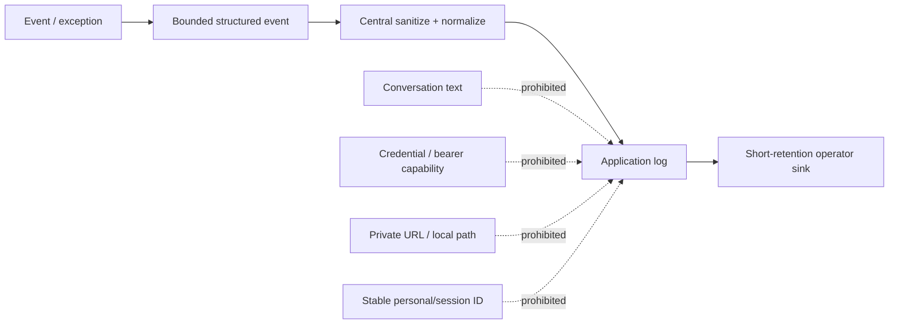
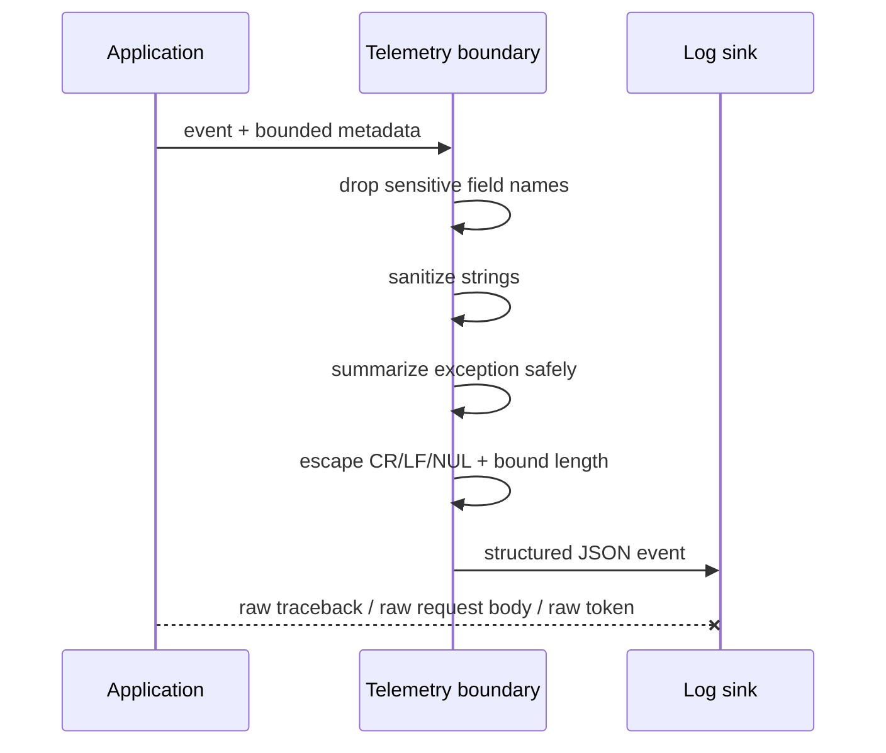
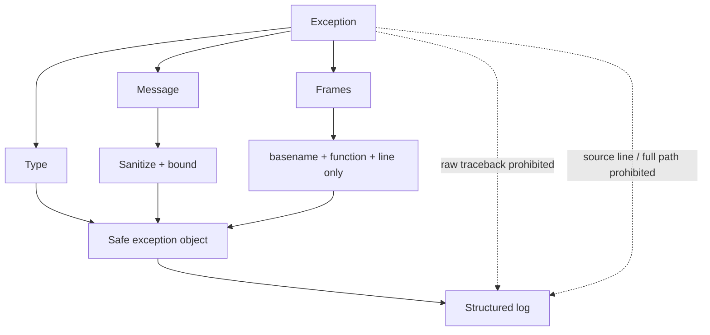
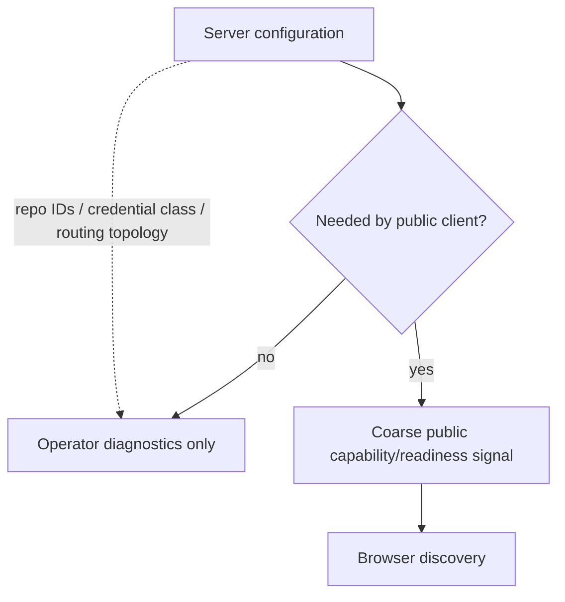

# B21 — Logging, Telemetry & Diagnostic Minimization

Status: **RUN 5 COMPLETE — bundled application logs/tracebacks and public diagnostics are privacy-minimized; infrastructure/provider access logs remain a deployment residual**
Date: **2026-08-29**
Depends on: **B18 privacy/abuse threat model**, **B19 Global Share authority**, **B20 prompt authority**

## 1. Decision

Logs are a secondary data store. In an open-source assistant they must be designed
as if operators, hosting providers, incident responders, and future log exports
may all see them. Therefore the application records only bounded operational
metadata. Conversation text, feedback comments, bearer capabilities, credentials,
private/local URLs, exact deployment topology, and stable personal identifiers
are not diagnostic payloads.



Security does not depend on the redactor recognizing every possible personal datum.
The primary control is **data minimization before logging**; pattern redaction is a
secondary containment layer for unexpected exception/message text.

## 2. Shared telemetry boundary

The HF proxy and direct model service now ship byte-identical `_telemetry.py`
modules. The shared boundary provides:

- `sanitize_log_text(...)` — high-confidence secret/private-value redaction,
  control-character escaping, and hard length bounding;
- `safe_exception_summary(...)` — exception type + sanitized bounded message + a
  small frame summary using basenames/function/line only;
- `safe_event_fields(...)` — drops fields whose names themselves represent
  sensitive payload classes;
- `PrivacyJsonFormatter` / `configure_privacy_logging(...)` — one structured
  output path for ordinary messages and exceptions.



The proxy's historical `_RedactingFilter` now delegates to the same central text
sanitizer instead of maintaining a separate secret vocabulary.

## 3. Secret handling in logs

The telemetry sanitizer recognizes high-confidence shapes including:

- PEM private-key blocks;
- Bearer authorization values;
- Hugging Face/OpenAI/Anthropic/GitHub/AWS/JWT-shaped credentials;
- common `api_key`, `access_token`, `password`, `secret`, and `token` assignments;
- credentialed/private HTTP(S) URLs and `file:` URLs;
- local filesystem paths;
- email and IPv4 shapes as privacy-sensitive diagnostic material.

This list is deliberately **not** described as complete PII detection. Rule 33
still applies: a non-match never proves that data is non-sensitive.

Partial-secret logging is forbidden. The previous helper that could expose an
8+4 token fragment now reports only coarse state such as `<set>` / `<not-set>`.

## 4. Exception and traceback policy

Run 5 removes split exception formatting in which a redacted message could later
be combined with a raw `traceback.format_exc()` payload.

The model service no longer returns or logs raw traceback text. Nested inference
failures do not concatenate the provider exception into a new public error string.
Application exception events pass through the privacy formatter and contain only
bounded sanitized summaries.



## 5. Cloudflare Worker logging

The Worker now applies `_safeLogFields(...)` / `_safeLogText(...)` at `_log(...)`.
Application events omit:

- feedback UUIDs;
- session/conversation IDs;
- stored IP hashes;
- Share capabilities;
- raw exception messages.

Worker responses also use fixed public error messages for upstream/network and
chat-contract failures rather than reflecting `err.message`.

Cloudflare platform logs, provider analytics, and any upstream reverse-proxy logs
are outside this source-level formatter and remain deployment-controlled data
stores.

## 6. Access-log policy

Both bundled HF services disable Uvicorn access logging. At the B21/Run 5 boundary this was especially important because Global Share used `/v1/share/<capability>` and a generic access log could copy the capability even when application events were clean. Run 13/B29 supersedes the current generated transport with a fragment-backed fixed path.

```mermaid
flowchart LR
    B[Browser] --> P[/v1/share/capability]
    P --> A[Application]
    A -->|safe event, no capability| L[App log]
    P -. generic request path .-> X[Access log disabled in bundled service]
    P -. provider/CDN may still observe path .-> R[Deployment residual]
```

**Residual:** a CDN, load balancer, hosting platform, WAF, or external reverse
proxy may independently record request paths. Source code cannot guarantee those
systems' retention/redaction. Operators must disable/redact sensitive access logs
or treat them as sensitive records. A future fixed viewer + URL-fragment Share
capability can further reduce this exposure because fragments are not sent in the
HTTP request.

Because of this residual, `AIA-022` / `SEC-P0-15` remain **PARTIAL**, not CLOSED.

## 7. Public diagnostic minimization

The proxy public status surface previously exposed deployment-detail fields such
as repository/storage topology, token-class diagnostics, routing information, and
CORS configuration. Run 5 keeps the existing browser discovery contract usable
while replacing those details with coarse capability/readiness signals.

Public discovery may expose only what a reader needs to use a public feature:

- service/version/capability negotiation;
- coarse `configured` / `ready` / target-count state where required by UI;
- intentionally public project configuration supplied by the documentation
  author through browser/Sphinx settings.

It does not auto-publish:

- dataset repository IDs;
- storage target URLs/links;
- provider/backend routing URLs;
- exact credential/token classes;
- secret-presence fragments;
- detailed CORS topology;
- model-service device/model diagnostics.



The browser now treats server-managed dataset storage as a coarse state. A public
dataset link is shown only when an author/profile explicitly publishes the repo
identifier; service discovery no longer publishes internal storage topology by
default.

## 8. Local development proxy

`dev_proxy.py` follows the same diagnostic posture:

- no partial-token fragments;
- startup reports only whether the HF token is configured;
- no exact upstream URL in routine request logs;
- local health response contains service/capability state, not upstream endpoint
  or default-model topology.

Local development is not exempt from privacy rules because local logs are often
attached to bug reports or copied into public issues.

## 9. Retention contract

This checkpoint controls **what the bundled application emits**, not the retention
period of every external hosting provider. Deployment guidance must treat logs as
a bounded-retention operational dataset and must not repurpose them as conversation,
analytics, training, identity, or feedback storage.

Run 6 owns the separate feedback/contribution retention pipeline.

## 10. Regression gates

Run 5 adds tests that inject deliberately sensitive values rather than only
checking helper names:

- `tests/test_logging_privacy.py` validates secret/private-value redaction,
  control-character handling, exception summarization, structured field drops,
  public discovery minimization, Worker/dev-proxy behavior, and disabled bundled
  access logs;
- `tests/test_logging_privacy_mutations.py` proves regressions are detected when
  bearer/URL redaction is removed, raw traceback formatting returns, access logs
  are restored, Worker field filtering is bypassed, stable identifiers return,
  or partial-token logging is reintroduced;
- discovery/storage/browser tests prove the minimized public discovery contract
  remains functional rather than silently breaking Endpoint Configuration.

## 11. Closure / residuals

Run 5 closes the **application-owned** portion of centralized logging and public
diagnostic minimization.

Closed here:

- ordinary message and exception text share one privacy boundary;
- raw traceback formatting is removed from model-service public/log paths;
- partial secrets are not logged;
- Worker application events omit stable feedback/session/share identifiers;
- bundled HF access logs are disabled;
- public health/discovery topology is minimized while schema compatibility is
  preserved;
- dev proxy follows the same coarse diagnostic posture.

Still open outside this checkpoint:

1. provider/CDN/reverse-proxy access-log retention and redaction;
2. possible future fragment-based Share viewer to keep read capability out of the
   HTTP request path entirely;
3. CORS and cross-route identity/resource parity — closed by Run 11 / B27;
4. feedback/contribution provenance and retention — Run 6;
5. local user-input secret/sensitive-data preflight — Run 7.

Run 5 therefore advances the privacy lifecycle but does not certify end-to-end
privacy or release readiness.


## Run 13 supersession note

B21's original path-capability residual described the pre-Run-13 transport accurately. B29 now closes that exposure for current generated links: `/v1/share#share=<id>` keeps the locator in browser fragment state and fixed operation paths carry it in bounded request bodies. `SEC-P0-15` remains PARTIAL only because legacy `/v1/share/{id}` compatibility routes and deployment-configured full-body telemetry are outside that current-path closure.
