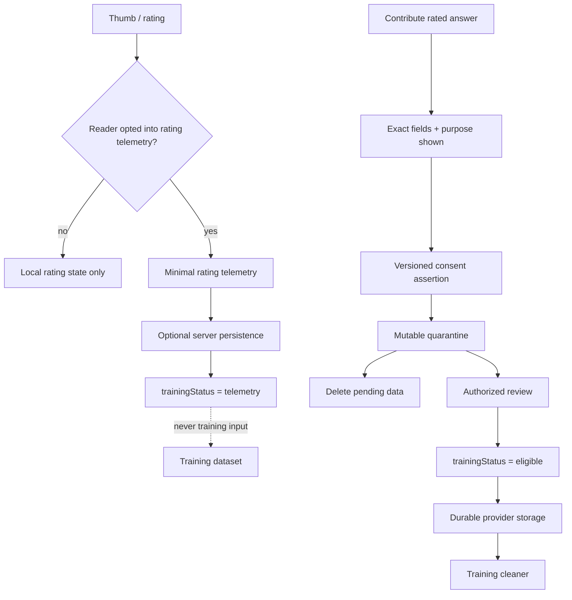
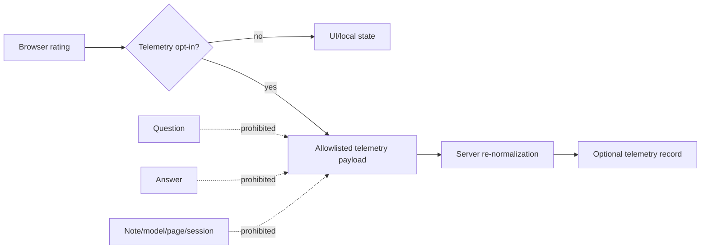
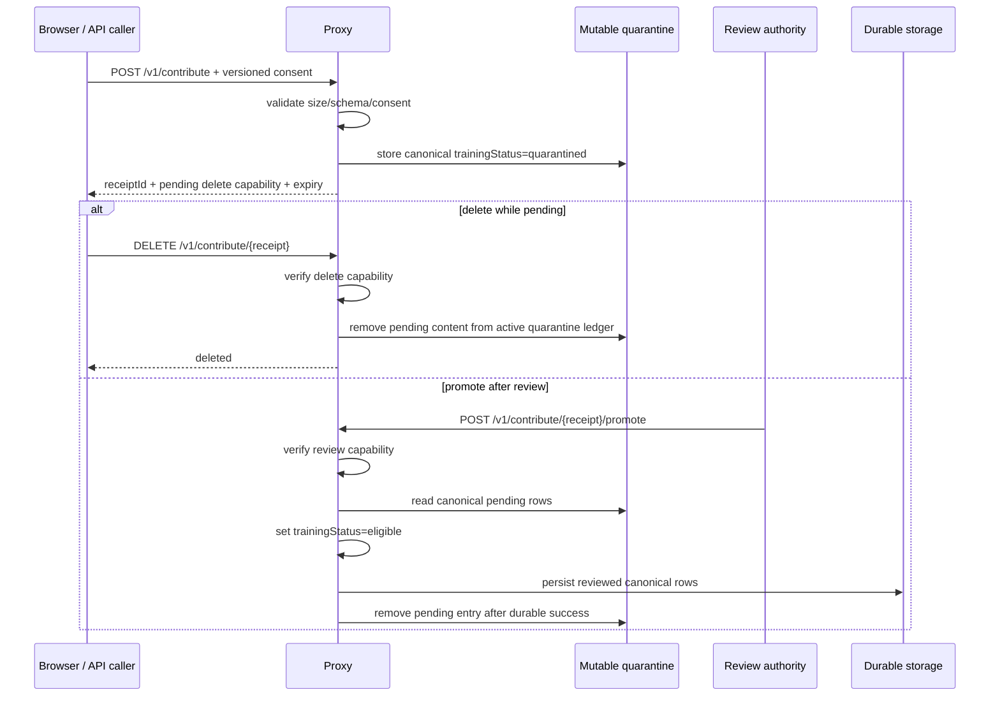
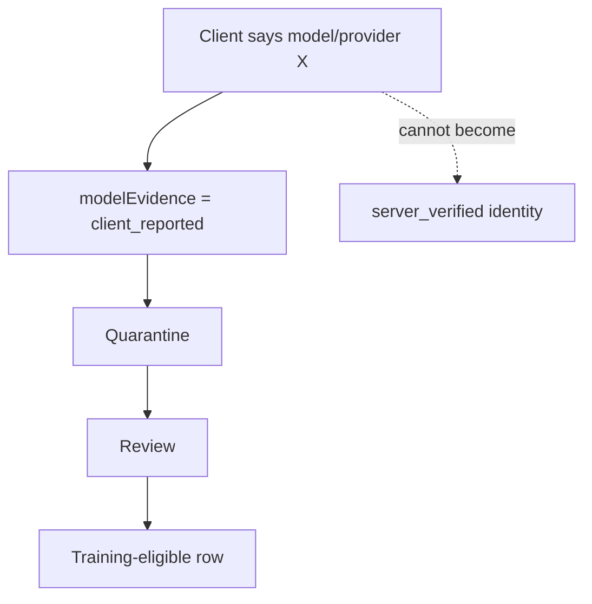
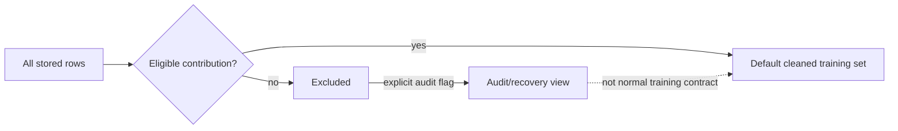

# B22 — Feedback / Contribution / Provenance / Retention

Status: **RUN 6 COMPLETE WITH DURABLE-CONTROL-PLANE RESIDUALS**
Date: **2026-08-29**
Depends on: **B18 privacy/abuse threat model**, **B21 logging/privacy**, **B07 feedback provenance**

## 1. Decision

Ordinary feedback and explicit training contribution are different data classes and
must remain different pipelines.

A rating is not implicit permission to collect the question, answer, free-text note,
model identity, page URL, or conversation/session identifier. A contribution is not
training truth merely because a browser sent `consentFlag=true`. Raw contribution
content is untrusted intake until an independent review authority promotes a
canonical record to `trainingStatus="eligible"`.



## 2. Privacy-minimal feedback contract

The browser network preference is **off by default**. Without explicit opt-in, a
rating remains local UI state.

When the reader enables **Send rating telemetry**, the browser sends only bounded
rating/event mechanics such as:

- schema version;
- action (`rate` / `retract`);
- event IDs needed for edit/retract mechanics;
- answer index;
- rating value/label/title/mode;
- edit count;
- client event timestamp.

It does **not** send:

- user question;
- model answer;
- free-text feedback note;
- model/provider metadata;
- page URL;
- conversation/session identifier.

The server independently normalizes `/v1/feedback` to the same minimal shape, so a
direct or legacy caller cannot restore over-collection by submitting those fields.
Persisted feedback is marked:

```text
_source = feedback
trainingStatus = telemetry
```

and is excluded from training output.



The browser preference cannot enable server-side durability. Server persistence is
an independent operator policy (`FEEDBACK_PERSIST_ENABLED`) and defaults off.

## 3. Explicit contribution contract

Contribution is a separate user action and carries content intentionally selected
for that purpose.

Current consent requirements:

```text
consentFlag    = true
consentVersion = 1.0.0
```

`consentVersion` is validated exactly by the server. A future material change to
the contribution terms requires a new version and coordinated client/server update.

The consent value is evidence of a client assertion, **not verified real-world
identity**. The system must never infer that an unauthenticated API caller is a
specific person merely because the JSON says `consentFlag=true`.

## 4. Quarantine-first intake

Accepted contribution content does not write directly to Git, Hugging Face, or
other append-only/mirrored record storage.



The current quarantine is process-local mutable memory with explicit count, byte,
and TTL bounds. That is intentionally safer than writing raw sensitive intake into
append-only repository history, but it is **not** a production-grade durable review
control plane.

Residual consequences are explicit:

- process restart can remove pending intake;
- multi-replica deployments do not share one quarantine ledger;
- review/delete capabilities are therefore valid only while the owning process
  retains the pending entry;
- production-scale review requires a dedicated mutable transactional store.

## 5. Separate pending-delete capability

A quarantined receipt has a separate high-entropy deletion capability. Possession
of the receipt identifier alone is not deletion authority.

```text
public/pending receipt ID     != pending delete capability
review operator capability    != pending delete capability
```

The server stores only a digest of the pending-delete token.

While the record is still quarantined, **Delete pending data** is a truthful
physical-delete operation for the process-local pending store.

## 6. Review and promotion authority

Only the independently configured operator capability
`CONTRIBUTION_REVIEW_TOKEN` may promote quarantined rows.

The browser does not receive that capability and cannot set `trainingStatus`.
Direct callers cannot make content training-eligible by including a field named
`trainingStatus` in their request; normalization owns it server-side.

Review promotion produces canonical rows with:

```text
_source = contribution
trainingStatus = eligible
consentVersion = current accepted version
```

Only after successful durable persistence is the pending quarantine entry removed.

## 7. Provenance and malicious identity

Client-supplied model/provider labels are claims, not verified provenance.

Current evidence labels:

```text
modelEvidence = client_reported      # current contribution payload
modelEvidence = legacy_unverified    # historical rows without stronger evidence
```

This prevents later dataset consumers from mistaking a fabricated model name for a
server-observed identity.



A future server-observed inference provenance path may add stronger evidence, but it
must use a different explicit evidence value rather than silently upgrading
`client_reported`.

## 8. Training dataset fail-closed policy

`deduplicate_dataset.py` is now an enforcement boundary, not merely a cleanup tool.
By default it accepts only:

```text
_source == contribution
AND trainingStatus == eligible
```

It excludes:

- feedback telemetry;
- quarantined contribution rows;
- historical contributions normalized as `legacy_unreviewed`;
- malformed/unknown lifecycle states.

`--include-unreviewed` is an explicit audit/recovery option. It does not make
feedback telemetry eligible and prints a warning so an operator cannot confuse it
with the production training path.



## 9. Retention and deletion truthfulness

Two operations must never be conflated:

```text
withdraw / stop using for training
                   !=
physical erasure from every durable copy/history/mirror
```

Before promotion, the current mutable quarantine can truthfully support physical
pending deletion.

After promotion, rows may be written to Git/HF/provider storage or mirrors whose
history/replication semantics can preserve earlier bytes. This implementation does
**not** guarantee global physical erasure after promotion.

Therefore UI/operator documentation must not promise "Delete my data everywhere"
or equivalent wording for promoted records until a durable deletion/control-plane
contract proves that claim across every configured provider and mirror.

For sensitive/blackmail-risk data, the preferred defense remains minimization:
never create a durable identity-linked corpus unless the purpose truly requires it.

## 10. Resource limits

Collection endpoints have independent, purpose-sized bounds rather than inheriting
the larger chat body budget.

Current Run 6 boundary includes:

- feedback body budget: 16 KiB;
- contribution body budget: 256 KiB;
- quarantine entry-count limit;
- quarantine aggregate-byte limit;
- quarantine TTL;
- rate-limit policy from the surrounding service layer.

The browser cannot enlarge these server limits.

## 11. Cloudflare parity

Run 6 hardens Cloudflare `/v1/feedback` to the same privacy-minimal telemetry model:

- small body limit;
- allowlisted telemetry fields only;
- no query/answer/note/model/page/conversation content;
- persistence only when the operator explicitly enables it;
- bounded persistence TTL;
- `trainingStatus="telemetry"`.

The Worker does **not** yet implement the contribution quarantine/review/promotion
control plane. Therefore full collection-service parity remains partial. Do not
route training contribution to the Worker and claim B22 provenance guarantees
until an equivalent or intentionally centralized contribution service is enforced.

## 12. User-facing copy invariants

Settings/help copy must make these distinctions understandable:

- **Send rating telemetry** is off by default;
- when enabled, only rating/event metadata is sent;
- the optional written feedback note remains local unless the reader explicitly
  chooses the contribution action;
- **Contribute rated answers** is a separate content/purpose action;
- successful contribution intake says **pending review / not training-eligible**;
- pending deletion says **Delete pending data**;
- after promotion, the product does not promise physical erasure from all durable
  histories/mirrors.

No UI may use "anonymous" merely because explicit account identity is absent; IP,
platform, timing, provider logs, and content can still be identifying.

## 13. Regression gates

Run 6 regression owners:

- `tests/test_feedback_contribution_privacy.py` — server/schema/quarantine/review/
  deletion/training-eligibility contract;
- `tests/test_feedback_contribution_privacy.mjs` — browser opt-in/minimal payload,
  consent/quarantine/delete UI contract;
- `tests/test_deduplicate_multisource.py` — fail-closed training dataset behavior;
- `tests/test_mutation.py` / `_mutants.py` — positive-control regressions.

Positive-control mutations include restoring:

- query recollection in feedback telemetry;
- telemetry-on-by-default behavior;
- disabled consent versioning;
- browser contribution session linkage;
- direct durable contribution persistence / review bypass;
- training eligibility bypass.

## 14. Security disposition

Closed by Run 6 core boundary:

- ordinary feedback no longer silently becomes full conversation collection;
- contribution consent is versioned and server-validated;
- raw contribution intake is quarantined rather than immediately durable;
- pending deletion is capability-protected and removes pending content from the active quarantine ledger; forensic/global erasure is not claimed (clarified by Run 12 / B28);
- only separate review authority can promote training eligibility;
- model provenance is labeled as client-reported/unverified rather than trusted;
- the default training cleaner accepts eligible contributions only.

Still open/residual:

1. durable multi-replica quarantine/review/delete control plane;
2. guaranteed physical erasure after promotion across append-only histories/mirrors;
3. Cloudflare contribution/review parity;
4. Run 7 local secret/sensitive-input preflight before inference/share/contribution;
5. complete PII detection is intentionally **not** claimed;
6. release-level CORS/identity/resource parity was subsequently closed at the application boundary by Run 11 / B27.

## 15. Closure criterion

Run 6 is complete when source + tests + maintenance prove that:

```text
rating != content contribution
receipt != delete capability
client consent assertion != verified identity
client model label != verified model identity
quarantined != training eligible
withdrawal != physical erasure
```

and no normal training build can consume telemetry/quarantined/unreviewed rows
without an explicit audit/recovery override.


## 16. Working-tree verification

Run 6 closure gates on 2026-08-29:

- browser contribution/privacy harness: **21 passed, 0 failed**;
- `test_feedback_contribution_privacy.py`: **10 passed**;
- `test_deduplicate_multisource.py`: **10 passed**;
- Node harness wrapper: **32 passed**;
- mutation suite: **137 passed**;
- complete runnable non-Sphinx suite: **529 passed, 3 skipped**;
- full Sphinx-inclusive attempt: **995 passed, 3 skipped, 5 failed, 62 errors**; every failure/error is confined to `test___init__.py` and reports missing `sphinx`, so this remains **ENVIRONMENT_BLOCKED**, not green.

Syntax/compile gates: browser JS GREEN, Cloudflare Worker JS GREEN, proxy/schema/dedup Python compile GREEN.


## 17. Packaged-copy acceptance

A clean extraction of the Run 6 candidate overlay reproduced:

- **21/21** browser privacy/contribution assertions;
- **20 passed** focused Python privacy + dedup lifecycle tests;
- **32 passed** Node harness wrapper;
- **137 passed** mutation gate;
- **529 passed, 3 skipped** complete runnable non-Sphinx suite;
- GREEN browser/Worker syntax and Python compile;
- GREEN maintenance drift checker.

After this evidence is recorded, the archive must be rebuilt and the rebuilt final bytes re-extracted/re-tested before delivery.
