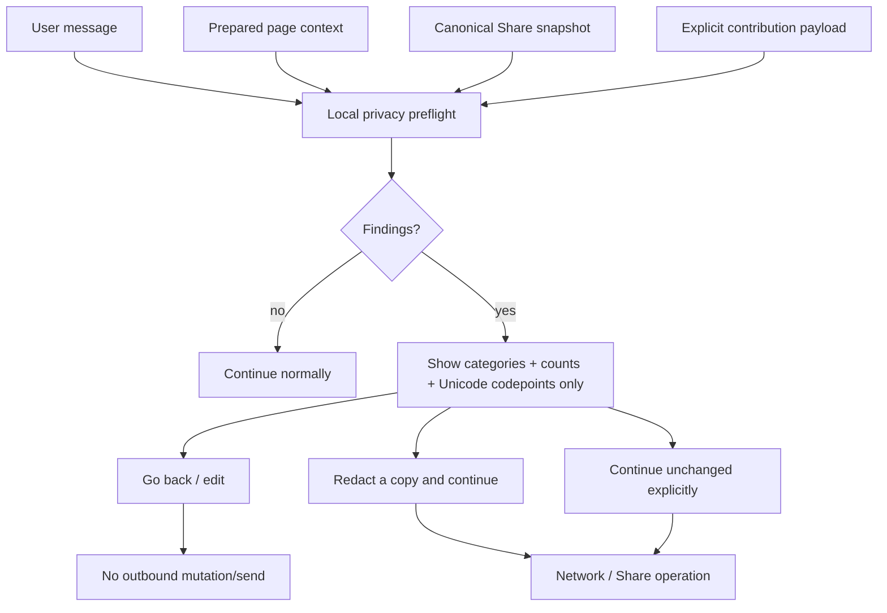
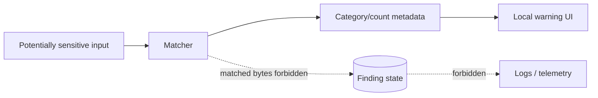
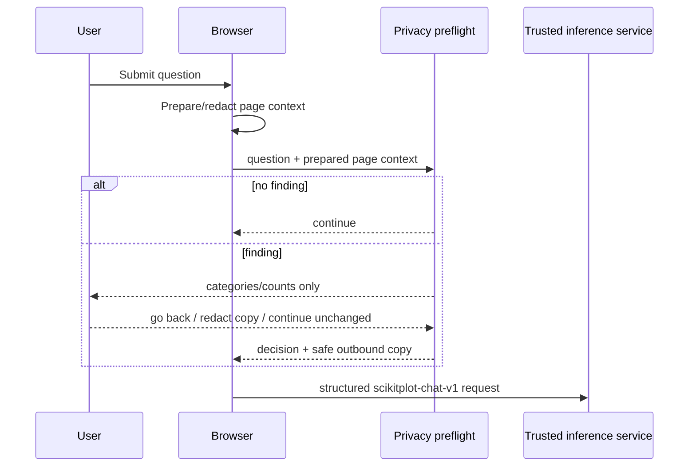
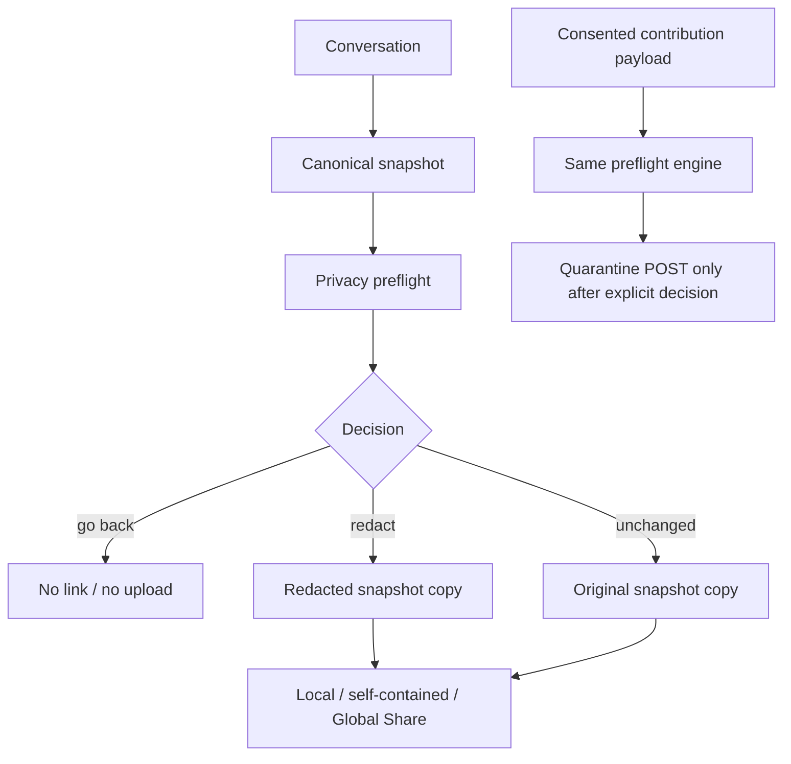
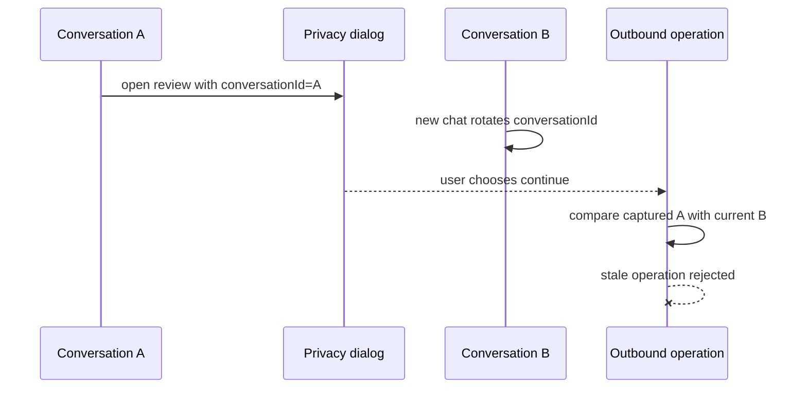

# B23 — Privacy Preflight / Sensitive-Input User Protection

Status: **RUN 7 COMPLETE — ADVISORY LOCAL EGRESS PREFLIGHT**
Date: **2026-08-29**
Depends on: **B18 privacy/abuse threat model**, **B20 prompt authority**, **B22 collection/provenance lifecycle**

## 1. Decision

Before browser-controlled content leaves the page through inference, Share, or explicit
contribution, run one local advisory privacy preflight over the **actual outbound data**.
The preflight reports only safe categories/counts/codepoints; it never stores, renders,
or logs the matching sensitive value.

This is user protection, not service authorization. An open-source client is bypassable,
so server prompt authority, logging minimization, Share isolation, and contribution
quarantine remain independent controls.



## 2. Data-minimizing finding model

A finding may contain only safe metadata such as:

```text
kind/category
human-readable label
count
Unicode codepoint + control-name (for invisible/bidi controls)
```

It must never retain:

```text
matched secret
matched email/phone/IP/card candidate
surrounding source text
raw page/query/share/contribution field value
```



The current advisory scanner covers high-confidence credential shapes, selected
personal-information patterns, Luhn-valid payment-card-like numbers, and suspicious
invisible/bidi formatting controls. This list is intentionally not described as
complete PII detection.

## 3. Inference preflight

Inference reviews the complete browser-generated egress envelope, including the user
question and automatically attached page context.

Existing page-context protection still performs automatic high-confidence secret
redaction and invisible-character containment before the advisory dialog. The preflight
then warns about remaining categories such as possible personal data.



The transcript is not mutated and the composer is not cleared until this decision is
resolved. Cancelling leaves the original user text available for editing.

## 4. Share and contribution preflight

Share reviews the canonical privacy-filtered snapshot **before** creating local,
self-contained, permanent-compatibility, or Global output. Explicit contribution
reviews the exact consented payload before the quarantine request.



Redaction changes an operation copy only. It does not silently rewrite the transcript,
composer, stored source page, or prior conversation history.

## 5. Invisible/bidi controls

Suspicious formatting controls are surfaced using safe metadata such as:

```text
U+200B ZERO WIDTH SPACE × 4
U+202E RIGHT-TO-LEFT OVERRIDE × 1
```

The warning does not reproduce surrounding source content. Legitimate Unicode is
preserved by normal archival/export behavior; explicit **Redact & continue** removes
matched controls from the outbound copy. Prepared page context continues to use the
existing automatic containment rules.

## 6. Explicit choice and accessibility

For flagged content the dialog provides three distinct actions:

- **Go back / Edit** — cancel the outbound action;
- **Redact & continue** — remove detected values/controls from an operation copy;
- **Continue unchanged** — intentional override.

Additional requirements:

- Escape cancels;
- focus is trapped among dialog actions while open;
- focus is restored after close;
- clicking the backdrop cancels;
- the warning never relies only on color;
- if flagged data cannot be reviewed because DOM/UI support is unavailable, the
  preflight fails closed rather than silently sending.

## 7. Async conversation-identity guard

Privacy review is asynchronous. A warning opened for conversation A may remain visible
while the reader starts conversation B. Every outward operation therefore captures the
initiating conversation identity and verifies it after the preflight resolves.



This guard applies to inference, portable/session Share, permanent compatibility Share,
Global Share, and explicit contribution.

## 8. Security and privacy non-claims

Run 7 deliberately does **not** claim:

1. complete PII detection;
2. that absence of a warning means content is non-sensitive;
3. real-world identity classification;
4. that client-side preflight prevents direct API callers from sending sensitive data;
5. that warning/detection is an authorization boundary;
6. server-side content classification or provider-side deletion;
7. durable multi-replica contribution quarantine;
8. physical erasure after promoted data reaches append-only/mirrored providers.

Names, addresses, account numbers, organization-specific identifiers, contextual
secrets, and many other sensitive facts may not be detectable reliably with local
patterns. The product must therefore use wording such as **possible sensitive
information** rather than **safe**, **clean**, or **PII free**.

## 9. Defense-in-depth relationship

Run 7 complements, but never replaces:

```text
Run 1  secret lifecycle / no persistent browser credentials
Run 2  active-content isolation + sanitized source metadata
Run 3  server-owned Share representation/authorization
Run 4  server-owned prompt/model/credential authority
Run 5  logging/diagnostic minimization
Run 6  minimal feedback + quarantine/review provenance
```

A direct malicious API caller bypassing the browser is still constrained by those
server-side boundaries.

## 10. Regression gates

Primary browser gates:

- `tests/test_privacy_preflight.mjs` — scan/redaction/source contract + all outward
  integration points;
- `tests/test_privacy_preflight_dom.mjs` — real helper execution in fake DOM,
  value-non-disclosure, action behavior, codepoint display;
- `tests/test_share_conversation_dom.mjs` — delayed preflight/new-conversation race;
- `tests/test_js_harnesses.py` — all Node harnesses;
- `tests/test_mutation.py` / `_mutants.py` — positive-control security regressions.

Mutation positives include restoring:

- inference bypass;
- Share bypass;
- contribution bypass;
- source-text retention inside a finding;
- invisible-control preservation during explicit redaction;
- fail-open behavior without review UI;
- removal of the async conversation-identity guard.

## 11. Working-tree verification

Run 7 focused closure gates on 2026-08-29:

- privacy-preflight source/integration harness: **45 passed, 0 failed**;
- privacy-preflight DOM harness: **17 passed, 0 failed**;
- Share conversation contract: **97 passed, 0 failed**;
- Share DOM/race harness: **36 passed, 0 failed**;
- feedback/contribution privacy harness: **21 passed, 0 failed**;
- untrusted-context harness: **233 passed, 0 failed**;
- Node harness wrapper: **34 passed**;
- mutation suite: **151 passed**.

Broad non-Sphinx and full-suite/package acceptance counts are recorded in
`VERIFICATION.md` after final execution/package re-extraction.

## 12. Disposition

Run 7 closes the local sensitive-egress warning boundary:

```text
possible finding -> local category/count review -> explicit user decision -> outbound copy
```

The broader `PrivacyDataLifecycle` contract remains **PARTIAL** because durable
multi-replica quarantine, provider-complete post-promotion erasure, and other service
residuals are not solved by local detection.

Run 8 may now build YAML/TOML and the final Share-sheet information architecture on top
of this preflight boundary, but it must preserve the same canonical snapshot and
operation-copy rules.


## 13. Packaged-copy acceptance

A clean extraction of the Run 7 candidate overlay reproduced:

- **45/45** privacy-preflight source/integration assertions;
- **17/17** executed privacy-dialog assertions;
- **36/36** Share DOM/race assertions;
- **34 passed** dynamic Node harness wrapper;
- **151 passed** mutation gate;
- **545 passed, 3 skipped** complete runnable non-Sphinx suite;
- GREEN browser/Worker syntax and maintenance drift checker.

The rebuilt archive reproduced the same acceptance plane before the final metadata-only package rebuild; the delivered bytes are re-extracted and rechecked once more before handoff.
