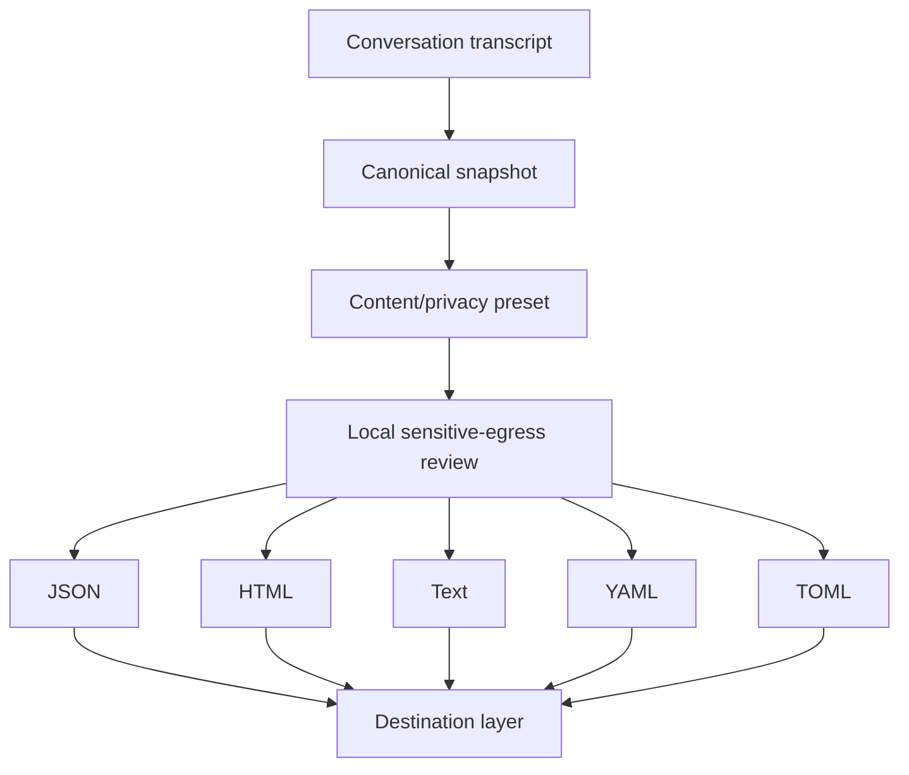
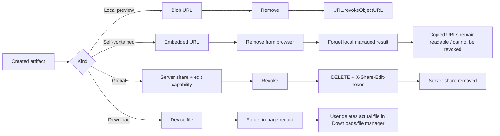
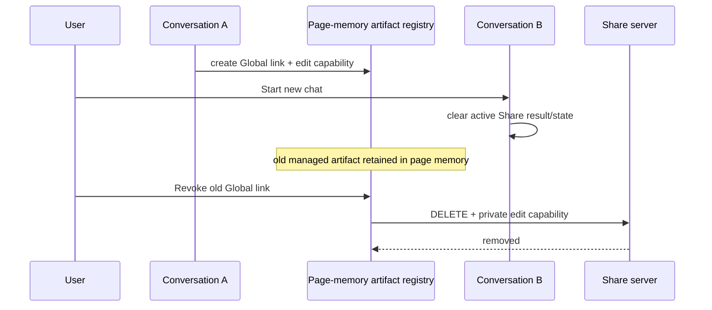

# B24 — Share Formats, Information Architecture, and Artifact Lifecycle

Status: **COMPLETE WITH REAL-BROWSER ACCEPTANCE RESIDUAL**
Date: **2026-08-29**
Run: **B18 security campaign Run 8**
Depends on: B17, B19, B22, B23

## Decision

Run 8 completes the planned Share information architecture on top of the secured
canonical snapshot/server boundaries. The browser exposes five live formats and
three destinations from one unified sheet:

```text
Share conversation
│
├── Format
│   ├── JSON
│   ├── HTML
│   ├── Text
│   ├── YAML
│   └── TOML
│
├── Destination
│   ├── Local preview
│   ├── Self-contained link
│   └── Global link
│
├── Content & privacy
│   ├── Standard
│   ├── Minimal
│   ├── Complete
│   └── Customize
│
├── Advanced
│   ├── size/preflight
│   ├── Download current snapshot
│   └── Delete legacy local Share artifacts
│
├── Result
│   └── Copy / Open / Inspect / Update / Remove or Revoke
│
└── Created artifacts
    └── lifecycle-aware management for every assistant-managed result
```

Training contribution remains under **More actions** and is explicitly separate
from Share semantics.

## Canonical format boundary

All formats consume the same privacy-filtered canonical snapshot before any
format-specific serialization:



YAML and TOML are first-class `_EXPORT_FORMATS` entries. They are not preview
stubs or special-case buttons.

### YAML

- MIME: `application/yaml`
- extension: `.yaml`
- deterministic JSON-like value domain only;
- all strings/keys are quoted through safe scalar helpers;
- user text cannot create tags, anchors, aliases, document markers, or mappings;
- browser and server serializer round-trip tests use a real YAML parser.

### TOML

- MIME: `application/toml`
- extension: `.toml`
- strings are emitted only through the dedicated quoted-string helper;
- optional `null` values are omitted because TOML has no native null;
- omitted optional fields reconstruct to canonical null semantics;
- browser and server serializer round-trip tests use `tomllib`.

## Content/privacy presets

Share filtering happens **before serialization**. A disabled field is absent from
all representations rather than merely hidden from the rendered HTML.

```text
Standard  → normal share metadata, no session identifier
Minimal   → messages + errors, minimal metadata
Complete  → fuller metadata, session identifier still requires explicit choice
Customize → granular controls, Share sanitization remains locked
```

Query strings, fragments, URL credentials, and local filesystem paths remain
non-disableable removals for Share.

## Artifact lifecycle contract

The user requirement that created links/artifacts be removable is implemented
with truthful semantics per storage layer. “Remove” and “Revoke” are not
synonyms.



### Local preview

A managed local preview has a real browser resource. Removing it calls
`URL.revokeObjectURL()` and removes the managed result.

### Self-contained link

A self-contained link contains the snapshot itself. The assistant can remove its
local managed record, but it **cannot revoke copies already copied/sent**. The UI
states this explicitly and never claims remote deletion.

### Global link

A Global link is genuinely revocable while the page still owns its private edit
capability. Revoke calls server `DELETE` with `X-Share-Edit-Token`; successful
remote deletion removes the managed result.

The public URL may be restored from session storage, but the edit capability is
not persisted. A restored read-only URL can only be removed from this browser;
it cannot be remotely revoked without the private capability.

### Downloads

A browser page cannot delete a file after the browser/device has saved it. The
assistant can forget its in-page artifact record only. Both Share-sheet downloads
and direct toolbar downloads enter the same page-memory artifact registry, so no
assistant-created conversation export is silently unmanaged. The UI explicitly
tells the user to remove the actual file from browser Downloads/device storage.

### Direct toolbar Downloads

The top-level Download-mode export path registers its generated device-file
record in the same page-memory artifact registry used by the Share sheet. Opening
Share later therefore exposes **Forget** for that record and repeats the device
file deletion limitation. No file content, secret, or remote capability is stored
in this registry.

### Legacy local artifacts

Advanced exposes **Delete legacy local Share artifacts**, which clears the old
IndexedDB Share store. This is separate from self-contained copied URLs.

## New-chat lifecycle

Starting a new conversation clears the current result/current Global state, but
does **not** discard the page-memory managed-artifact registry. This is
intentional so a user can still revoke an older Global link before closing the
page.



Edit capabilities still disappear when the page itself closes/reloads; they are
not placed in `sessionStorage`.

## Size preflight

Self-contained links are measured before generation using UTF-8 byte estimates:

- conservative warning threshold: 48 KiB;
- configured hard limit: 256 KiB;
- warning recommends Global Share or Download;
- hard limit blocks self-contained generation.

These are product safety budgets, **not claims about universal browser URL
limits**.

## Result model

There is one destination-aware result component rather than duplicated link
rows. Existing results become stale when format/content changes and explicitly
say they still represent the previous snapshot.

Large self-contained URLs are hidden by default and shown only through
**Inspect**.

## Security invariants

1. Every live format consumes the canonical privacy-filtered snapshot.
2. YAML/TOML user strings never become serializer structure.
3. Destination choice never changes content authority.
4. Global Share continues to send `{snapshot, format, ttlDays}` only.
5. Client never owns Global MIME/representation authority.
6. Global update/revoke requires the page-memory edit capability.
7. A created assistant-managed artifact always exposes a truthful lifecycle action.
8. `Remove` means local removal only unless the underlying resource can actually be revoked/deleted.
9. `Revoke` means a real server DELETE operation.
10. Starting a new chat does not silently destroy old Global revoke capabilities still available in page memory.
11. Share-sheet and direct toolbar Download records cannot imply device-file deletion; both are lifecycle-managed in page memory.
12. Self-contained links cannot imply revocability after copying.
13. Privacy preflight runs on the canonical Share snapshot before serialization.
14. Contribution remains a separate consent/quarantine workflow, not a Share destination.

## Verification

Working-tree gates:

```text
test_export_formats.mjs                 64/64
test_run8_serializers.mjs               22/22
test_run8_client_roundtrip.py            2 passed
test_run8_share_formats.py               3 passed
test_share_server_authority.py          10 passed
test_share_conversation.mjs             96/96
test_share_conversation_dom.mjs         38/38
test_global_share_capability.mjs        36/36
test_privacy_preflight.mjs              47/47
test_active_content_isolation.mjs       41/41
test_feedback_contribution_privacy.mjs  21/21
test_js_harnesses.py                    35 passed
test_mutation.py                        163 passed
pytest tests --ignore=test___init__.py  563 passed, 3 skipped
client/Worker syntax                    GREEN
HF share-contract compile               GREEN
```

Positive-control mutation coverage includes YAML raw-scalar injection, TOML raw
string/table injection, direct toolbar downloads becoming untracked, local Blob
removal without revocation, false self-contained revocation wording, and Global
local-only removal replacing server DELETE.

## Packaged-copy acceptance

The candidate overlay was cleanly extracted outside the working tree and
reproduced the Run 8 acceptance plane: 64/64 export-registry assertions, 22/22
serializer assertions, 15 focused real-parser/server Python tests, 96/96 Share
source assertions, 38/38 lifecycle fake-DOM assertions, 36/36 Global capability
assertions, 198 combined Node-harness+mutation tests, and 563 passed / 3 skipped
in the complete runnable non-Sphinx suite. Syntax/compile and maintenance drift
were also green. The metadata-only rebuild produced for delivery is re-extracted
and rechecked before its SHA is published.

## Residual / non-claim

A true representative-browser visual/accessibility pass remains outstanding.
The environment provides Chromium but not the maintained Playwright/WebDriver
harness needed to claim cross-browser focus/layout/clipboard acceptance. Fake
DOM, source contracts, responsive CSS, keyboard semantics, and runtime
construction tests are green, but they are not represented as real browser E2E.

Therefore `AIA-019` moves from OPEN to **PARTIAL** rather than CLOSED.

## Closure

Run 8 implementation is complete with the real-browser acceptance residual
above. The B17 Share information-architecture implementation sequence has now
landed across Runs 2, 3, 7 and 8.
