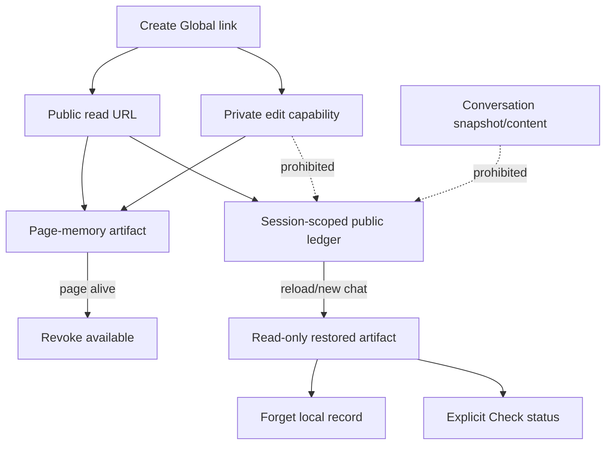
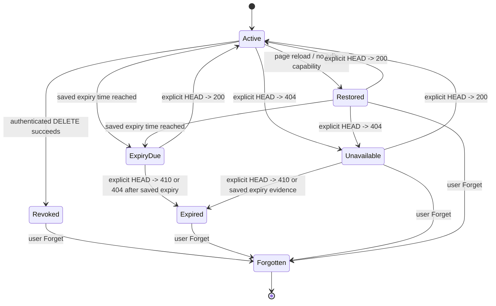
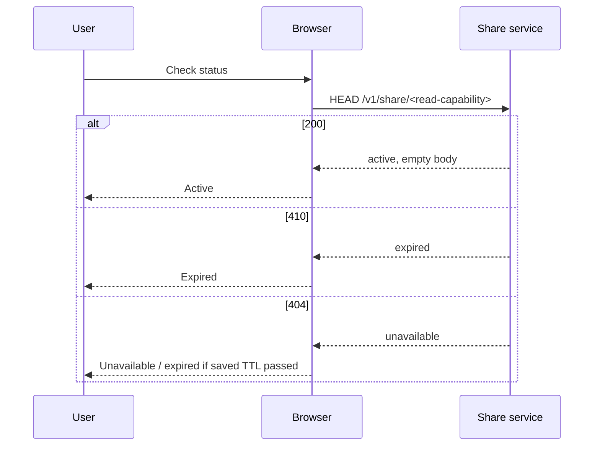
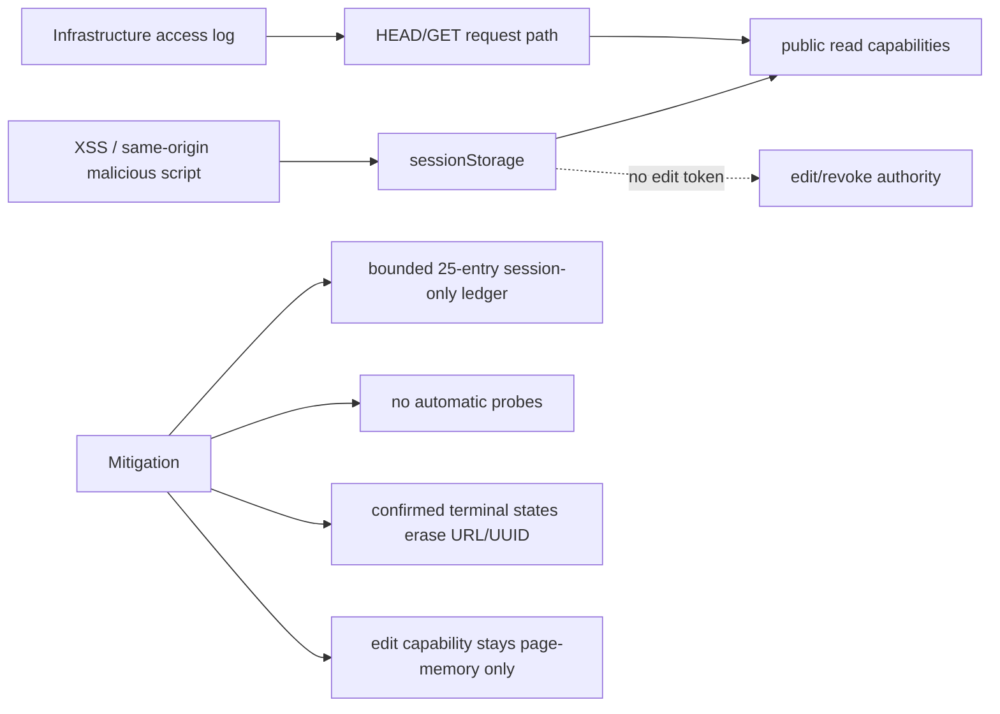

# B25 — Global Link Artifact Tracking

Status: **COMPLETE — Run 9 implementation; representative-browser acceptance remains under AIA-019**
Date: **2026-08-29**
Depends on: **B19 Global Share server authority**, **B24 Share artifact lifecycle**

## 1. Decision

Every Global Share link that the assistant hands to the user is a managed artifact, not a fire-and-forget URL.

Run 8 already gave page-memory lifecycle actions. Run 9 closes the cross-chat/reload visibility gap with a bounded **session-scoped public Global artifact ledger**.

The ledger may retain the public read capability because tracking the link requires remembering what was handed to the user. It must never retain the private edit/revoke capability, conversation snapshot, message text, model prompt, endpoint credential, or other secret.



## 2. Lifecycle states

Global artifacts use truthful states:

```text
active
restored (read-only)
expiry_due (saved expiry reached; server not checked)
expired (server-confirmed / status result)
revoked (this client successfully DELETEd it)
unavailable (server returned reason-unknown not-found; recheckable)
forgotten (removed from browser ledger; no tombstone retained)
```

`404` is **not** automatically labeled `revoked`: it may represent manual removal, expiry cleanup, deployment reset, or another valid absence cause.

## 3. Storage boundary

Ledger key:

```text
sessionStorage
└── ai-assistant-global-share-ledger:v1
```

Bound:

```text
maximum 25 entries
```

Allowed data per active/restored entry:

```text
ledgerId
public uuid/read locator
public read URL
conversationId (UI correlation only)
format
createdAt / updatedAt
expiresAt
lifecycle state
```

Forbidden data:

```text
editToken
share/create bearer token
snapshot
message text
prompt/context
contentHash
feedback/contribution content
endpoint credentials
```

Confirmed terminal (`revoked`, `expired`) ledger entries erase the public UUID and URL and retain only lifecycle metadata. `unavailable` is reason-unknown and remains bounded/recheckable; Run 10 B26 hardens this distinction.



## 4. No background capability probing

Run 9 deliberately does **not** automatically probe every restored Global link.

Reason: the public URL is a bearer read capability and a network request exposes the request path to the hosting/CDN/reverse-proxy infrastructure. Run 5 already records that infrastructure access logs are outside application source control.

Status check therefore requires an explicit user action:

```text
Created artifacts
└── Global link · read-only restored · status not checked
    [Open] [Check status] [Forget]
```

`Check status` performs:

```http
HEAD /v1/share/<public-id>
```

It never downloads conversation content and does not follow redirects.



## 5. Revoke vs Forget

### Revoke

Available only while the page-memory edit capability exists.

```text
Global link + editToken
       |
       v
DELETE /v1/share/{uuid}
X-Share-Edit-Token: ...
       |
       v
server deletion succeeds
       |
       v
artifact state = revoked
public URL/UUID erased from ledger
edit token erased from page artifact
```

The revoked lifecycle row stays visible until the user explicitly chooses **Forget**.

### Forget

`Forget` removes only browser tracking metadata. It never claims remote deletion.

A restored Global link after reload has no edit token, so it can be **Open**, **Check status**, or **Forget**, but not remotely revoked from that browser state.

## 6. New chat and reload

New chat clears only current-conversation update state:

```text
current _globalShareState -> cleared
public Global ledger      -> preserved
page-memory old edit token -> preserved until page close
```

This allows an older Global link to remain revocable during the same page lifetime even after a new conversation begins.

Reload behavior:

```text
private edit capability -> gone by design
public ledger            -> restored from sessionStorage
all tracked links        -> read-only lifecycle rows
```

The design explicitly chooses secret safety over cross-reload mutation convenience.

## 7. Server parity

HF proxy and Cloudflare Worker expose a content-free lifecycle probe:

```text
HEAD /v1/share/{uuid}
```

HF returns 200/410/404 according to in-memory lifecycle state. Cloudflare returns equivalent status when KV state remains observable; expired KV may already be absent and therefore appear as 404. The browser combines server status with its saved expiry metadata and never overclaims the cause of absence.

HEAD responses use no-store/privacy headers and application logs omit the Share ID.

## 8. Threat model



The ledger does not make public read capabilities secret. It deliberately minimizes their persistence scope and lifetime while meeting the user requirement to track links that were handed out.

## 9. Regression gates

Run 9 requires:

- `test_global_share_capability.mjs`
  - versioned session ledger;
  - maximum 25 entries;
  - no edit-token/snapshot persistence;
  - explicit HEAD status probe;
  - Worker HEAD/CORS parity.
- `test_share_conversation_dom.mjs`
  - link creation enters ledger;
  - status check active/expired transitions;
  - revoke retains lifecycle tombstone;
  - Forget removes tombstone/ledger entry;
  - multiple links survive new-chat and simulated reload;
  - restored links have no Revoke action.
- `test_share_server_authority.py`
  - HEAD returns empty active response;
  - revoked Share returns 404 through HEAD.
- Run 9 mutation positives:
  - edit capability persisted into ledger;
  - ledger bound removed;
  - status check changed from HEAD to GET;
  - revoke drops lifecycle history;
  - new chat clears the public ledger.

## 10. Non-claims / residuals

- Session storage is readable by same-origin JavaScript; therefore only public read capabilities and minimal lifecycle metadata are stored there.
- Historical/pre-Run-13 path links may expose their public locator to infrastructure URL logs. B29 current links use fragment + fixed operation paths; legacy compatibility remains until retired.
- A restored link cannot be remotely revoked without its non-persisted edit capability.
- No automatic polling/monitoring is introduced.
- Real-browser focus/layout/clipboard acceptance remains `AIA-019`.

## 11. Closure

Run 9 is complete when source/DOM/server/mutation/broad regression gates pass and the packaged overlay reproduces them after clean extraction.


## Packaged-copy acceptance

Candidate overlay clean-extraction acceptance: **GREEN**.

- Global capability contract: **46/46**
- Share conversation contract: **96/96**
- Share lifecycle fake-DOM: **54/54**
- HF Share server-authority: **10 passed**
- Node harness wrapper: **35 passed**
- mutation suite: **173 passed**
- complete runnable non-Sphinx suite: **573 passed, 3 skipped**
- browser/Worker syntax + HF proxy compile: **GREEN**
- maintenance drift: **GREEN**

The rebuilt archive reproduced this acceptance plane from clean extraction. Final packaged-copy status: **GREEN**.


## Run 13 transport supersession

B25's HEAD/path wording is historical for links issued before B29. Current status uses fixed `POST /v1/share/status` and current public URLs use `/v1/share#share=<id>`. The lifecycle semantics (explicit user check, no polling, edit capability not persisted, truthful 404/410/revoke/Forget) are unchanged.
