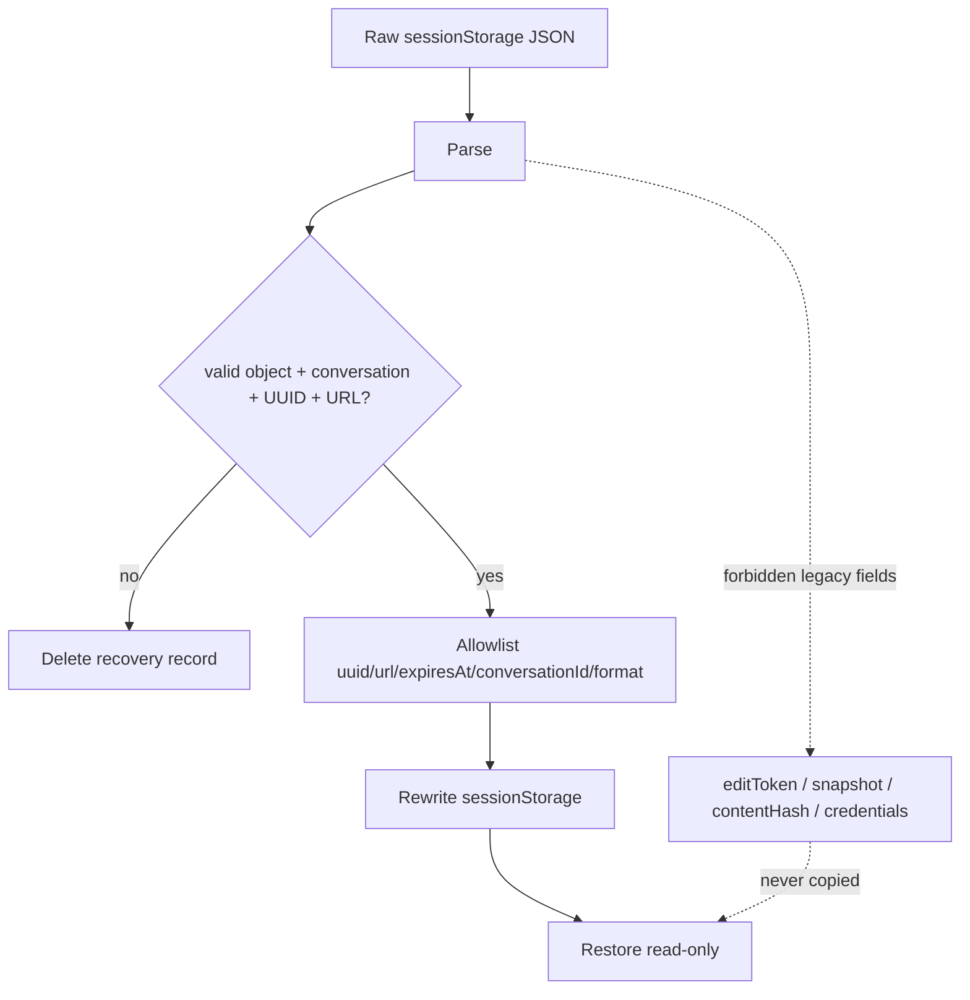
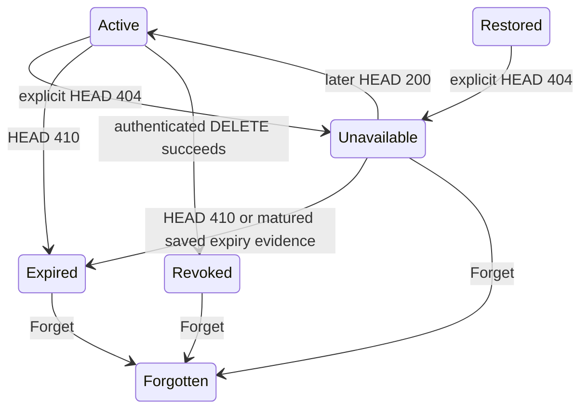

# B26 — Global Link Lifecycle Hardening

Status: **COMPLETE — Run 10 implementation; remote status of the user-provided live capability was not assumed**
Date: **2026-08-29**

## 1. Scope

Run 10 re-reviews B25 against the exact delivered Run 9 overlay and the Global link present in the supplied saved-page MHTML. It hardens four boundaries: recovery trust, unavailable-vs-terminal semantics, current-update state, and server expiry parity.

The public capability observed in the MHTML is treated as sensitive bearer material. The review confirms its lifecycle plumbing but does not infer `ACTIVE`, `EXPIRED`, or `REVOKED` without a successful status observation.

## 2. Fail-closed reload recovery

Legacy/tampered `ai-assistant-global-share:v2` is untrusted input. The loader validates the conversation binding, UUID, and URL; then constructs a new allowlisted object containing only public recovery metadata and rewrites storage. Unknown fields are destroyed.



`contentHash` is removed from public recovery serialization because it is a conversation-derived fingerprint with no cross-reload mutation purpose.

## 3. Lifecycle state semantics

```text
200 -> active/restored
404 -> unavailable / reason unknown / recheckable
410 -> expired / terminal
successful authenticated DELETE -> revoked / terminal
```

If a 404 occurs after independently saved expiry evidence has matured, the browser may classify the object as expired. Otherwise 404 remains non-terminal.



For a same-page artifact, a 404 does not erase its edit token. The user may explicitly re-check or attempt Revoke. Because Revoke itself can also observe the same reason-unknown 404, the artifact row exposes a separate **Forget** action so local lifecycle cleanup never becomes trapped behind a remote operation that cannot succeed. It is nevertheless detached from `_globalShareState` so future Create Global link does not silently PATCH a known-unavailable object.

## 4. Update recovery

An expired current object can return 410 to PATCH. The client now treats `404`, `405`, and `410` as stale update targets: current recovery state is cleared and the operation retries as a fresh POST.

```text
Create/Update requested
  -> PATCH current only while live edit state exists
  -> 404/405/410 means current target is not safely updateable
  -> forget implicit update target
  -> POST fresh Global share
```

## 5. Server expiry parity

| Route | Expired result |
|---|---|
| HEAD | 410 |
| GET | 410 |
| PATCH | 410 |
| DELETE | 410 |

HF removes the expired in-memory entry before returning 410. Cloudflare performs a best-effort KV delete before returning 410. This avoids calling an already expired object successfully revoked/updated/read merely because stale storage is still observable.

## 6. Regression gates

- `test_global_share_capability.mjs`: storage allowlist/destructive scrub, no edit token/content hash persistence, PATCH 410 fallback, 404 semantics, Worker expiry parity.
- `test_share_conversation_dom.mjs`: 404 remains checkable/revocable in the live page, public locator survives, later 200 recovers, and legacy/tampered recovery cannot restore Revoke/PATCH authority.
- `test_share_server_authority.py`: expired DELETE returns 410 and clears the entry.
- Run 10 mutants: trust legacy object; terminalize 404; remove 410 PATCH fallback; restore public content fingerprint persistence; remove the unavailable-state local Forget escape hatch.

## 7. Non-claims

- Remote status of the user-provided Global link is **unverified** unless a network probe succeeds; lifecycle code must not manufacture an answer.
- A restored link still cannot be revoked after reload because private edit authority is deliberately not persisted.
- CDN/reverse-proxy/provider request-path logging remains the independent `SEC-P0-15` deployment residual.
- Representative real-browser Share E2E remains `AIA-019`.
- B05/B06 CORS/identity/pre-buffer resource-limit/rate-limit residuals were subsequently closed at the bundled application boundary by Run 11 / B27; strict distributed limiter accounting remains infrastructure residual `SEC-P0-31`.

## 8. Packaged-copy acceptance

Clean extraction of the Run 10 overlay is **GREEN**: 57/57 Global capability assertions, 96/96 Share contract assertions, 64/64 lifecycle fake-DOM assertions, 11 HF Share server tests, 35 Node wrappers, 183 mutations, 584 passed / 3 skipped runnable non-Sphinx suite, syntax/compile GREEN, maintenance drift GREEN, 217 files under exactly `scikitplot/` + `maintenances/`, and no packaged cache/bytecode contamination.
